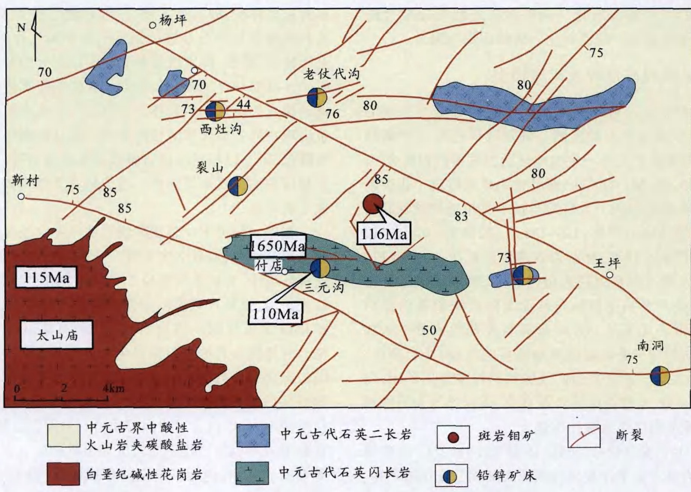

# ·矿产资源·  

# 东秦岭中生代钼铅锌银多金属矿床模型及其找矿评价  

毛景文1,叶会寿1,王瑞廷²,代军治2,简伟3,向君锋3,周珂3,孟芳3 MAO Jing-wen', YE Hui-shou', WANG Rui-ting?, DAI Jun-zhi², JIAN Wei, XIANG Jun-feng', ZHOU $\mathrm{Ke}^{3}$ MENGFang?  

1.中国地质科学院矿产资源研究所,国土资源部成矿作用和资源评价重点实验室,北京100037;   
2.西北有色金属地质勘查局，陕西西安710054；3.中国地质大学地球科学与资源学院，北京100083   
1. MLR Key Laboratory of Metallogeny and Mineral Assessment, Institute of Mineral Resources,   
Chinese Academy of Geological Sciences, Beijing 100037, China;   
2. Northwestern Bureau of Nonferrous Metal Geological Exploration, Xi'an 710054, Shaanxi, China;   
3. Faculty of Earth Sciences, China University of Geosciences, Beijing 100083, China  

摘要：最近几年不仅在东秦岭地区又发现和探明一批大型超大型斑岩型钼矿床，而且在南泥湖矿田（包括南泥湖一三道庄一上房沟矿床)和东沟超大型斑岩钼矿床外围探明了一批脉状铅锌银矿。这些脉状铅锌银矿与斑岩钼矿具有明显的时空关系,而且互为找矿指示。以南泥湖和东沟为代表的斑岩钼矿分别形成于晚侏罗世一早白垩世(156\~137Ma)和白垩纪中期( $125{\sim}114\mathrm{Ma})$ 其成矿有关岩体指示成矿物质分别来源于壳慢同熔和壳源。尽管有物质来源的差别，但是在2个不同时代斑岩钼矿的外围都有一系列脉状铅锌矿的发育，而且通常在断裂膨大或拐弯处和2组断裂的交会部位形成大矿和富矿，也见出现在地层不整合界面的部位。这种钼与铅锌矿的密切时空分布关系构成一个很好的成矿系统,斑岩一矽卡岩钼矿与铅锌银矿互为找矿的指示标志。矿床模型的建立有利于进一步推动在中国东部地区开展此类矿床组合的找矿勘查。  

关键词：矿床模型；斑岩钼矿；脉状铅锌银矿；中生代；东秦岭地区中图分类号：P618.65;P618.42 文献标志码：A 文章编号:1671-2552(2009)01-0072-08  

Mao J W, Ye H S, Wang R T, Dai J Z, Jian W, Xiang J F, Zhou K, Meng F. Mineral deposit model of Mesozoic porphyry Mo and vein-type Pb-Zn-Ag ore deposits in the eastern Qinling, Central China and its implication for prospecting. Geological Bulletin of China, 2009, 28(1):72-79  

Abstract: A decade of molybdenum deposits comprising several large -supper large ones have been explored in the past several years. At the same time a lot of vein-type $\mathrm{{Pb}{-}\mathrm{{Zn}{-}\mathrm{{Ag}}}}$ deposits are discovered, which are distributed around the porphyry molybdenum deposits, such as the Nannihu giant porphyry molybdenum ore district and the Donggou giant porphyry molybdenum deposit, a new property. These vein -type $\mathbf{P}\mathbf{b}{\mathrm{-}}\mathbf{Z}\mathbf{n}{\mathrm{-}}\mathbf{A}\mathbf{g}$ deposits obviously exhibit a close relationship to the porphyry Mo deposits in space and time, sharing one ore system. The porphyry molybdenum deposits in the episodes of 156-137Ma and $125\!-\!114\mathrm{Ma}$ represented by the Nannihu and the Donggou, are derived from anatexis of the mantle and crust, and the crust only, respectively. Although the two episodes of mineralization have differences of the ore --forming time and sources the mineralization zoning reflects a normal temperature -decreasing process around the high-fractionation granite plutons associated with the all porphyry deposits. On the other hand, the granite plutons are able to act as energy engines, which triggered to form the convective hydrothermal system. The hydrothermal solution in the system leached the ore -substances from the host rocks of carbonate and discharged them in the available structures, for instance, the extension locations of faults, and discordant boundary of the strata. In light of the basic characteristics of the ore system and understanding for the metallogenic process, we propose a new model to describe.  

Key words: mineral model; porphyry molybdenium deposit; vein-type $\mathrm{Pb-Zn-Ag}$ deposit; Mesozoic; eastern Qinling  

东秦岭是中国最大的钼矿成矿带，也是仅次于美国Climax钼矿带的全球第2大钼成矿带。最近几年在东秦岭地区钼矿找矿不断取得新突破，又发现和探明了东沟超大型钼矿[-3、鱼池岭超大型斑岩钼矿和汤家坪大型斑岩钼矿,还有正在勘查的石窑沟、大石门沟等斑岩钼矿。同时，在中国最大的南泥湖钼矿田和东沟超大型钼矿床外围发现了一系列脉状铅锌银矿，这些脉状铅锌银矿与斑岩钼矿互为找矿勘查指示。本文就这一少见的钼铅锌银矿成矿系统开展研究，提出一个矿床模型，并指出其找矿评价意义。  

# 成矿地质构造背景  

东秦岭地区在大地构造上属于华北克拉通南缘，区内出露的地层为新太古界结晶基底 $(2.6\sim$ 2.9Ga)，中元古界熊耳群中基性火山岩 $(1.78\,\mathrm{Ga})^{15]}$ 中一新元古界变质碎屑岩和碳酸盐岩，寒武系和下奥陶统碎屑岩和碳酸盐岩，由于上奥陶统至下石炭统缺失，海陆交互相的中上石炭统陆相碎屑岩和碳酸盐岩平行不整合地覆盖在早期的地层上。局部出现二叠系、三叠系和侏罗系一白垩系陆相碎屑沉积岩。在白垩纪盆地中广泛发育安山质火山岩 $(131.8{\sim}117\,\mathrm{Ma})^{16{\sim}7},$ ，区域构造主要表现为NWW向三门峡－鲁山、栾川区域性断裂及与之平行的复式褶皱，以及一系列的变质核杂岩系。区内花岗质岩浆多次侵位，不仅有元古宙花岗闪长岩和三叠纪 $213{\sim}217\,\mathrm{Ma}$ 的环斑花岗岩、( $223{\sim}214\mathrm{\,Ma})$ 的碱性岩(墙)"，更广泛发育的是晚侏罗世至早白垩世花岗质岩石，呈花岗岩基和斑岩体产出，成岩时代在 $157{\sim}112\,\mathrm{Ma}$ 之间。东秦岭地区钼多金属矿化在中生代表现为3个主成矿期，即 $233{\sim}221\mathrm{~M}{\bf a}$ 、$148{\sim}138\mathrm{Ma}$ 和 $131{\sim}112\,\mathrm{Ma}^{[10]}$ 。第1期钼矿化呈脉状，可能与地慢排气作用或被加热的地壳流体有关，后2期大规模的钼及铅锌银多金属矿化均与晚侏罗世一早白垩世花岗质岩浆活动有关。  

# 2矿床地质特征  

华北陆块南缘钼多金属矿化最主要的特征表现为以花岗岩质岩体为核心的斑岩-矽卡岩钼(钨)矿及岩体外围围岩中分布的脉状铅锌银矿(图1)。金堆城、石家湾、银家沟、石窑沟、马圈、东沟、汤家坪等以典型斑岩钼矿产出,木龙沟、夜长坪、南泥湖、上房沟、火神庙等钼矿以斑岩-矽卡岩或矽卡岩类型产出，鱼池岭、雷门沟、石门沟、祁雨沟I号岩体则以隐爆角砾岩-斑岩或隐爆角砾岩产出；而铅锌(银)矿，如后窑峪、曲里、银家沟、骆驼山等矿床产于岩体外接触带，具矽卡岩化的特征，其他如银家沟黑山、冷水北沟、西灶沟、老代丈沟、裂子山等矿床多呈脉状产于岩体外围几百米至几千米的围岩断裂带中。  

# 2.1实例一：南泥湖钼钨铅锌银矿田  

矿田内发育斑岩-矽卡岩型钼(钨)矿床、矽卡岩型多金属硫铁矿床和热液脉型铅锌银矿床。它们围绕斑岩体由里往外呈规律性分布(图2)",即在斑岩体内及接触带处发育斑岩型或斑岩-矽卡岩型钼(钨)矿床,如南泥湖-三道庄斑岩-矽卡岩型钼(钨)矿床、上房沟斑岩-矽卡岩型钼(铁)矿床和马圈斑岩型钼矿；远离斑岩体的外接触带发育矽卡岩型多金属硫铁矿床，如骆驼山、银和沟、鱼库等矿床或矿点；在斑岩体外围围岩的断裂带中发育热液脉型铅锌银矿床，如冷水北沟、核桃岔、银洞沟、杨树凹、竹园沟、黄背岭、榆木沟等矿床。这与矿田地球化学异常元素水平分带相吻合，斑岩-矽卡岩型钼(钨)矿床和矽卡岩型多金属硫铁矿床主要分布于地球化学异常的中心带，热液脉型铅锌银矿床主要分布于地球化学异常的中间带[2-3]。  

南泥湖一三道庄钼(钨)矿体赋存于南泥湖斑岩体内外接触带，由新元古界三川组和南泥湖组碳酸盐岩、碎屑岩经接触交代变质形成的矽卡岩和长英质角岩中，呈层状、似层状分布。成矿阶段分为： $\textcircled{1}$ 矽卡岩化阶段和角岩化阶段，花岗质岩体侵位与碳酸盐岩经接触交代形成钙质矽卡岩，主要由石榴子石和透辉石-钙铁辉石组成，还有少量硅灰石。硅铝质岩石主要沿裂隙产生钾长石化、硅化、英云岩化，形成钾长石、石英等细脉、云英岩团块及少量的浸染状钨矿化、磁铁矿化。 $\circledcirc$ 退化蚀变作用阶段，形成大量的含水硅酸盐矿物透闪石-阳起石、绿泥石和绢云母,金属矿物有磁铁矿、辉钼矿、白钨矿；在硅铝质角岩中产生绢云母化、绢英岩化、黑云母化及硅化、黄铁矿化等，伴有细脉状、浸染状辉钼矿、白钨矿等。 $\textcircled{3}$ 热液期,包括辉钼矿-钾长石-石英阶段（I)、辉钼矿-黄铁矿-石英阶段(Ⅱ)和沸石-辉钼矿-石英阶段(Ⅲ),形成大量的黄铁矿、辉钼矿及少量磁黄铁矿、黄铜矿、闪锌矿、方铅矿等硫化物，并与石英、钾长石、方解石、萤石、沸石等组成各种细脉，充填于矽  

  

  
图2东秦岭南泥湖矿田钼钨铅锌矿床分布图(据参考文献[11]修编) Fig. 2 Distribution of the porphyry-skarn molybdenum deposits and surrounding  

$\mathrm{Pb}{\mathrm{-}}Z\mathrm{n}{\mathrm{-}}\mathrm{A}\mathrm{g}$ ore deposits in the Nannihu ore district,eastern Qinling   
1一新元古界淘湾群碳酸盐岩、碎屑岩；2一新元古界栾川群碎屑岩、碳酸盐岩及粗面岩；3一中元古界官道口群含隧 石条带大理岩；4一中元古界宽坪群大理岩及基性火山岩；5一早白垩世花岗岩；6一晚侏罗世花岗斑岩；   
7一晚侏罗世花岗岩；8—断裂；9—斑岩-矽卡岩型钼（钨）矿；10一矽卡岩型硫铁矿；11—脉状或沿层充填的铅锌矿  

卡岩、角岩及斑岩裂隙中。  

上房沟斑岩钼矿发育于花岗斑岩体的隆起部位，赋矿围岩为新元古界煤窑沟组白云质大理岩和云母片岩，矿化主要呈细脉浸染状出现在斑岩体内，在外接触带也有少量的镁质矽卡岩矿化及较弱的钼矿化。矿石金属矿物主要为辉钼矿、磁铁矿、黄铁矿及黄铜矿、闪锌矿、方铅矿、磁黄铁矿；脉石矿物在斑岩矿体中主要为钾长石、石英及萤石、绢云母、绿泥石，在矽卡岩型矿体中有橄榄石、石榴子石、透辉石、透闪石、滑石、蛇纹石、绿泥石、金云母及绢云母、碳酸盐、萤石等。以斑岩体为核心有钾长石、钾长石一石英和青盘岩化的蚀变分带现象。  

南泥湖矿田外围的铅锌银矿化多沿北东向和/或北西向断裂分布，容矿岩石为新元古界三川组白云母片岩、石英岩和大理岩，新元古界白术组炭质千枚岩和中元古界官道口群含石条带大理岩。在冷水北沟矿区，主要矿脉走向NNE，倾向SE，倾角 $60{\sim}70^{\circ}$ ，长度一般为 $1000{\sim}2000\,\mathrm{m}$ ，厚度一般小于 $3\,\mathrm{m}$ 。矿体呈脉状、透镜状赋存于断裂带内。在百炉沟矿区，矿脉走向NW，倾向NE，倾 $35{\sim}70^{\circ}$ ，延长$1500{\sim}3000\,\mathrm{m}$ ，厚度 $1\;\mathrm{m}$ 至数米，延深 $100{\sim}500\,\mathrm{m}$ 。矿石类型为石英脉型和蚀变岩型。成矿阶段划分为黄铁矿-石英阶段（I）、石英-方铅矿闪锌矿多金属硫化物阶段(Ⅱ）和碳酸盐化阶段(Ⅲ)。矿石中金属矿物有方铅矿、闪锌矿、黄铜矿、黄铁矿、辉银矿等，脉石矿物有石英、绢云母、方解石、绿泥石等。围岩蚀变有硅化、绢云母化、碳酸盐化和黄铁矿化。  

据叶会寿等[2-3和吕文德等[2研究，斑岩-矽卡岩钼矿与脉状铅锌矿属于统一的成矿系统，成矿温度和盐度从岩体内外接触带向外，从早期到晚期均呈现出连续降低的趋势， $_{\textrm{H},\textrm{O}}$ 同位素数据表明含矿流体从前者到后者也是一个连续的过程，主要表现为从岩浆流体到岩浆与越来越多大气降水混合流体的性质过渡。S同位素测定表明无论钼(钨)矿还是铅锌银矿，矿石中的S均来自于岩浆，与围岩中、新元古代地层中的数值截然不同。李永峰等3]对矿石中辉钼矿进行 $\mathrm{\ttRe-Os}$ 同位素年龄精测，获得一组精确的模式年龄数据，即三道庄为$(145.4{\pm}2.0){\sim}(144.5{\pm}2.2)\mathrm{Ma}$ 、南泥湖 $141.8\,\mathsf{M a}{\pm}2.1$ $\mathbf{M}\mathbf{a}$ 和上房沟 $(145.8\pm2.1){\sim}(143.8\pm2.1)\mathrm{Ma}_{\circ}$ 燕长海[4]也获得冷水北沟构造破碎蚀变岩型铅锌银矿的成矿时代，为 $137.2\,\mathrm{Ma}{\pm}2.5\,\mathrm{Ma}$ 。这说明2类矿床在时间上具有一致性。  

# 2.2实例二：付店钼铅锌银矿田  

付店矿田位于外方山地区，在矿田内有最近几年新发现的东沟大型斑岩钼矿！，控制储量已超过 $60\!\times\!10^{4}\mathrm{t}$ ，在其外围先后探明了西灶沟、老代丈沟、裂子山、三元沟、王坪西沟、银鹿沟等铅锌银矿（图3)，构成了一个以花岗斑岩体为核心的钼 $\stackrel{\cdot}{\longrightarrow}$ 铅锌银矿化系统。东沟斑岩体地表出露长 $190\,\mathrm{m}$ ，宽 $6{\sim}36\,\mathrm{m}$ ，面积 $0.003\,\mathrm{km}^{2}$ ，深部工程控制总面积 $1.08\,\mathrm{km}^{2}.$ 岩体顶面形态波状起伏，向四面倾斜。斑岩体与西南 $10\,\mathrm{km}$ 处的太山庙碱性花岗岩在岩石学、岩石化学等方面极其相似，岩石具斑状结构，基质为花岗结构，斑晶为钾长石、斜长石、石英。岩石高硅富碱（ $\mathrm{SiO}_{2}$ 为$75.84\%$ $\mathrm{K}_{2}\mathrm{O}+\mathrm{N}_{2}\mathrm{O}$ 为 $7.76\%{\sim}8.54\%$ ， $\mathrm{Na}_{2}\mathrm{O}/\mathrm{K}_{2}\mathrm{O}$ 为$0.50{\sim}0.87\$ ,其 SHRIMP 锆石 $\scriptstyle\mathrm{U}-\mathrm{Pb}$ 年龄为 $(112\pm2)$ $\mathtt{M a}$ ，与太山庙复式岩体的SHRIMP锆石 $\mathsf{U}\mathrm{-}\mathsf{P}\mathsf{b}$ 年龄 $(115{\pm}2)\mathrm{Ma}$ 相同。  

东沟斑岩型钼矿的矿体环绕花岗斑岩体呈“草帽”状分布，矿体形态严格受花岗斑岩体顶面形态的制约。依据赋矿岩石类型和空间位置的不同，分为内、外接触带2种类型。外接触带中的矿体位于斑岩体顶面以上 $0{\sim}360\mathrm{~m~}$ 的中元古界熊耳群安山质火山岩中，内接触带中的矿体位于斑岩体顶面以下 $0{\sim}70\,\mathrm{m}$ 的花岗斑岩体内。外接触带的主要矿体和内接触带的主要矿体在斑岩体顶面上凸的部位相连续,实际为一个统一的矿体。内外接触带矿体局部不相连,二者之间有 $0{\sim}100\,\mathrm{m}$ 厚的围岩[5]。矿体厚度 $47{\sim}254\,\mathrm{m}$ ,平均 $190\,\mathrm{m}$ ，呈近水平的似层状。矿化以细脉浸染状和浸染状辉钼矿矿石为主，脉体一般为辉钼矿钾长石石英细脉、辉钼矿石英细脉,一般脉宽 $1{\sim}5\mathrm{mm}$ ,最宽可达 $20\,\mathrm{mm}$ 。矿石中金属矿物主要为辉钼矿和少量的黄铁矿、黄铜矿、方铅矿、闪锌矿、白钨矿等;脉石矿物主要为石英、钾长石、斜长石、辉石、角闪石、黑云母,次有绿泥石、绿帘石、绢云母、萤石等。围岩蚀变主要为硅化、钾长石化、黑云母化，次为绢云母化、绿泥石化、萤石化、碳酸盐化等，呈面型分布。蚀变自岩体往外由强变弱。矿化大致分为4个阶段： $\textcircled{1}$ 石英-钾长石阶段，脉体主要由石英、正长石或全由正长石组成,基本无辉钼矿化。 $\circledcirc$ 辉钼矿-石英-钾长石阶段，形成辉钼矿钾长石石英细脉。 $\textcircled{3}$ 硫化物-辉钼矿-石英阶段,形成辉钼矿(硫化物)石英细脉,石英均一温度 $199{\sim}392^{\circ}\mathrm{C}$ ,平均$296\mathrm{\textdegreeC}$ ，成矿流体的盐度为 $12.6\%{\sim}22.7\%$ ，平均$15.6\%_{\odot}(\widehat{\Phi})$ 碳酸盐化阶段,形成方解石脉，并切穿辉钼矿脉。测得矿石中辉钼矿 $\mathrm{Re}/\mathrm{Os}$ 同位素模式年龄为$(116.5\pm1.7){\sim}(115.5\pm1.7)\mathrm{Ma^{[2]}}_{\mathrm{c}}$  

东沟斑岩钼矿外围的铅锌银矿均成脉状，沿构造裂隙发育。赋矿围岩为中元古界熊耳群英安岩、英安流纹岩、粗安岩、玄武岩、凝灰岩和火山角砾岩。区内断裂构造发育,有EW向、NE向 $\mathbf{\Pi},\mathbf{NW}$ 向、NS向、NNE向、NNW向,其中EW向、NE向和NW向对成矿具有控制作用。矿体呈脉状、网脉状、串珠状、分支复合状和尖灭再现状，在不同方向矿脉的交切处形成矿柱。矿脉由断裂岩、断层泥、角砾岩、糜棱岩、构造透镜体、矿化蚀变岩和石英脉组成。有些断裂沿层发育，形成层状和似层状矿体。由于断裂构造显示出舒缓波状，在膨大处往往形成比较大的透镜状矿体。矿石中的金属矿物有方铅矿、闪锌矿、黄铁矿、磁黄铁矿、白铁矿、黄铜矿及微量磁铁矿、斑铜矿、菱铁矿、辉银矿、自然银、自然金、金银矿。脉石矿物有石英、铁白云石、绢云母、绿泥石、绿帘石、方解石和重晶石。矿石构造以浸染状、块状和条带状为主。一般来讲，矿化活动分为4个阶段：黄铁矿一石英阶段、石英-多金属硫化物阶段、多金属硫化物-碳酸盐阶段和碳酸盐阶段。近矿围岩蚀变有硅化、绢英岩化、碳酸盐化和绿泥石化。从矿体向外蚀变分带为硅化 $\rightarrow$ 绢英岩化 $\longrightarrow$ 绿泥石化 $\rightarrow$ 碳酸盐化 $\rightarrow$ 围岩。  

# 3矿床成矿过程及矿床模型  

近年来，对华北陆块南缘钼矿床进行系统的${\tt R e-O s}$ 同位素年龄精测，确定成矿存在3个高峰期。每期钼矿化与一定的地球动力学事件相耦合!,即 $233{\sim}221\,\mathrm{Ma}$ 的脉状、网脉状钼矿化形成于张性断裂或拆离断层内，为华北与扬子克拉通碰撞晚期局部伸展环境的产物； $148{\sim}138\;\mathrm{Ma}$ 的斑岩一矽卡岩钼矿和接触交代型、脉状铅锌多金属矿床，与1型和】型-S型过渡系列花岗斑岩有关，形成于伊泽奈奇板块或古太平洋板块向欧亚大陆板块俯冲的弧后岩浆带，尤其是NE向断裂与先期形成的NWW向断裂的(三叠纪碰撞或碰撞后的产物)交会部位。$131{\sim}112\,\mathrm{Ma}$ 的斑岩钼矿及脉状铅锌多金属矿床，与I型、S型、A型花岗质岩石有关，成因上与岩石圈减薄、拆沉和热侵蚀事件相耦合。  

无论是 $148{\sim}138\ \mathrm{Ma}$ 还是 $131\!\sim\!112\mathrm{Ma}$ 成矿事件，均是古太平洋板块与欧亚大陆相互作用的产物，前者为整体挤压局部伸展环境的产物，后者是在古太平洋板块俯冲角度从接近垂直俯冲转移到几乎平行大陆边缘运动后而引致欧亚大陆整体发生大规模伸展背景下形成的。与 $148{\sim}138\,\mathrm{Ma}$ 成矿事件有关的岩浆来自深源，可能为下地壳，尽管花岗质岩浆经历了强烈的分异作用，以高硅富碱和挥发组分为特征，但是明显相对低铝，岩浆起源于深部，定位于浅部，在向大厚度岩石圈上侵期间岩浆混染了比较多的地壳组分，因此大多数含矿岩浆岩表现为I型与S型花岗岩的过渡性质。古太平洋板块向欧亚大陆俯冲开始于中侏罗世,岩浆上侵定位的主要通道为NNE向或NE向断裂与先期形成的近EW向或NWW向断裂的交会部位。 $131{\sim}112\,M a$ 的成矿事件与岩石圈大伸展相关,此时，由于拆沉作用和软流圈热侵蚀作用，来自地壳重熔的S型岩浆、壳慢相互作用性质的I型岩浆和地慢来源的碱性(A型)岩浆同时上侵定位，因此与钼成矿有关的花岗质岩浆岩表现为多样性。而且,这些岩浆也可能沿着已有的NNE向或NE向断裂与近EW向或NWW向断裂的交会部位上侵定位，可多显示为与拆离断层、变质核杂岩和盆地边缘有关的构造部位成岩成矿。  

在东秦岭地区，与钼多金属矿有关的花岗质岩石具有多样性,即I型、S型、I一S过渡型和A型，但其共同特点是岩石经过了强烈的分异演化作用，以至于硅质、碱质、挥发组分和矿质得以充分的聚集和成矿。目前对含矿岩浆与非含矿岩浆的演化路线还缺乏深入的研究，但总体上可认为与矿化有关的岩浆出现在同一期岩浆演化的晚期，往往出现在岩体的隆起部位，以相对高硅富碱多挥发组分为特征。在多期侵位的复式杂岩体中，与成矿有关的岩体多形成于晚阶段。  

花岗岩侵位不仅是成矿物质从深部向浅部运移和富集的过程，而且必定形成一个高热的能量场。在这种环境中，含矿岩浆侵位于碎屑岩、变质岩和中酸性火山岩,通常形成斑岩型钼矿或钼(钨)矿(图4)，矿化以含硫化物的钾长石-石英和石英网脉为特征，并伴随围岩的强烈角岩化及可能的钾化 $\xrightarrow{}$ 石英绢云母化 $\rightarrow$ 青盘岩化的分带现象；侵人于碳酸盐岩则首先形成钙质矽卡岩(以灰岩或泥灰岩为围岩)或镁质矽卡岩(以白云岩或白云质岩石为围岩)(图4)，在矽卡岩形成的过程中同时沉淀出辉钼矿、白钨矿等金属矿物,在退化蚀变期间形成闪石、绿泥石、绿帘石等含水矿物，不仅有辉钼矿、钼钙矿和白钨矿沉淀,而且还有黄铁矿、黄铜矿、方铅矿、闪锌矿等;成矿晚期多种流体活动,形成萤石脉、方解石脉、石英方解石脉、石英绢云母脉等。  

钼矿与周围脉状铅锌矿之间的关系是一个颇受关注的科学问题，它们在时空上紧密相伴，是同一地质事件的结果。但是铅锌矿的成矿物质来自岩浆还是来自其他什么地方?燕长海[4、Chen 等[和叶会寿等通过对铅锌矿的稳定同位素和流体包裹体研究后指出，这些铅锌矿是一种中低温和低盐度的热液矿床,成矿温度一般在 $150{\sim}300^{\circ}\mathrm{C}$ 之间,盐度为 $5\%\sim$ $8\%$ 。成矿多表现为 $_{2\sim3}$ 个阶段，从早阶段到晚阶段成矿温度下降，盐度降低， $_{\ H,\ O}$ 同位素表现出岩浆流体与大气降水不同程度的混合。叶会寿等根据C、S 和 $\mathbf{Pb}$ 同位素资料推测成矿物质来自于太古宙基底岩石，由其重熔的花岗岩是提供成矿物质的主要母岩。但是,Chen等通过对铁炉坪铅锌矿的解剖及稳定同位素研究，认为中新元古代官道口群和栾川群中的碳酸盐岩-页岩-燧石可能是矿源层。由此来看，对于这样的成矿系统，可能有2种形成途径：其一由于岩浆侵位及其结晶分异、成矿，受温度和物化条件的制约，出现了以岩体为中心的成矿物质和温度梯度分带；其二，也可能由于热源的出现而形成对流循环系统，流体以比较大的尺度（几千米至十多千米）对流和迁移，并从碳酸盐岩、火山岩和陆源碎屑岩中萃取 $\mathrm{Pb}_{\setminus}Z\mathrm{n}_{\setminus}A\mathrm{g}$ 等成矿元素进入成矿流体系统，然后迁移到适宜的构造部位，例如构造膨大处、滑脱部位和地层不整合界面等(图4)沉淀。由于成矿属于中低温流体系统，矿化蚀变组分相对简单，主要矿物有方铅矿、闪锌矿、黄铁矿、磁黄铁矿、黄铜矿、白铁矿及绿泥石、石英、绢云母、碳酸盐矿物。  

  
图3 东秦岭付店矿集区地质矿产图(据参考文献[2]修编) Fig. 3 Geological map and distribution of the porphyry Mo and veintype $\mathrm{Pb}{\mathrm{-}}Z\mathrm{n}{\mathrm{-}}\mathrm{A}\mathrm{g}$ ore deposits in the Fudian ore district, eastern Qinling  

  
Fig. 4  Mineral model of the porphyry Mo and vein type $\mathrm{Pb-Zn-Ag}$ ore deposits in eastern Qinling   
图4东秦岭地区钼铅锌矿床模型  

# 4 矿床模型应用及找矿评价  

(1)找矿部署针对活动大陆边缘和大陆岩石圈减薄地区。对于中国和欧亚中生代大陆边缘，NNE向或NE向断裂与近EW向或NWW向断裂的交会部位是找矿的最佳部位，尤其是在岩浆活动发育地段；盆地边缘、变质核杂岩和拆离断层地段的花岗质岩石也是重要的找矿目标区。  

(2)在花岗杂岩体内关注较晚期分异程度高的岩体，在单一期次的岩体中关注分异程度的隆起部位，确定找矿靶区。高硅富碱多挥发组分是确定含钼矿岩体的重要标志。  

(3)在碎屑岩、变质岩和中酸性火山岩地区寻找斑岩钼矿，在碳酸盐岩地区寻找斑岩-矽卡岩型钼(钨)矿或矽卡岩型钼(钨)矿。  

(4)在钼矿外围围岩的断裂带中，关注脉状铅锌银矿的寻找。同时，在脉状铅锌银矿附近或深部寻找隐伏的斑岩钼矿,如沙沟脉状铅锌矿,其成矿时代为 $147\,\mathrm{Ma}^{17}$ ,其下部或附近隐伏的斑岩体内可能存在斑岩钼矿。  

(5)地表找矿以重砂和钼钨铅锌银地球化学异常为主，配合强蚀变区的遥感信息提取和航磁异常。深部找矿以重磁为主，配合激电，确定深部找矿靶区。  

# 参考文献  

[1]付治国，吕伟庆，田修启，等.东沟钼矿矿床地质特征及找矿因素研 究.中国钥业，2005，29(2)：8-16.   
[2]叶会寿,毛景文,李永峰,等.豫西东沟超大型斑岩钼矿SHRIMP锆 石U-Pb和辉钼矿 $\mathrm{Re}\!-\!\mathrm{Os}$ 年龄及其地质意义凹.地质学报， 2006,80(7) :1078-1088.   
[3]叶会寿.华北陆块南缘中生代构造演化与铅锌银矿成矿作用[D].中 国地质科学院博士研究生论文，2006:1-217.   
[4]杨泽强.河南商城县汤家坪钼矿辉钼矿-俄同位素年龄及地质意 义[].矿床地质,2007,26(3):289-295.   
[5]Peng P, Zhai M G, Ernst R E, et al. A 1.78 Ga large igneous province in the North China Craton: The Xiong'er Volcanic Province and the North China Dyke Swarm[. Lithos,2008, 101:260- 280.   
[6]Wang Y J, Fan W M, Guo F. K - Ar dating of Late Mesozoic volcanism and geochemistry of volcanic gravels in the North Huaiyang belt, Dabie Orogen: Constraints on the stratigraphic framework and exhumation of the northern Dabie orthogneiss complex[]. Chin. Sci. Bull, 2002,47 : 1668-1695.   
[7]Xie G Q, Mao J W, Li L R, et al. SHRIMP zircon U - Pb dating for the volcanic rocks of the Dayingzi Group in the Baofeng basin in the East Qinling and its significancel. Acta Petrol. Sin., 2007, 23: 2387- 2396.   
[8]Wang X X., Wang T, Jahn B M, et al. Tectonic significance of Late Triassc post-collisional lamprophyre dykes from the Qinling Mountains (China)J]. Geol. Mag., 2007, 144: 1-12.   
[9]毛景文,谢桂青,张作衡,等.中国北方中生代大规模成矿作用的期 次及其动力学背景切.岩石学报,2005,21(1):169-1881.   
[10]Mao J W, Xie G Q, Bierlein F, et al. Tectonic implications from Re-Os dating of Mesozoic molybdenum deposits in the East Qinling - Dabie orogenic belt[]. Geochim. Cosmochim. Acta, 2008, 72:4607-4626.   
[11]叶会寿,毛景文,李永峰,等.豫西南泥湖矿田钼钨及铅锌银矿床地 质特征及其成矿机理探讨切.现代地质,2006,20(1):165-174.   
[12]吕文德,赵春和,孙卫志,等.豫西南泥湖多金属矿田铅锌矿地质特 征与成因研究切.矿产与地质,2006,20(3):219-226.   
[13]李永峰,毛景文,白凤军,等.小秦岭一熊耳山南泥湖钼钨矿田 $\mathrm{Re}{\mathrm{-}}\mathrm{Os}$ 同位素年龄及其地质意义D.地质论评,2003,49(6):652- 659.   
[14]燕长海.小秦岭一熊耳山铅锌银成矿系统内部结构[M].北京:地 质出版社,2004:1-96.   
[15]马红义,吕伟庆,张云政,等.河南汝阳东沟超大型钼矿床地质特 征及找矿标志.地质与勘探,2007,43(4)：1-7.   
[16]Chen Y J, Pirajno J, Sui Y H. Isotope geochemistry of the Tieluping silver-lead deposit, Henan, China: A case study of orogenic sil ver-- dominated deposits and related tectonic setting]. Mineralium Deposita, 2004, 39: 560-575.   
[17]毛景文,郑榕芬,叶会寿,等.豫西熊耳山地区沙沟银铅锌矿床成 矿的 $^{40}\mathbf{Ar-}^{39}\mathbf{Ar}$ 年龄及其地质意义D.矿床地质,2006,25(4):359- 368.  