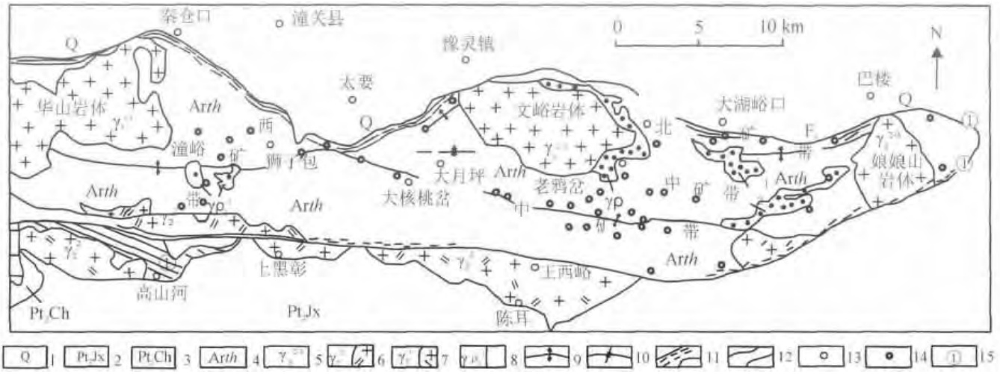
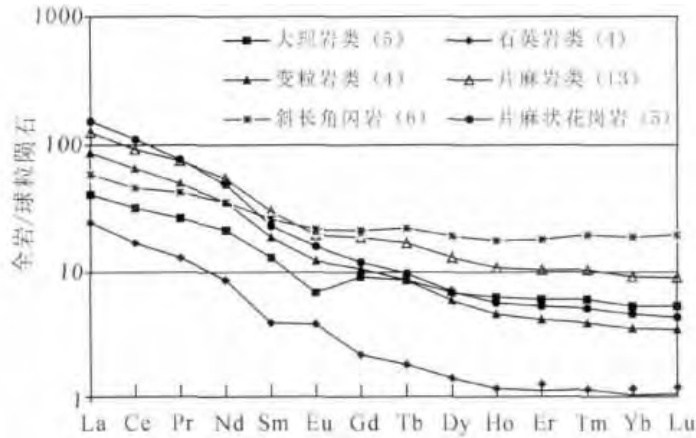
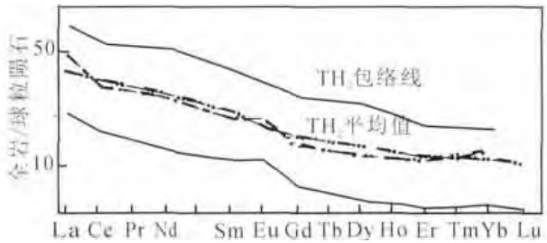
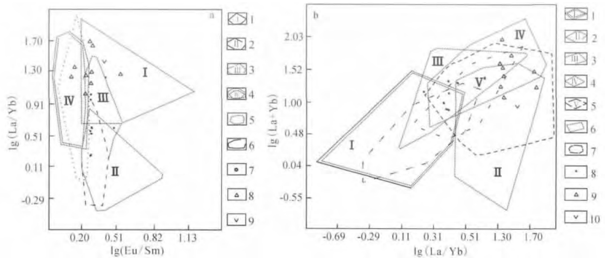
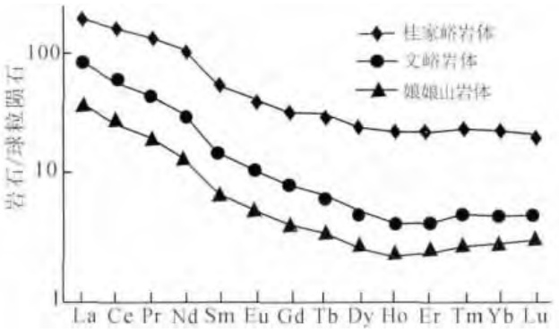
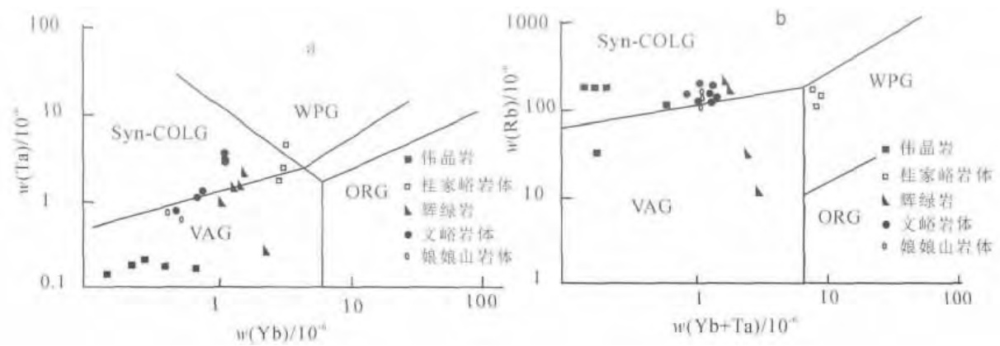
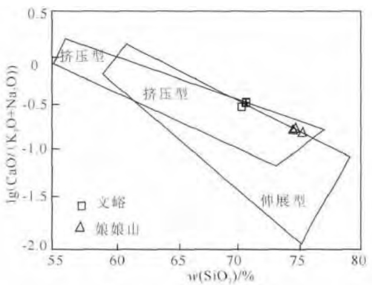
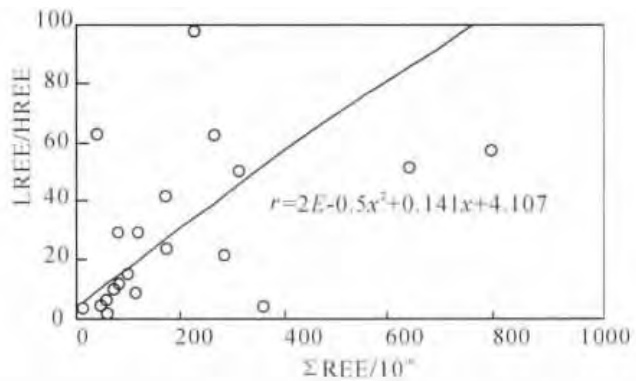
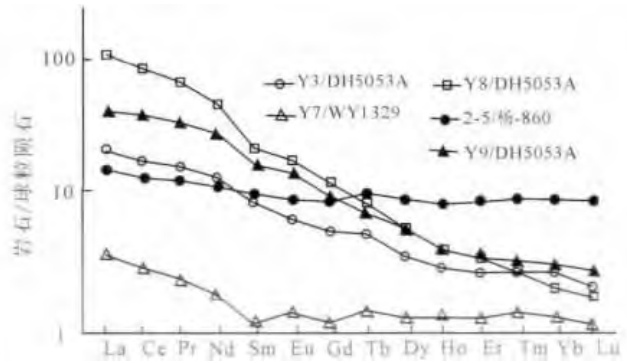

# 河南小秦岭金矿稀土元素地球化学特征及地质意义  

冯建之，张灯堂，张为民，王杏村，崔燮祥，刘宗彦，王振强( 河南省地质矿产勘查开发局 第一地质矿产调查院，河南 洛阳 471023)  

摘要: 小秦岭金矿产于新太古界太华群变质岩中，其中的次级拆离断裂为赋矿构造。为了探究矿床的地球化学特征和矿床成因，从矿区主要地质体采集了100 件来自太华群地层、文峪岩浆岩和矿石的样品进行测试，其稀土元素的主要特征为: 太华岩群的 ΣREE 值为 $30.81\times10^{-6}\sim188.66\times10^{-6}$ ; $\delta\mathrm{Eu}$ 值为 $0.62\sim1.24$ ; 花岗岩和脉岩类 ΣREE 值为 58. 22$\times10^{-6}\sim365.98\times10^{-6}$ ; $\delta\mathrm{Eu}$ 为 $0.90\sim1.10$ ; 矿石的 ΣREE 值多集中于 $76.74\times10^{-6}\sim358.22\times10^{-6}$ ， $\delta\mathrm{Eu}$ 值多集中于$0.74\sim1.14$ 。结果表明: 各地质体稀土总量接近，没有 Eu 异常或有微弱的正、负铕异常; 矿石的稀土元素含量特征与太华群接近，而与文峪等花岗岩相差较远。分析认为，成矿物质主要来源于太华群地层而不是花岗岩。  

关键词: 小秦岭金矿; 稀土元素; 成矿物质; 河南省中图分类号: P618. 51 文献标志码: A 文章编号: 1000 － 8527( 2014) 06 － 1151 － 10  

# REE Geochemical Characteristics of Xiaoqinling Gold Deposits and Their Geological Significance  

FENG Jian-zhi，ZHANG Deng-tang，ZHANG Wei-min，WANG Xing-cun， CUI Xie-xiang，LIU Zong-yan，WANG Zhen-qiang ( No. 1 Institute of Geological and Mineral Resources Survey，Henan Provincial Bureau of Geo-exploration and Mineral Development，Luoyang，Henan 471023，China)  

Abstract: The Xiaoqinling gold deposits are located in the Neoproterozoic Taihua Group，of which the secondary detachment faults are the major ore bearing structure． In order to figure out geochemical characteristics and genesis of ore deposit，we collected 100 samples from the Taihua Group ，magmatic rocks and gold ores of main geological body in the study area，respectively． The main characteristics of rare earth elements are as following: the ΣREEs of Taihua Group are from $30.81\times10^{-6}$ to $188.66\times10^{-6}$ ，and the δEu values are from 0. 62 to 1. 24; ΣREEs of granite and dike rocks are from $58.22\times10^{-6}$ to $365.98\times10^{-6}$ ，and the δEu values are from 0. 90 to 1. 10; ΣREE of gold ores are mainly concentrated in $76.74\times10^{-6}-358.22\times10^{-6}$ ，δEu values are mainly concentrated in 0. 74 － 1. 14． The results show that the $\Sigma\mathrm{REE}$ from the three kinds of geologic body are similar，and there is no Eu anomaly or there are only weakly positive and negative europium anomaly． The rare earth distribution of ores is similar to that of the Taihua Group，and is different from that of Wenyu granite． It proves that the ore-forming materials come from the Taihua Group instead of granite．  

Key words: Xiaoqinling gold deposit; REE; ore-forming material; Henan Province  

# 0 引 言  

中，是我国重要的黄金产地，其小秦岭金矿产于新太古界太华群变质岩中，近东西向次级拆离断裂为赋矿构造( 图 1)［1］。在小秦岭地区，由西向小秦岭位于华北地台南缘的东西向构造体系  

  
图 1 小秦岭地区地质矿产图( 据文献 ［1］ 修编)  
Fig. 1 Geological and mineral map of Xiaoqinling area ( modified from reference ［1］)  

1. 第四系; 2. 中元古界蓟县系; 3. 中元古界长城系; 4. 太古宇太华群; 5. 燕山期花岗岩; 6. 熊耳期花岗岩; 7. 中岳期花岗岩; 8.中岳期伟晶状花岗岩; 9. 背斜构造; 10. 向斜构造; 11. 糜棱岩及边界断裂; 12. 地质界线及地层不整合线; 13. 地名; 14. 金矿床( 石英脉型) ; 15. 构造蚀变岩型金矿  

东大体等间距分布着中生代花岗岩体( 基) ，金矿围绕文峪花岗岩体呈半环状分布。金矿床基本为石英脉型热液金矿［1 －2］，矿体为脉状、板状、透镜状，矿体倾向分为两组，南倾组一般为 $45^{\circ}$ 左右，北倾组一般为 $20^{\circ}\sim30^{\circ}$ 。矿体厚 $1\textrm{m}$ 左右，主要有用组分为金，其赋存形态以自然金为主，品位为 $6\times10^{^{-6}}\sim13\times10^{^{-6}}$ 。部分矿床共生钼或铅，多数矿床伴生银、铅、钨、铜及碲等，矿石类型主要为硫化物 －石英型［3］。  

本文重点对小秦岭金矿含矿围岩、岩浆岩及金矿石中稀土元素地球化学特征进行比较研究，以探讨该区金矿成矿作用。  

# 1 地层稀土元素  

# 1. 1 地层概述  

小秦岭地区地层( 岩石) 为新太古界太华群，呈“地垒”状分布于南北边界拆离带之间，划分为上、下两套岩石单位。下部为基性喷发表壳岩，呈包体或残块分布于变质花质岩中，如杨寨峪灰色片麻岩为斜长花岗岩( 英云闪长岩) － 花岗闪长岩( TTG 岩系) 的变质产物，属钠质花岗岩系，变质为各类片麻岩; 四范沟片麻状花岗岩的原岩为以二长花岗岩为主的岩石组合，属钾质花岗岩。上部为观音堂组变粒岩、浅粒岩、黑云斜长片麻岩，局部有磁铁矿条带，为一套滨海—沙滩相泥质沉积岩，其间有基性火山岩喷出; 焕池峪组大理岩为一套浅海相沉积碳酸盐岩。本区地层( 岩石) 具花岗 －绿岩特征，变质程度不高，主要为角闪岩相、绿片岩相，下部局部见麻粒岩相。  

# 1. 2 地层( 岩石) 稀土元素  

小秦岭主要赋矿地层的分析样品主要从大理岩类、石英岩类、变粒岩类、片麻岩类、斜长角闪岩类、片麻状花岗岩类中分别取样，共获得有效样品37 件，经中国地质科学院地球物理地球化学勘查研究所测试。稀土元素含量采用 Finnigan-MAT 公司 生产的双聚焦高分辨率 ICP-MS 测定( 标准 DZ/T0223—2001 监控) ，稀土元素含量结果及特征值见表 1、图 2。根据表 1 和图 2 可知，斜长角闪岩 $\Sigma$ REE 平均为 $107.70\times10^{-6}$ ( 不含 Y) ，低于华北地台角闪岩相地层 $\scriptstyle\sum$ REE ( $134.00~\times$ $10^{-6}\cdot$ )［4］，远高于黎彤［5］报道的上地幔的 $\Sigma$ REE 值( $17.70\times10^{-6}$ ) 。轻重稀土元素比值为 3. 84，显示轻稀土元素富集，其富集程度低于迟清华等［4］的统计数据( $18.34\times{10}^{-6}\sim18.39\times{10}^{-6})$ 。 $(\mathrm{La}/\mathrm{Yb})_{\mathrm{~N~}}$ 比值为 3. 27，说明在球粒陨石标准化曲线图上呈右倾。( $\mathrm{La}/\mathrm{Sm})_{\textrm{N}}=2.32$ ，( Gd /Yb) $_\mathrm{~\scriptsize~N~}=1.15$ ，说明轻稀土元素的分异程度大于重稀土元素。δEu 为0. 92，即具有弱 $\mathrm{Eu}$ 负异常［4］。小秦岭金矿片麻岩类与片麻状花岗岩的 $\Sigma$ REE 接近，其轻重稀土元素含量比值分别为 10. 43 和 20. 64，说明其分异程度较高，后者的分异程度更高; 二者的球粒陨石标准化图上右倾曲线斜率较大，( La /Yb) $\mathrm{N}$ 分别为14. 09 和 34. 04，片麻状花岗岩斜率较大。轻稀土元素分馏显著高于重稀土元素( 表 1) ，片麻状花岗岩的 δEu 为 0. 92，具弱 Eu 负异常，片麻岩 Eu负异常明显( $\delta\mathrm{Eu}=0.80\$ ) 。变粒岩∑REE 值为 117. 12$\times10^{-6}$ ，轻重稀土元素比值为 14. 99，说明轻稀土元素富集，轻重稀土元素分异强; 其球粒陨石标准化图显示曲线右倾，斜率较大 $\smash{\mathrm{~(~La/Yb)~}_{\mathrm{N}}}=$ 25. 17) ， $\mathrm{Eu}$ 为明显负异常( $\delta\mathrm{Eu}=0.83\$ 。大理岩和石英岩 $\Sigma$ REE 值较低，为 $64.64\times10^{-6}.$ ～$30.81\times10^{-6}$ ，轻重稀土元素比值显示轻稀土元素富集; 其球粒陨石标准化图显示曲线右倾，斜率较大。大理岩 $\mathrm{Eu}$ 负异常明显，石英岩 $\mathrm{Eu}$ 为明显正异常。  

表1 变质岩稀土元素含量和特征值  
Table 1 REE compositions and eigenvalues of metamorphic rocks   

<html><body><table><tr><td>岩性</td><td>样数</td><td>La</td><td>Ce</td><td>Pr</td><td>Nd</td><td>Sm</td><td>Eu</td><td>Gd</td><td>Tb</td><td>Dy</td><td>Ho</td></tr><tr><td>大理岩类</td><td>5</td><td>12. 74</td><td>25.58</td><td>3.28</td><td>12. 76</td><td>2.56</td><td>0.51</td><td>2.40</td><td>0.41</td><td>2. 25</td><td>0.46</td></tr><tr><td>石英岩类</td><td>4</td><td>7.65</td><td>13.72</td><td>1. 59</td><td>5.21</td><td>0.79</td><td>0.29</td><td>0.60</td><td>0.09</td><td>0.48</td><td>0.09</td></tr><tr><td>变粒岩类</td><td>4</td><td>26.67</td><td>51. 96</td><td>6.13</td><td>21. 32</td><td>3.66</td><td>0.90</td><td>2.76</td><td>0. 41</td><td>1. 97</td><td>0.34</td></tr><tr><td>片麻岩类</td><td>13</td><td>38.11</td><td>74.65</td><td>9. 12</td><td>32.33</td><td>5.89</td><td>1. 45</td><td>4.93</td><td>0.81</td><td>4. 20</td><td>0.79</td></tr><tr><td>斜长角闪岩</td><td>6</td><td>18.09</td><td>37.12</td><td>5.22</td><td>21.38</td><td>5. 04</td><td>1. 61</td><td>5.51</td><td>1. 05</td><td>6.19</td><td>1. 27</td></tr><tr><td>片麻状花岗岩</td><td>5</td><td>47. 46</td><td>89.04</td><td>9. 26</td><td>29. 61</td><td>4. 49</td><td>1. 18</td><td>3.10</td><td>0. 47</td><td>2.32</td><td>0.42</td></tr><tr><td>几何均值</td><td>37</td><td>24. 27</td><td>47. 29</td><td>5. 77</td><td>20. 68</td><td>3. 78</td><td>0. 99</td><td>3. 20</td><td>0.53</td><td>2. 77</td><td>0.52</td></tr><tr><td>岩性</td><td>样数</td><td></td><td>Tm</td><td>Yb</td><td>Lu</td><td>人 EREE</td><td>LREE/</td><td>SEu</td><td>( La/</td><td>( La/</td><td>(Gd/</td></tr><tr><td>大理岩类</td><td>5</td><td>1. 31</td><td>0.20</td><td>1. 14</td><td>0.17</td><td>9. 44</td><td>HREE 64. 46 6.89</td><td>0.62</td><td>Yb) N 8.02</td><td>Sm) N 3.21</td><td>Yb) N 1. 74</td></tr><tr><td>石英岩类</td><td>4</td><td>0. 25</td><td>0.04</td><td>0.23</td><td>0.03</td><td>15. 08</td><td>30.81 16. 16</td><td>1. 24</td><td>23.86</td><td>6. 25</td><td>2.16</td></tr><tr><td>变粒岩类</td><td>4</td><td>0.90</td><td>0.13</td><td>0.76</td><td>0.11</td><td>2. 49 117. 12</td><td>14. 99</td><td>0.83</td><td>25. 17</td><td>4.70</td><td>3.00</td></tr><tr><td>片麻岩类</td><td>13</td><td>2.20</td><td>0.34</td><td>1. 94</td><td>0.28</td><td>22.10</td><td>174. 84 10. 43</td><td>0.80</td><td>14. 09</td><td>4. 18</td><td>2.10</td></tr><tr><td>斜长角闪岩</td><td>6</td><td>3.78</td><td>0.64</td><td>3.97</td><td>0.61</td><td>35.36</td><td>107.70 3.84</td><td>0.93</td><td>3.27</td><td>2.32</td><td>1. 15</td></tr><tr><td>片麻状花岗岩</td><td>5</td><td>1. 15</td><td>0.17</td><td>1. 00</td><td>0.14</td><td>11. 62</td><td>188. 66 20. 64</td><td>0.92</td><td>34. 04</td><td>6.82</td><td>2.56</td></tr><tr><td>几何均值</td><td>37</td><td>1. 47</td><td>0.23</td><td>1. 33</td><td>0.19</td><td>12. 15</td><td>111. 55 10. 04</td><td>0.85</td><td>13. 09</td><td>4. 14</td><td>1. 99</td></tr></table></body></html>

注: 样品由中国地质科学院地球物理地球化学勘查研究所测试完成; 稀土元素含量的单位为 $10^{-6}$ 。  

  
图2 变质岩稀土元素配分曲线  
Fig. 3 Chondrite-normalized REE patterns of Archean tholeiite $\mathrm{TH}_{2}$ ( Base map from reference ［5］)  

本区变质岩总体与大陆拉斑玄武岩稀土元素分布型式［6］相类似，且与 K. C. Condie［7］太古宙拉斑玄武岩 $\mathrm{TH}_{2}$ 型相一致( 图 3) 。  

稀土元素在变质作用过程中是不活动的，至少在低角闪岩相变质作用时不活动，总体相当于中下地壳的稀土元素丰度［8］，各种岩石中的显著差异是由于原岩的不同造成的。  

  
Fig. 2 Chondrite-normalized REE patterns of metamorphic rock   
图3 太古宙拉斑玄武岩 $\mathrm{TH}_{2}$ 球粒陨石标准化图式( 底图据参考文献 ［5］)  

# 1. 3 原岩恢复  

根据稀土元素分析资料，对该区主要变质岩类作 $\mathrm{lg(La/Yb)}~-\mathrm{lg(Eu/Sm)}$ 图解和 $\mathrm{lg(La+Yb)}$ －$\mathrm{lg(La/Yb)}$ 图解( 图 4a，b) ，从图 4 中可以看出，斜长角闪岩主要落在大洋拉斑玄武岩区( Ⅱ) 和大陆、岛弧玄武岩区( Ⅲ、 $\mathrm{V}$ ) ，集中于两区重叠部位，个别落入太古宙沉积岩区。黑云斜长片麻岩主要落在酸性火山岩区( Ⅳ) 和太古宙沉积岩区或Ⅳ与Ⅲ区重叠部分，反映它们的原岩为玄武岩和英安岩及火山碎屑岩。变粒岩落在中酸性火山岩区和太古宙沉积岩区，其原岩为流纹英安岩或凝灰岩和沉积岩。此判别与岩石化学成分判别所得  

  
图 4 小秦岭主要变质岩的 lg( La/Yb) $\mathrm{{-lg}(\mathrm{{Eu}/\mathrm{{Sm})}}}$ 图解( a) 和 $\mathrm{{lg}(L a+Y b)\partial\mathrm{{-lg}(L a/Y b)}}$ 图解( b)  
Fig. 4 lg( La / Yb) -lg( Eu / Sm) and lg( $\mathrm{La}+\mathrm{Yb}.$ ) -lg( La / Yb) diagrams of main metamorphic rocks from Xiaoqinling area图 a: 1. 太古宙沉积岩区; 2. 大洋拉斑玄武岩; 3. 大陆、岛弧玄武岩及碱性玄武岩区; 4. 中酸性火山岩区; 5. 太古宙基性岩区;6. 新太古代沉积岩区; 7. 斜长角闪岩; 8. 黑云斜长片麻岩; 9. 黑云浅粒 － 变粒岩。图 b: 1. 大洋拉斑玄武岩; 2. 太古宙沉积岩区; 3. 岛弧玄武岩区; 4. 中酸性火山岩区; 5. 大陆玄武岩及大洋岛弧玄武岩区; 6. 太古宙基性岩区; 7. 新太古代沉积岩区; 8.斜长角闪岩; 9. 黑云斜长片麻岩; 10. 黑云浅粒 － 变粒岩  

的结论［6］相一致。  

综合上述，小秦岭太华群斜长角闪岩原岩为拉斑玄武岩( 镁铁质火山岩) ，四范沟片麻状花岗岩中的斜长角闪岩生成于大洋 － 岛弧环境，观音堂组及其以上地层中的斜长角闪岩具大陆玄武岩特征，少数观音堂组和杨寨峪片麻岩中的斜长角闪岩可能为副变质岩，其原岩为镁铁质泥灰岩、黑云角闪斜长片麻岩和黑云斜长片麻岩，变粒岩的原岩主要为玄武岩 － 安山岩和流纹岩 － 英安岩及火山碎屑岩，少数为杂砂岩。石英岩、含石墨和高铝矿物片麻岩及各类蚀变大理岩等原岩为滨海相—浅海相和碎屑、泥砂质、碳酸盐岩类。  

# 2 主要岩浆岩稀土元素  

# 2. 1 岩浆岩概述  

本区岩浆岩活动频繁，具有多期次、多岩类、多成因特征。总体以花岗岩类为主，另外发育基性岩脉。本区岩浆活动主要为埠平、五台—中岳、熊耳和燕山等旋回。其中阜平旋回主要为 TTG 岩系( 杨寨峪灰色片麻岩) 和钾质花岗岩( 四范沟片麻状花岗岩) 。TTG 岩系单粒锆石 U-Th 年龄为 2 400$\sim2~600~\mathrm{Ma(}$ 早期) 和 $1900\sim2000\mathrm{Ma}(}$ 晚期) ［9］。它们均为侵入岩，并已强烈变质。中岳—五台旋回形成桂家峪黑云母化角闪二长花岗岩和广泛分布的伟晶花岗岩。桂家峪岩体分布于小河断裂北侧，面积为 $12~\mathrm{km}^{2}$ ，据岩石结构分为 2 个构造单元。锆石 $\mathrm{U}\mathrm{\mathcal{A}b}$ 年龄为( $1748\pm25\$ ) Ma，Rb-Sr 等时线年龄为 $1552\mathrm{Ma}^{\left[10\right]}$ 。岩石中角闪石退变为黑云母。  

伟晶花岗岩呈脉状和不规则团块状，往往构成第二期混合岩化岩石和混合岩脉体，其中以含较多磁铁矿和褐帘石为特征，分布广泛。  

熊耳旋回区域上出现三叉裂谷，中性—酸性岩浆喷发，形成熊耳群安山岩，在小秦岭地区形成小河岩体。该岩体分布在小河断裂南侧，带状分布，长约 $25~\mathrm{km}$ ，宽 $3\sim6~\mathrm{km}$ ，东端侵入于太华群变质花岗岩系，西端被中元古界官道口群和高山河组沉积覆盖，岩体总体分为两个结构单元。锆石 U-Pb 法年龄为 $2328\pm14\$ ) $\mathrm{{Ma}^{[11]}}$ 。  

燕山旋回形成文峪、娘娘山岩体和陕西境内的华山等岩体; 这些岩体从小秦岭变质核杂岩西端向东大体等间距分布，其次尚有广泛分布的花岗岩伟晶岩脉和少量煌斑岩脉。  

文峪黑云二长花岗岩体面积为 $65~\mathrm{km}^{2}$ ，据岩性和接触关系，可分为早期、主期和补充期 3 个岩浆活动期和 4 个单元。各单元之间多呈涌动 －脉动接触。岩体呈椭圆形，长轴与区域构造线一致，与围岩接触界面呈规则、清晰的圆滑曲线。围岩片麻理在接触带比较紊乱，显示强力就位特点。主期3 个单元在空间上呈套环状展布，结构分带明显，边部暗色包体相对集中，反映本序列具有底辟和气球膨胀侵位机制特点。锆石 SHRIMP  

表2 岩浆岩稀土元素平均值( $w_{\mathrm{B}}/10^{-6}$ )  
Table 2 Average contents of REEs from magmatic rocks( $10^{-6}$ )   

<html><body><table><tr><td>岩体样 序号</td><td>数</td><td>La</td><td>Ce</td><td>Pr</td><td></td><td>Nd</td><td>Sm</td><td>Eu</td><td>Gd</td><td>Tb Dy</td><td>Ho</td><td>Er</td><td></td><td>Tm</td><td>Yb</td><td>Lu</td><td>Y</td><td>EREE</td><td>LREE/ HREE</td><td>SEu</td></tr><tr><td>1</td><td>3</td><td></td><td></td><td>71.32 155.79 19.72</td><td></td><td>73.3</td><td>12.643.54</td><td></td><td>10.11</td><td>1.68</td><td>9.09</td><td>1. 79</td><td>5.25</td><td>0.88</td><td>5.31</td><td>0.81</td><td>51.88</td><td>365.98</td><td>9.63</td><td>0.93</td></tr><tr><td>2</td><td>7</td><td></td><td>31.09 56.99</td><td>6.59</td><td>21.87</td><td>3.40</td><td>0.89</td><td></td><td>2.39</td><td>0.36</td><td>1.75</td><td>0.32</td><td>0.96</td><td>0.17</td><td>1.07</td><td>0.17</td><td>10.23</td><td>127.06</td><td>16.81</td><td>0.91</td></tr><tr><td>3</td><td>3</td><td></td><td>13.96 26.15</td><td>2.93</td><td></td><td>9.80</td><td>1.59</td><td>0.45</td><td>1.17</td><td>0.18</td><td>0.94</td><td>0.18</td><td>0.56</td><td>0.10</td><td>0.66</td><td>0.11</td><td>5.72</td><td>58.22</td><td>14.07 0.96</td><td></td></tr><tr><td>4</td><td>5</td><td></td><td>80.32 134.90 14.18 42.17</td><td></td><td></td><td>4.71</td><td></td><td>1.37</td><td>2.51</td><td>0.31</td><td>1.31</td><td>0.22</td><td>0.58</td><td>0.07</td><td>0.39</td><td>0.06</td><td>5.96</td><td>282.52</td><td>50.94 1.10</td><td></td></tr><tr><td>5</td><td>1</td><td></td><td>34.76 83.38</td><td></td><td>10.6037.96</td><td>6.59</td><td></td><td>1.76</td><td>5.02</td><td>0.80</td><td>4.12</td><td>0.79</td><td>2.31</td><td>0.38</td><td>2.22</td><td>0.33</td><td>22.65</td><td>188.71</td><td>10.96 0.90</td><td></td></tr><tr><td>6</td><td>4</td><td>33.18</td><td>63.38</td><td>8.90</td><td>34.97</td><td>7.22</td><td></td><td>2.24</td><td>6.62</td><td>1.10</td><td>5.83</td><td>1. 09</td><td>3.02</td><td>0.47</td><td>2.74</td><td>0.39</td><td>30.35</td><td>168.13</td><td>7.05</td><td>0.97</td></tr></table></body></html>

注: 1. 桂家峪岩体; 2. 文峪岩体; 3. 娘娘山岩体; 4. 伟晶状花岗岩; 5. 闪长岩脉; 6. 辉长辉绿岩脉。  

U-Pb 测年成岩年龄为( $138.4\pm2.5\$ $\mathrm{Ma}^{[12]}$ 。  

娘娘山黑云二长花岗岩体面积为 $33~\mathrm{km}^{2}$ ，侵位于变质核杂岩东段，岩体与围岩接触面多内倾，少数外倾，倾角 $30^{\circ}\sim50^{\circ}$ 。该序列分为 2 个岩浆活动期、3 个单元，各单元之间显示脉动 － 涌动接触类型，具有膨胀式推挤特征; 在岩体外接触带，围岩中发育一组轴面平行边界的揉皱，显示强力就位特征。锆石 SHRIMP $\mathrm{U}\mathrm{\mathbf{+}b}$ 测定成岩年龄为( 141. 7 ± 2. 5) Ma［12］。  

另外，加里东、华力西、印支等旋回主要形成区内广泛分布的基性岩脉，分为辉长岩脉和辉绿岩脉，这些岩脉的形成可延续到燕山期。  

# 2. 2 岩浆岩稀土元素  

小秦岭地区花岗岩的样品采自文峪、娘娘山、桂家峪等二长花岗岩和伟晶状花岗岩、辉绿岩脉、闪长岩脉等脉岩，共采集了 23 件代表性样品，经由中国地质科学院地球物理地球化学勘查研究所分析，其研究区主要岩浆岩体及岩脉的稀土元素含量特征可以分为 3 类( 表 2) 。  

第一类为花岗岩，包括桂家峪、文峪、娘娘山岩体，稀土元素总量由 $365.98\times10^{-6}$ ，逐渐降低为 $58.22\times10^{-6}$ ，娘娘山岩体最低; 不具 $\mathrm{Eu}$ 异常( $\delta\mathrm{Eu}=0.96\$ ) 或具弱负异常 ( $\delta\mathrm{Eu}=0.93\sim\$ 0. 91) ， $\delta\mathrm{Eu}$ 值接近壳幔型花岗岩( 0. 84) ［13］，指示了花岗岩类地幔成因的特征。LREE /HREE 值为$9.63\sim16.81$ ，桂家峪岩体最低，文峪岩体最高，显示稀土配分曲线图上文峪岩体斜率最大，而桂家峪岩体斜率最小( 图 5) 。  

第二类为伟晶花岗岩脉，其 $\scriptstyle\sum$ REE 值很高，为 $282.52\times10^{-6}$ ，轻重稀土元素分异最强( LREE /HREE $=50.94\$ ) ，在稀土元素配分曲线上斜率最大( 图 6) ，具有弱 Eu 正异常( $\delta\mathrm{Eu}=1.10\$ ) 。伟晶花岗岩的 REE 特征一方面反映其由部分熔融残余相最终形成，其中较多长石类矿物的存在导致 Eu 的弱正异常; 另一方面，伟晶花岗岩中较多褐帘石的存在导致 Ce 的大量富集，由此造成轻稀土元素总量增高和 LREE /HREE 值的升高。  

  
图5 花岗岩稀土元素配分曲线图( 球粒陨石引自参考文献 ［14］)  

  
Fig. 5 Chondrite-normalized REE patterns of granites ( Chondrite from reference ［14］)   
图6 脉岩稀土元素配分曲线图( 球粒陨石引自参考文献 ［14］)  
Fig. 6 Chondrite-normalized REE patterns of vein rocks ( Chondrite from reference ［14］)  

第三类为中基性岩脉，稀土元素总量为$188.71\times10^{-6}\sim168.13\times10^{-6}$ ，稀土配分曲线斜率较小，LREE /HREE 值为 $7.05\sim10.96$ ，δEu 值为$0.90\sim0.97$ ，不具 $\mathrm{Eu}$ 异常或具弱负异常，说明基性岩脉稀土元素分异程度较区内花岗岩低。  

  
Fig. 7 Tectonic discrimination diagrams ( Base map from reference［14］)  

a. $w($ Ta) $-w(\mathrm{Yb})$ 构造环境判别图; b. $w($ Rb) $-w(\mathrm{~Yb~+~Ta})$ 构造环境判别图; Syn-COLG. 同碰撞花岗岩; VAG. 火山弧花岗岩;WPG. 板内花岗岩; ORG. 洋中脊花岗岩  

根据稀土元素和微量元素图解( 图 7) 可分析岩浆岩形成的大地构造环境。岩浆岩多数均在同碰撞花岗岩和火山弧花岗岩中，文峪花岗岩则主要在同碰撞花岗岩中( 图 7a) ; 娘娘山花岗岩均落入火山弧花岗岩中，文峪和娘娘山花岗岩则全部落入同碰撞花岗岩中( 图 7b) 。上述特征反映了岩浆岩的生成环境，同时显示文峪花岗岩和娘娘山花岗岩两个岩体产生环境存在明显的差异。  

由于在中生代印支运动( $245\sim215\mathrm{Ma})$ 之后，华北与扬子两陆块全面碰撞作用引起华北陆块南缘向南仰冲，该区在燕山期不可能存在岛弧，所以两岩体在一定程度上表现为火山弧花岗岩的性质，其源岩可能为陆 － 陆碰撞中捕获了地壳深部或壳幔之间的大洋岩石圈物质残片，这些残片在大陆岩石圈加厚过程中又经历了不相容元素的富集过程。  

本区燕山期剧烈的构造作用和花岗岩的大规模活动说明，陆内造山阶段构造活动依然十分活跃。毛景文等［15］通过对华北地区中—新生代大规模成矿作用的研究，发现中国北方大规模成矿作用出现在 $200\sim160~\mathrm{Ma}$ 、 $140\mathrm{Ma}$ 左右和 $120\mathrm{Ma}$ 左右3 个峰期，对应的地球动力学背景分别为后碰撞造山过程、构造体制大转变晚期和岩石圈大规模快速减薄。文峪和娘娘山岩体的形成年龄分别为( $138.4\pm2.5\rangle$ ) $\mathrm{Ma}$ 、( $141.7\pm2.5)$ Ma，即形成于晚侏罗世。这个时期也正是造山带由挤压碰撞向伸展垮塌的转变阶段，在 $\mathrm{lg}\left(\mathrm{\left(\begin{array}{l}{\mathrm{CaO}}\end{array}\right)/(\begin{array}{l}{\mathrm{K}_{2}\mathrm{O}\mathrm{~+~}}\end{array}\right)}$ $\mathrm{Na}_{2}\mathrm{O})\mathrm{~}\mathrm{)~}-w(\mathrm{SiO}_{2})$ 图( 图 8) 上，两岩体投在挤压型—伸展型的界线附近。  

因此，文峪和娘娘山岩体形成于秦岭造山带由碰撞阶段向岩石圈伸展过程的转变时期，这个过程导致减压 － 增温，是大规模花岗岩浆活动形成的最佳时期。  

  
图 7 构造环境判别图( 底图据参考文献［14］)  
图8 小秦岭花岗岩 $\mathrm{lg}(\mathrm{CaO}/(\mathrm{K}_{2}\mathrm{O}+\mathrm{Na}_{2}\mathrm{O}))-w(\mathrm{SiO}_{2})$ 图 ( 底图据文献 ［16］) Fig. 8 lg ( CaO / ( $\mathrm{K}_{2}\mathrm{O}+\mathrm{Na}_{2}\mathrm{O})$ ) $\mathrm{{\ell}}\mathrm{{SiO}}_{2}$ diagram of granites from Xiaoqinling area( Base map from reference ［16］)  

# 3 金矿石稀土元素  

# 3. 1 矿床地质  

研究区内矿床为石英脉型，均产于韧性剪切带内，主体走向近东西，倾向南或北。矿体呈板状、脉状或透镜状，矿体规模以大中型为主。  

矿石中主要矿物为石英，其次为黄铁矿以及方解石、绢云母、铁白云石和方铅矿、黄铜矿、闪锌矿等; 微量矿物为自然金、银金矿、碲金矿及白钨矿、辉钼矿、辉铜矿、磁铁矿等。自然金成色高，多在 $907\text{\textperthousand}$ 以上，最多为 $995\text{\textperthousand}$ 。矿石中$\mathrm{Au/Ag}$ 比值变化大，变化范围为 $0.14\sim4.75$ ，绝大多数在 $0.73\sim2.83$ 。主要载金矿物为黄铁矿，其次为石英和方铅矿。矿石中主要有用组分为金，少数矿床共生铅，个别矿床共生钼，多数矿床伴生银、钨、铜等。  

# 3. 1. 1 同位素特征  

据区内14个矿床统计[1 17]，硫同位素平均值$\left(\mathbf{\nabla}\delta^{34}\mathbf{S}\langle\mathbf{\vec{E}}\rangle\right)$ 为 $3.3\%o\sim8.6\%o$ ，主要集中在 $2\%o\sim3\%o$ 。与区内太华群变质岩( $\delta^{34}\mathrm{S}$ 值为 $3.0\text{\textperthousand}$ 和文峪花岗岩( $\delta^{34}\mathrm{S}$ 值为 $3.1\text{\textperthousand}$ 一致，接近地幔硫，显示深源硫特征。  

金矿床的 $\mathrm{^{206}P b/^{204}P b}$ 值为 $17.054\sim17.999$ ，平均为 17. 138; $\mathrm{^{207}P b/^{204}P b}$ 值为 $15.333\sim15.583$ ，平均为 15. 439; ${}^{208}\mathrm{Pb}/{}^{204}\mathrm{Pb}$ 值为 $37.342\sim38.474$ ，平均 37. 706。与太华群变质岩的这 3 个比值( 分别为17. 698、15. 439、38. 635) 和文峪花岗岩的这 3 个比值( 17. 172、15. 439、38. 199) 比较一致。按照朱炳泉［18］的方案，铅的来源为地幔。  

矿石中热液石英的 $\delta^{18}0_{\mathrm{H}_{2}\mathrm{0}}$ 值为 $-0.22\%o$ ～$+7.71\text{\textperthousand}$ ，与岩浆石英中水的氧同位素变化范围比较接近，表明金矿热液中可能以岩浆水为主，但混入了一定量天水。矿石中石英的 δD 值为$-47.3\%o\sim\textmd{-}116.13\%o^{[17]}$ ，与地幔初生水的数据接近( $\delta\mathrm{D}=\mathrm{~-~}60\%o\sim\mathrm{~-~}100\%o)$ 。据此可以认为本区金矿成矿流体应是幔源的初生水上升、淋滤围岩的有用组分而成。  

# 3. 1. 2 流体包裹体  

矿石中流体包裹体的液相成分为: 阳离子以$\mathrm{Na}^{+}$ 为主，其次为 $\mathrm{K}^{+}$ 和 $\mathrm{Ca}^{2+}$ 离子; 阴离子以 $\mathrm{Cl}^{-}$ 为主，其次为 ${\mathrm{S}}0_{4}^{2-}$ 和 $\mathrm{F^{-}}$ 离子。总体含量特征由到大小是: $\mathrm{Na}^{+}\to\mathrm{K}^{+}$ ， $\mathrm{Ca}^{2+}\mathrm{\to}\mathrm{Mg}^{2+}$ ， $\mathrm{Cl}^{-}{\to}\mathrm{SO}_{4}^{2-}$ $\mathrm{\rightarrowF^{-}}$ 。气相成分主要为 $\mathrm{H}_{2}\mathrm{O}$ 和 $\mathrm{CO}_{2}$ ，占气体组分的 $97\%\sim99\%$ ，其次有 CO、 $\mathrm{H}_{2}$ 、 $\mathrm{H}_{2}\mathrm{S}$ 、 $\Nu_{_{2}}$ 等，气液比值一般 $<10\%$ ; 盐度在 $6\%\sim14.2\%$ ，多数小于 $10\%$ 。  

# 3. 1. 3 成矿物理化学  

含金石英脉石英包裹体均一温度范围为 $110\sim$ $428\mathrm{~C~}$ ，多数为 $235\sim275\mathrm{~\textperthousand~}$ 。在小秦岭金矿田内，由文峪花岗岩体向外，成矿温度呈半环状逐渐降低。成矿压力变化范围为 $100\sim190~\mathrm{MPa}$ ，随着温度降低，压力也呈逐渐降低趋势。成矿热液 $\mathrm{pH}$ 值为 $3.92\sim7.20$ ，主矿化阶段多在 4 ～7，说明成矿处于酸到弱碱性环境，且以弱酸性为主。  

# 3. 2 矿石稀土元素  

小秦岭金矿东区金矿的形成具有多阶段、多期次、多类型的特点。它们的稀土元素特征也存在较大差异，矿床之间或同一矿床之内，其稀土元素特征变化较大。矿石中稀土元素含量最高为$4~774.52\times10^{-6}$ ，最低为 $7.64\times10^{-6}$ ; 稀土元素总量最高的矿石均在大湖矿区，这种矿石一般不在主要矿体上，而是与其中的钼矿密切相关。因此认为稀土元素的变化与成矿作用有关。  

矿石稀土元素的基本特征是稀土元素总量与轻稀土元素富集程度密切相关，并且轻重稀土元素比值与稀土元素总量呈正相关关系( 图 9) ，稀土元素总量高的样品( Y8 /DH5053A) 配分曲线斜率大，而稀土元素总量较低的样品配分曲线斜率小( Y9 /DH5053A) ，稀 土 元 素 总 量 最 低 的 样 品( Y7 /WY1329，2 － 5 /杨 － 860) 曲线斜率接近平缓状态( 图 10) 。  

  
图 9 金矿石 LREE/HREE-REE 图解Fig. 9 LREE /HREE-REE diagram of gold ores  

  
图 10 金矿石稀土元素配分曲线图( 球粒陨石据文献 ［14］)Fig. 10 Chondrite-normalized REE patterns of gold ores( Chondrite from reference ［14］)  

根据稀土元素的这些基本特征，将矿石中稀土元素分成 3 类，分别为强富集型、富集型和弱富集型( 表 3) 。  

第一类 REE 强烈富集型， $\scriptstyle\sum$ REE 值在 3 000$\times10^{-6}$ 以上，LREE /HREE 在 100 以上，说明轻重稀土元素强烈分异; 在球粒陨石标准化图上曲线右倾 斜 率 大， $\mathrm{\left(\mathrm{La}/Y b\right)_{N}}$ 值 范 围 为 539. 49 ～1 436. 46，但轻稀土元素和重稀土元素各自分异差异较大。此类矿石全部出现在大湖矿区。  

表 3 3 种类型的矿石稀土元素含量( $w_{\mathrm{B}}/10^{-6}\cdot$ )  
Table 3 REE contents of three kinds of ores $(10^{-6})$   

<html><body><table><tr><td></td><td>样品编号</td><td>La</td><td>Ce</td><td>Pr</td><td>PN</td><td>Sm</td><td>Eu</td><td>Gd</td><td>Tb</td><td>Dy</td><td>Ho</td><td>Er</td></tr><tr><td>类型 强富</td><td>Y27/DH5053A</td><td></td><td>1 256.02 1 901.30</td><td>188.13</td><td>485.13</td><td>35.38</td><td>2.94</td><td>12.92</td><td>1. 49</td><td>5.94</td><td>0.91</td><td>2.86</td></tr><tr><td>集型</td><td>Y35/DH5053A</td><td></td><td>1 301.69 2 421.21</td><td>256.64</td><td>688.92</td><td>60.26</td><td>10.78</td><td>22.52</td><td>2.06</td><td>6.71</td><td>0.72</td><td>2.15</td></tr><tr><td rowspan="15">富集型</td><td>Y9/WY1329</td><td>18.86</td><td>33.55</td><td>3.77</td><td>12.68</td><td>2.06</td><td>0.54</td><td>1.69</td><td>0.28</td><td>1. 45</td><td>0.28</td><td>0.69</td></tr><tr><td>Y3/DH5053A</td><td>20.39</td><td>40.08</td><td>5.35</td><td>20.18</td><td>3.76</td><td>0.88</td><td>2.30</td><td>0.39</td><td>1.59</td><td>0.27</td><td>0.71</td></tr><tr><td>Y4/DH5053A</td><td>74.69</td><td>130.44</td><td>12.92</td><td>38.36</td><td>4.41</td><td>1. 19</td><td>2.40</td><td>0.29</td><td>0.94</td><td>0.11</td><td>0.26</td></tr><tr><td>Y6/DH5053A</td><td>65.44</td><td>115. 99</td><td>9.99</td><td>27.61</td><td>2.73</td><td>0.73</td><td>1. 24</td><td>0.14</td><td>0.50</td><td>0.07</td><td>0.19</td></tr><tr><td>Y8/DH5053A</td><td>213.24</td><td>391.44</td><td>42.28</td><td>119. 46</td><td>13.48</td><td>3.79</td><td>7.53</td><td>0.84</td><td>3.08</td><td>0.42</td><td>1.00</td></tr><tr><td>Y9/DH5053A</td><td>54.26</td><td>129.92</td><td>16.83</td><td>59.99</td><td>9.27</td><td>2.92</td><td>5.73</td><td>0.71</td><td>2.97</td><td>0.45</td><td>1.13</td></tr><tr><td>Y19/DH5053A</td><td>63.81</td><td>124.59</td><td>16.92</td><td>68.09</td><td>15.73</td><td>3.78</td><td>16.66</td><td>3.20</td><td>18.87</td><td>3.76</td><td>10.54</td></tr><tr><td>Y11/DH5053A</td><td>41. 07</td><td>83.02</td><td>9.10</td><td>28.89</td><td>3.99</td><td>0.92</td><td>2.20</td><td>0.24</td><td>0.89</td><td>0.13</td><td>0.30</td></tr><tr><td>Y21/DH5053A</td><td>10.14</td><td>20.48</td><td>1.47</td><td>4.59</td><td>0.64</td><td>0.22</td><td>0.34</td><td>0.04</td><td>0.13</td><td>0.02</td><td>0.04</td></tr><tr><td>Y24/DH5053A</td><td>141.12</td><td>323.88</td><td>36.54</td><td>109.28</td><td>13.97</td><td>3.28</td><td>7.33</td><td>0.79</td><td>2.60</td><td>0.33</td><td>0.73</td></tr><tr><td>Y38/DH5053A</td><td>31.13</td><td>54.15</td><td>5.69</td><td>17. 44</td><td>2.21</td><td>0.73</td><td>1.37</td><td>0.19</td><td>0.92</td><td>0.17</td><td>0.47</td></tr><tr><td>Y5/DH435-OR</td><td>21.30</td><td>39.06</td><td>4.22</td><td>12.79</td><td>1.75</td><td>0.79</td><td>1.07</td><td>0.14</td><td>0.66</td><td>0.12</td><td>0.31</td></tr><tr><td>Y6/DH435-OR</td><td>79.80</td><td>157.75</td><td>16.52</td><td>48.47</td><td>5.92</td><td>1.63</td><td>3.00</td><td>0.36</td><td>1.48</td><td>0.22</td><td>0.59</td></tr><tr><td>Y7/DH435-OR</td><td>36.90</td><td>85.14</td><td>9.30</td><td>30.20</td><td>4.28</td><td>1.30</td><td>2.92</td><td>0.41</td><td>1.77</td><td>0.30</td><td>0.75</td></tr><tr><td>Y10/DH435-OR</td><td>21.21</td><td>48.65</td><td>5.79</td><td>20.57</td><td>4.42</td><td>1. 11</td><td>4.14</td><td>0.74</td><td>3.40</td><td>0.52</td><td>1.14</td></tr><tr><td></td><td>Y11/DH435-OR 17.71</td><td>32.23</td><td>3.91</td><td>13.81</td><td>2.62</td><td>0.61</td><td>2.11</td><td>0.37</td><td>1.88</td><td>0.35</td><td>0.97</td></tr><tr><td rowspan="6">弱富集型</td><td>Y7/WY1329</td><td>1.58</td><td>3.02</td><td>0.34</td><td>1. 17</td><td>0.18 0.09</td><td>0.25</td><td>0.06</td><td>0.35</td><td>0.08</td><td>0.22</td></tr><tr><td>2-5/杨-860</td><td>13.00</td><td>27.00</td><td>3.80</td><td>16.00</td><td>4.40 1.42</td><td>5.20</td><td>1.07</td><td>6.55</td><td>1.31</td><td>3.90</td></tr><tr><td>2-6/杨-860</td><td>9.43 17.62</td><td></td><td>2.31</td><td>8.59 2.22</td><td>0.90</td><td>3.11</td><td>0.73</td><td>4.62</td><td>0.96</td><td>3.00</td></tr><tr><td>2-7/杨-860</td><td>6.78</td><td>13.37</td><td>1.54</td><td>5.27</td><td></td><td></td><td></td><td></td><td></td><td></td></tr><tr><td></td><td>9.32</td><td>19. 27</td><td>2.65</td><td>1.04</td><td>0.32</td><td>1.40</td><td>0.31</td><td>1.70</td><td>0.35</td><td>0.97</td></tr><tr><td>Y8/DH435-OR</td><td>Tm</td><td>Yb Lu</td><td>9.53 Y</td><td>1.93</td><td>0.94</td><td>1. 97</td><td>0.37</td><td>2.11</td><td>0.41</td><td>1. 16</td></tr><tr><td>强富 集型</td><td>样品编号 Y27/DH5053A 0.30</td><td>1.67</td><td>0.24 24.80</td><td>3 895.23</td><td>EREE</td><td>LREE/HREE 288.51</td><td>8Eu 0.34</td><td></td><td>( La/Yb) N 539.49</td><td>( La/Sm) N 22.92</td><td>( Gd/Yb) N 6.40</td></tr><tr><td rowspan="14">富集型</td><td>Y35/DH5053A</td><td>0.12</td><td>0.65</td><td>0.09 18.30</td><td>4 774.52</td><td>135.34</td><td></td><td>0.74</td><td>1436.46</td><td>13.95</td><td>28.66</td></tr><tr><td>Y9/WY1329</td><td>0.12</td><td>0.67</td><td>0.10</td><td>7.50</td><td>76.74</td><td>13.53</td><td>0.86</td><td>20.19</td><td>5.91</td><td></td><td>2.09</td></tr><tr><td>Y3/DH5053A</td><td>0.11</td><td>0.71</td><td>0.08</td><td>8.00</td><td>96.80</td><td>14.71</td><td>0.85</td><td>20.60</td><td>3.50</td><td></td><td>2.68</td></tr><tr><td>Y4/DH5053A</td><td>0.02</td><td>0.11</td><td>0.01</td><td>3.63</td><td>266.15</td><td>63.29</td><td>1. 01</td><td>487.05</td><td>10.93</td><td></td><td>18.05</td></tr><tr><td>Y6/DH5053A</td><td>0.02</td><td>0.10</td><td>0.01</td><td>3.41</td><td>224.76</td><td>98.01</td><td>1. 05</td><td>469. 40</td><td>15.47</td><td></td><td>10.26</td></tr><tr><td>Y8/DH5053A</td><td>0.11</td><td>0.47</td><td>0.06</td><td>14. 14</td><td>797.20</td><td>58.01</td><td>1. 05</td><td>325. 44</td><td></td><td>10.21</td><td>13.25</td></tr><tr><td>Y9/DH5053A</td><td>0.15</td><td>0.87</td><td>0.12</td><td>15.50</td><td>285.32</td><td>22.52</td><td>1. 14</td><td>44.74</td><td></td><td>3.78</td><td>5.45</td></tr><tr><td>Y19/DH5053A</td><td>1.69</td><td>9.34</td><td>1.24</td><td>103.00</td><td>358.22</td><td>4.49</td><td>0.71</td><td>4.90</td><td></td><td>2.62</td><td>1.48</td></tr><tr><td>Y11/DH5053A</td><td>0.04</td><td>0.19</td><td>0.03</td><td>3.30</td><td>171. 01</td><td>41.54</td><td>0.86</td><td>155.05</td><td></td><td>6.64</td><td>9.58</td></tr><tr><td>Y21/DH5053A</td></table></body></html>  

第二类为 REE 富集型， $\scriptstyle\sum$ REE 值在 $10\times10^{-6}$ 和 $100\times10^{-6}$ 之间，多数样品大于 $100\times10^{-6}$ ;LREE /HREE 多为 $10\sim100$ ，仅1 个样品为9. 26，说明轻稀土元素富集，轻重稀土元素分异较强; 在球粒陨石标准化图上曲线右倾且斜率大， $\mathrm{\left(La/Yb\right)_{N}}$ 在10 和1 000 之间，Eu 无异常或有弱负异常，少数为弱正异常。此类矿石在区内主要矿区均有分布。  

第三类为 REE 弱富集型， $\Sigma$ REE 多为( $10~\sim$ $100)\times10^{-6}$ ，个别小于 $10\times10^{-6}$ 和大于 $100~\times$ $10^{-6}$ ; LREE /HREE 为小于 10，在球粒陨石标准化图上曲线右倾平缓，斜率不大。  

# 4 讨 论  

稀土元素中 $\mathrm{Eu}$ 异常 $(\delta\mathrm{Eu})$ 是示踪地壳 － 地幔交换作用的重要参数，幔源岩石一般无 Eu 异常，因此由地幔形成的新生地壳同样不具 $\mathrm{Eu}$ 异常。本区地壳经历了3 次规模较大的深源物质贯入( $\mathrm{Ar}_{3}$ 、$\mathrm{Pt}_{1}$ 、 $\mathrm{Pz}_{2}\mathrm{-Mz})$ 以及 4 次以沉积作用为主导的物质重新组合和再分配。这种作用的结果是本区地壳$75\%$ 以上的物质来源于地幔; 因此，总体显示地幔地球化学特征。除大理岩外，其他岩石 δEu 接近或略小于 1，另有石英岩为 Eu 正异常( $\delta\mathrm{Eu}=$ 1. 28) 。上述特征反映本区地壳演化中曾经历下地壳拆沉作用和地幔物质的大量贯入。  

研究区内主要岩浆岩稀土元素地球化学特征具有继承地幔岩的趋势，特别是燕山期花岗岩更为明显，其 $\delta\mathrm{Eu}$ 值均较接近，而与壳型花岗岩( $\delta\mathrm{Eu}=0.46\$ 差异较大，反映这些花岗岩为壳幔重熔而生成。只有伟晶花岗岩具 $\mathrm{Eu}$ 正异常，稀土元素的其他特征也与花岗岩类差异较大，反映它们有成因差别。文峪和娘娘山岩体均为陆内花岗岩，在 $w(\mathrm{Rb})-w(\mathrm{Yb}+\mathrm{Ta})$ 图上均落入同碰撞花岗岩区，而在 $\mathrm{Ta-Yb}$ 图上文峪岩体仍落入同碰撞花岗岩区，娘娘山岩体则落入火山弧花岗岩区，说明两岩体在生成构造环境上有差异，前者与金矿形成密切相关，而后者与金的成矿关系不清楚。另外，根据岩石地球化学特征，文峪岩体为埃达克岩，其含量为: $\mathrm{SiO}_{2}$ ， $0.77\%$ ; $\mathrm{Al}_{2}\mathrm{O}_{3}$ ， $15.72\%$ ;$\mathrm{{MgO}}$ ， $0.05\%$ ; Y， $10.23~\times~10^{-6}$ ; Yb， $1.07~\times$ $10^{-6}$ ; $\mathrm{Sr}$ ， $482.03\times10^{-6}$ 。尽管娘娘山岩体也具上述基本特征，但其 $\mathrm{Sr}$ 含量仅为 $276.66\times10^{-6}$ ，因此娘娘山岩体不是埃达克岩。一般认为埃达克岩是 $\mathrm{Au}$ 、 $\mathrm{Cu}$ 的成矿岩体，非埃达克岩不成矿［19］。  

矿石稀土元素特征比较复杂，总体可分为 3类: 一类为 REE 强富集，强分异，右倾曲线斜率大， $\mathrm{Eu}$ 为负异常，仅存在于大湖矿区; 另一类为富集稀土元素，轻重稀土元素比值在 $1\sim100$ ，球粒陨石标准化图上曲线右倾斜率大到平缓， $\mathrm{Eu}$ 元素分布特征不明显，正异常、负异常或无异常均有显示，区内多数主要矿床均属此类; 第三类REE 弱富集，在本区不常见。  

利用稀土元素良好的示踪作用，我们编制了各类岩石和矿石的 LREE /HREE － ΣEREE 关系图( 图 11) 。总体来看岩石与矿石在图中分布比较分散，特别是大湖钼金矿，与其他金矿差异显著。杨寨峪和文峪两个金矿分布位置接近; 灵湖金矿也具有杨寨峪和文峪金矿的轻重稀土元素比值特征，但稀土总量有较大差异。文峪、杨寨峪和灵湖金矿总体反映与斜长角闪岩关系密切，它们具有相近的稀土元素特征，大湖金矿稀土元素特征则显示与片麻岩类比较接近。所有矿床的稀土元素特征均与燕山期花岗岩差异较大，反映金钼的成矿与燕山期花岗岩很可能没有成矿物质联系，成矿物质与斜长角闪岩和片麻岩类有关。  

  
图11 岩石和矿石稀土元素分布图Fig. 11 REE distribution of rocks and ores  

徐九华等［20］对东闯金矿床进行了流体研究，对石英中的包裹体用热爆提取技术和电感耦合等离子质谱( ICP-MS) 方法，测定了微量元素( 含稀土元素) ，结果显示，含金石英脉的 LREE /HREE为 11. 5。石英包裹体的轻重稀土比值为 $3.19\sim$ 8. 45( 平均 5. 84) ，这些与所测定的太华群变质岩轻重稀土比值( 2. 34) 接近，而与文峪岩体( 15. 64$\sim23.40)$ 差距大，由此判定成矿物质与太华群有更为密切的关系，而与文峪岩体无关。这种认识支持了地层成矿的观点。  

# 5 结 论  

结合前人对小秦岭金矿同位素和包裹体的研究，在野外观察的基础上，通过对小秦岭金矿太华群地层、矿区花岗岩体和金矿石的稀土元素的地球化学特征分析，得出以下结论。  

( 1) 小秦岭金矿产于新太古代太华群中，绝大多数矿床赋存于近东西向次级拆离带内，区内矿脉均为石英脉型热液金矿床。( 2) 研究区金的成矿与地幔流体密切相关，各地质体稀土总量接近，没有 Eu 异常或有微弱的正、负铕异常; 矿石的稀土元素含量特征与太华群接近，而与文峪等花岗岩相差较远，成矿物质主要来源于太华群地层而不是花岗岩。  

# 参考文献:  

［1］ 黎世美，瞿伦全，苏振邦，等． 小秦岭金矿地质和成矿预测［M］． 北京: 地质出版社，1996: 57 －174．  
［2］ 栾世伟，陈尚迪． 小秦岭金矿主要控矿因素及成矿模式［J］． 地质找矿论丛， $1990(5)\colon1-14$ ．  
［3］ 罗铭玖，王亨治，庞传安，等． 河南金矿概论 ［M］． 北京:地震出版社，1992: 1 － 22．  
［4］ 迟清华，鄢明才． 应用地球化学元素丰度数据手册 ［M］．北京: 地质出版社，2007: 1 －148．  
［5］ 黎彤． 化学元素的地球丰度 ［J］． 地球化学，1976( 3) : 167－ 174．  
［6］ 林宝钦，陶铁镛，李广远，等． 豫陕小秦岭地区太古代主要含金地层地质特征研究 ［M］ / /沈阳地质研究所． 中国金矿主要类型区域成矿条件文集: 豫陕小秦岭地区． 北京: 地质出版社，1989: 1 － 46．  
［7］ Condie K C． Archean Greenstone Belts ［M］． Amsterdam:Elsevier，1981: 1 － 434．  
［8］ 赵国春，孙德有，贺同兴． 中国东南部边缘大陆基底岩系变质岩石构造单元的时空划分 ［J］． 江西地质，1994( 3) : 195－ 203．  
［9］ 李厚民，陈毓川，王登红，等． 小秦岭变质岩及脉体锆石SHRIMP U-Pb 年龄及其地质意义 ［J］． 岩石学报，2007，23( 10) : 2504 － 2512．  
［10］ 赵太平，周美夫，金成伟，等． 华北陆块南缘熊耳群形成时代 ［J］． 地质科学，2001，36( 3) : 326 － 334．  
［11］ 李春麟． 小秦岭太华群花岗片麻岩与小河花岗岩形成时代及构造意义 ［D］． 北京: 中国地质大学，2011: 1 －100．  
［12］ 毛景文，胡瑞忠，陈毓川，等． 大规模成矿作用与大型矿集区预测 ［M］． 北京: 地质出版社，2005: 1 －991．  
［13］ 王中刚，于学之，赵振华． 稀土元素地球化学 ［M］． 北京: 科学出版社，1989: 1 － 251．  
［14］ Sun S S，McDonough W F． Chemical and isotopic systematics ofoceanic basalts: implications for mantle composition and processes［M］ / /Saunders A D，Norry M J． Magmatism in Ocean Basins．London: Geological Society，1989，42: 313 － 345．  
［15］ 毛景文，谢桂青，张依衡，等． 中国北方中生代大规模成矿作用的期次及其地球动力学背景 ［J］． 岩石学报，2005，21( 1) : 169 － 188．  
［16］ Brown G C． Calc-alkaline intrusive rocks: their diversity evolu-tion and relation to volcanic arcs ［M］ / / Thorpe R S． Andesites-Orogenic Andesites and Related Rocks． New York: John Wileyand Sons，1982: 437 － 464．  
［17］ 卢欣祥，尉向东，董有，等． 小秦岭 － 熊耳山地区金矿特征与地幔流体 ［M］． 北京: 地质出版社，2004: 1 －166．  
［18］ 朱炳泉． 地球科学中同位素体系理论与应用 ［M］． 北京:科学出版社，1998: 1 － 324．  
［19］ 张旗，王炀，熊小林，等． 埃达克岩和花岗岩: 挑战与机遇 ［M］． 北京: 中国大地出版社，2004: 1 －320．  
［20］ 徐九华，谢玉玲，刘建明，等． 小秦岭文峪 － 东闯金矿床流体包裹体的微量元素及成因意义 ［J］． 地质与勘探，2004( 4) : 1 － 6．  