杨立强，邓军，张良等． 2024． 胶东型金矿． 岩石学报，40（06）： 1691 － 1711， doi： 10． 18654 ／ 1000 － 0569 ／ 2024． 06． 01  

# 胶东型金矿  

杨立强1， 2， 3　 邓军1， 2， 3　 张良1　 杨伟1　 谢东1　 汪龙1　 邱昆峰1， 2， 3　 李大鹏2  
YANG LiQiang1， 2， 3 ， DENG Jun1， 2， 3 ， ZHANG Liang1 ， $\mathrm{YANG}\mathrm{\mathbb{W}e i^{1}}$ ， XIE Dong1 ， WANG Long1 ，QIU KunFeng1， 2， 3 and LI DaPeng2  

1. 中国地质大学地质过程与矿产资源国家重点实验室，深时数字地球前沿科学中心，北京　 100083  
2. 自然资源部金矿成矿过程与资源利用重点实验室，山东省金属矿产成矿地质过程与资源利用重点实验室，山东省地质科学研究院，济南250013  
3. 山东黄金地质研究院，济南　 250101  
1. Frontiers Science Center for Deep⁃time Digital Earth， State Key Laboratory of Geological Processes and Mineral Resources， China University ofGeosciences， Beijing 100083， China  
2. MNR Key Laboratory of Gold Mineralization Processes and Resources Utilization， Key Laboratory of Metallogenic⁃Geologic Processes and ComprehensiveUtilization of Minerals Resources in Shandong Province， Shandong Institute of Geological Sciences， Jinan 250013， China  
3. Institute of Geological Research， Shandong Gold Group Co. ， LTD， Jinan 250101， China  
2024⁃02⁃01 收稿， 2024⁃03⁃25 改回 .  

Yang LQ， Deng J， Zhang L， Yang W， Xie D， Wang L， Qiu KF and Li DP. 2024. Jiaodong⁃type gold deposit． ActaPetrologica Sinica， 40（6）： 1691 － 1711， doi： 10． 18654 ／ 1000⁃0569 ／ 2024． 06． 01  

Abstract　 　 Jiaodong area is the only Late Mesozoic giant gold province hosted in a Precambrian metamorphic terrane in the world. The metallogenic system of Jiaodong gold province is unique with the following distinctive features： （ 1 ） It is situated in an intracontinental composite tectonic setting which has experienced multiple tectono⁃thermal events. The large⁃scale gold mineralization is controlled by the change of the subduction direction of the Paleo⁃Pacific plate and induced the asthenosphere upwelling， the modification of the lithospheric mantle， the transition of the tectonic regime from compression to transpression， and the transition of ore⁃ controlling faults from transpression to transtension regime at $120\pm2\mathrm{Ma}$ . （2） Multiple ore⁃controlling structures and diverse ore⁃hosting formations collectively control the development of gold deposits with various scales and types， which result in the formation of six NE⁃ trending gold belts， namely Sanshandao， Jiaojia， Zhaoping， Qixia， Guoji and Muru， together with an EW⁃trending gold⁃rich corridor， namely Sanshandao⁃Qixia. These belts give rise to different mineralization types of gold deposits （ Jiaojia⁃type ／ altered rock type in fractured zones， Linglong⁃type ／ quartz vein type， Pengjiakuang⁃type ／ altered conglomerate $\pm$ breccia type， Liaoshang⁃type ／ pyrite⁃ carbonate vein type）， and each exhibiting distinct geological⁃geochemical characteristics. （3） The main mineralized elements of the belt include Au， Ag， Cu， $\mathrm{Pb}$ and $\mathrm{Zn}$ ， all of which meet the requirements of industrial utilization. Furthermore， it is an area with super⁃enrichment of many coexisting critical metals. （4） The $\mathrm{Pb}$ isotopic composition of gold⁃bearing sulfides in different gold belts is linearly correlated to the proven gold reserves and the distance to the Tanlu fault zone， suggesting that the proximity to the main channel of mantle⁃derived fluids leads to the more radiogenic $\mathrm{Pb}$ content and mantle⁃derived components in sulfides and higher gold mineralization intensity. （ 5 ） The $\Delta^{199}\mathrm{Hg}$ value （ averaged at $\sim0.012\text{\textperthousand}$ ） is relatively uniform in the region， and the negative correlation between $\Delta^{199}\mathrm{Hg}/\Delta^{201}\mathrm{Hg}$ and the gold grade indicate that its ore⁃forming fluids is derived from the metasomatic lithospheric mantle， and the intensity of mantle metasomatism by subducted oceanic slab and its overlying sediments controls the gold grade. （6） The constant $\Delta^{33}\mathrm{S}$ isotopic composition $(\sim0\text{\textperthousand}$ of gold⁃bearing pyrites excludes the Archean metamorphic basement and its remelting granite as the initial gold source. The heavy $\delta^{34}\mathrm{S}$ （averaged at $9.0\pm3.7\%o$ ） is attributed to the devolatilization of the subducted Paleo⁃  

Pacific plate and its overlying sediments. The $\Delta^{33}\mathrm{S}/\delta^{34}\mathrm{S}$ of different gold belts is linearly correlated to the known gold reserves and their distance to the Tanlu fault zone， reflecting that the degree of crustal extension during the mineralization period controls the gold mineralization intensity. （7） The regional He⁃Ar and H⁃O isotope compositions show the characteristics of crust⁃mantle mixing. The isotopic compositions of ore⁃forming fluids of the Jiaojia⁃type gold deposits resemble mantle value， while those of the Linglong⁃type gold deposits are distributed in the transition zone between mantle and crust. The Sanshandao， Jiaojia and Zhaoping gold belts exhibit fluid isotopic compositions similar to mantle⁃derived fluids， whereas the Guoji gold belt has a relatively open tectonic environment. Hydrogen⁃oxygen isotope composition positively correlates with the known gold reserves， suggesting a gradual decrease in ore⁃forming fluid flux and fluid⁃rock reaction intensity from west to east. Based on these findings， we propose a genetic model for Jiaodong⁃type gold deposits and clarify the key factors for the formation of the metallogenic system， such as the metallogenic geodynamic background and deep driving force， the source of giant gold and fluids and metal complexes， the channel and mode of transport， the process and mechanism of source⁃to⁃sink， the post⁃mineralization changes and preservation. The exploration idea of ‘ detachment fault system and basement activation zone and mantle⁃derived fluid channel composite ore⁃controlling ’ and a ‘ four⁃step ’ exploration model are established. The identification characteristics of different scales of Jiaodong gold deposits and the key factors of its formation are different from other types of gold deposits in the world. It is difficult to be explained by the existing metallogenic model. Thus， it belongs to a new type of gold deposit： The Jiaodong type. Its genetic model is universal for gold deposits in North China， South China， Siberia， the Yilgarn block of western Australia， Wyoming of South America， and Guyana of South America. Numerous prospecting breakthroughs validate the rationality and applicability of the genetic model and the proposed exploration model. The Jiaodong⁃type gold deposits emerge as a significant research focus and exploration direction， with disseminated gold deposits being the primary exploration target in Jiaodong area due to their large resources and stable occurrence.  

Key words　 　 Geological⁃geochemical features of the deposits； Metallogenic system； Spatio⁃temporal； Metallogenetic dynamics； Ore⁃controlling factors； Genetic and exploration model； Jiaodong⁃type gold deposits  

摘　 要　 　 胶东是全球唯一已知赋存于前寒武纪变质地体中的晚中生代巨型金矿省，其成矿系统独具特色，具体表现为：（1）位于陆内复合构造域，经历了多期重大构造⁃热事件，大规模金成矿作用受控于 $120\pm2\mathrm{Ma}$ 古太平洋板块俯冲方向变化及其诱发的软流圈上涌、岩石圈改造和伸展⁃挤压变形交替及控矿断裂剪压⁃剪张转换；（2）多重控矿构造和多样赋矿建造联合控制了不同规模和类型金矿的发育，形成了三山岛、焦家、招平、栖霞、郭即和牟乳六条 NE 向金矿带和三山岛⁃栖霞 EW 向富金廊带，导致了金矿化类型（焦家式／破碎带蚀变岩型、玲珑式／石英脉型、蓬家夼式／蚀变砾岩 $\pm$ 角砾岩型、辽上式／黄铁矿⁃碳酸盐脉型）及其地质⁃地球化学特征的多样性；（3）主要矿化元素 $\mathrm{Au_{\lambda}A g_{\lambda}C u_{\lambda}P b}$ 和 $\mathrm{Zn}$ 均达到工业利用要求，并有多种共／伴生关键金属超常富集；（4）不同金矿带中硫化物 Pb 同位素组成与探明金资源储量及到郯庐断裂带的距离线性相关，反映距离幔源流体主通道越近、金属硫化物中放射性成因 Pb 含量和幔源组分占比越多、金成矿强度越大；（5）区域总体相对均一的 $\Delta^{199}\mathrm{Hg}$ （平均$\sim0.012\text{\textperthousand}$ ）及 $\Delta^{199}\mathrm{Hg}/\Delta^{201}\mathrm{Hg}$ 与金品位呈线性负相关，表明成矿物质来源于富集岩石圈地幔、且地幔被俯冲洋壳及其上覆沉积物交代的程度控制了金品位的高低；（6）区域恒定的 $\Delta^{33}\mathrm{S}$ 同位素组成 $(\sim0\text{\textperthousand}$ 排除了巨量金源自太古宙变质基底及其重熔花岗岩的可能，重的 $\delta^{34}\mathrm{S}$ （平均 $9.0\pm3.7\%o)$ 来源于俯冲的古太平洋板片及其上覆沉积物的脱挥发份；不同金矿带 $\Delta^{33}\mathrm{S}/\delta^{34}\mathrm{S}$ 与探明金资源储量及其到郯庐断裂带距离线性相关，反映成矿期地壳伸展程度控制了金成矿强度；（7）区域 He⁃Ar 和 H⁃O 同位素组成显示壳幔混合特征，焦家式金矿的成矿流体组成更靠近地幔、玲珑式金矿位于地幔与地壳过渡带；三山岛、焦家和招平金矿带的成矿流体相对接近幔源流体，而郭即金矿带具有相对开放的构造环境；不同金矿带氢⁃氧同位素组成和探明金资源储量正相关，可能表征了从西到东成矿流体通量和流体⁃岩石反应强度逐渐降低。 基于对上述特征的总结，提出了胶东型金矿的成因模式，明确了其成矿地球动力学背景和深部驱动、巨量金属和流体及络合物来源、输运通道和方式、源 $\rightarrow$ 汇过程和机制、成矿后变化和保存等成矿系统形成的关键因素，确立了“拆离断裂系与基底活化带及幔源流体通道复合控矿”的勘查思路和“四步式”的勘查模型。 综上，胶东金矿不同尺度的鉴别特征及其形成的关键因素明显不同于全球已知的其他金矿类型，难以被已有成矿模式所涵盖，属于一种新的金矿类型———胶东型，其成因模式对华北、华南、西伯利亚、西澳伊尔岗、北美怀俄明和南美圭亚那等陆内金矿床具有普适性；系列找矿突破则验证了该成因模式与勘查模型的合理性和适用性。 因此，本文认为胶东型金矿是全球研究热点和重要的金矿勘查方向，而该地区找矿的主攻目标是资源量大且品位和产状稳定的破碎带蚀变岩型金矿。  

关键词　 　 矿床地质⁃地球化学特征；成矿系统； 时⁃空结构；成矿动力学； 控矿因素；成因及勘查模型；胶东型金矿中图法分类号　 　 P618. 51  

胶东是全球唯一已知赋存于前寒武纪变质地体中的晚中生 代 巨 型 金 矿 省 （ Goldfarb et al. ， 2019； Groves et al. ，2020a；Groves and Santosh，2021；Goldfarb and Pitcairn，2023），其内已发现金矿床 240 余处，探明金资源储量近 5800t，成矿强度实属罕见（ Yang et al. ，2016a，2022，2024；Deng et al. ，2023）。 然而，胶东金成矿系统独具特色，难以被已有成矿模式所涵盖，可能代表一类独特的、尚未被完全系统描述和定义的金矿类型（Goldfarb and Santosh，2014；Deng et al. ，2015a，  

2022）。 “胶东型”一词 21 世纪初见于地质文献，强调了其非造山型金矿成因（翟明国等，2004）。 之后，为明确与其他金矿类型的不同，胶东型金矿的成矿特征和成矿机制等逐渐被广为论述（杨立强等，2014；Deng et al. ，2015b，2020a，2022，2023；Li et al. ，2015；Yang et al. ，2016b，2017，2022；宋明春等，2020，2022，2023，2024）；但对于胶东型金矿的成因仍有很大争议，目前还缺乏被广泛接受的成因模式和勘查模型，特别是尚未见关于其鉴别特征和形成关键因素的系统报道。为此，本文在论述胶东型金矿不同尺度鉴别特征的基础上，提出了其形成的五个关键因素，探讨了其成因模式及其普适性、勘查模型及其找矿成效和推广前景，以期为发展该类型金矿成矿理论和提升找矿成效提供有力支撑。  

# 1 鉴别特征  

# 1. 1 成矿动力学背景  

胶东位于华北克拉通东南缘与苏鲁造山带的复合域，经历了太古宙至古元古代的克拉通化、古元古代东⁃西古陆的碰撞拼贴、晚古生代古特提斯洋的板块俯冲造山、三叠纪华南⁃华北的陆陆碰撞和深俯冲、晚中生代古太平洋板块俯冲的远程效应等多期岩浆、变质和构造⁃热事件（李三忠等，2003；Zheng et al. ，2013，2019；Zhao et al. ，2019；翟明国等，2020；Deng et al. ，2023）。  

胶东主期金成矿事件集中于 $120\pm2\mathrm{Ma}$ ，且金成矿年龄和同成矿期中⁃基性岩浆岩侵位时代均具有由西向东逐渐变小的趋势，表明区域大规模金成矿作用受控于古太平洋板块俯冲⁃回撤的方向变化及其诱发的软流圈上涌、岩石圈改造和伸展⁃挤压变形交替及控矿断裂剪压⁃剪张转换（Deng etal. ，2020b，c；Zhang et al. ，2020a；Ni et al. ，2024）。  

# 1. 2　 主要控矿因素  

胶东已发现金矿床受构造和建造的双重控制，主要沿区域 NE 向拆离断裂系与近 EW 向基底构造带复合部位产出，具有 NE 呈带、EW 呈行的分布特征（Yang et al. ，2014；杨立强等，2014，2019；Deng et al. ，2019；宋明春等，2022）。  

# 1. 2. 1　 EW 向基底构造带  

EW 向基底构造带主要包括蓬莱⁃龙口（ $\mathrm{N}37^{\circ}50^{\prime}$ ）、栖霞（ $\mathrm{\DeltaN}37^{\circ}20^{\prime}\mathrm{\Delta}$ ）和平度⁃石岛（ $\mathrm{N}36^{\circ}50^{\prime}\$ ）三条相距约 $60\mathrm{km}$ 的构造带，以 EW 向花岗岩带、地堑盆地、基底褶皱及其伴生断裂带构造复杂的不连续褶⁃断带（图 1）。 其形成始于前寒武纪基底逆冲和褶皱、在三叠纪华北和华南陆⁃陆碰撞和苏鲁超高压变质带形成的南北向挤压过程中再活化，并被 NE⁃NNE 向断裂带切割和改造（Deng et al. ，2019）。 其中，栖霞构造带的三山岛⁃玲珑段长五十余千米、宽十几千米，已发现近 100 个金矿床，集中了胶东约 3／4 的探明金资源储量，成矿强度实属罕见。  

# 1. 2. 2　 NE⁃NNE 向容矿断裂带  

NE 向拆离断裂系总体由 II⁃IV 级 NE⁃NNE 向容矿断裂带组成（图1）。 其中，主拆离断裂整体沿前寒武纪变质岩与晚中生代花岗岩的接触带产出、局部切穿岩体，主断面以发育 $10\sim30\mathrm{cm}$ 厚的灰黑色（ $\pm$ 灰白色）断层泥为特征；总体走向 $\mathrm{NE}30^{\circ}\sim50^{\circ}$ ，倾向 SE 或 NW、倾角 $30^{\circ}\sim50^{\circ}$ ，沿走向和倾向呈舒缓波状、膨胀夹缩和分支复合特征明显（杨立强等，2014，2019）。 断裂内部具有明显的分带结构，由中心向两侧依次发育断层泥（砾）带（局部见糜棱岩）、挤压片理带、构造透镜体带、密集裂隙带和稀疏裂隙带（邓军等，2010）；其内次级断裂和裂隙走向总体与主带近平行或小角度斜交，而倾角由中心向外逐渐变陡、直至反倾，形成系列羽状裂隙（Deng etal. ，2019）。 绝大多数金矿床集中于三山岛、焦家、招平、栖霞、郭即和牟乳六条高产的 NE 向构造⁃金矿带（图 1），具体如下所述。  

三山岛带探明金矿床5 处，包括超大型的新立、三山岛、西岭和北部海域金矿床以及大型的仓上金矿床，累计探明金资源储量 1400 余吨（Zhang et al. ，2020b）；矿体均赋存于三山岛断裂带及其下盘派生的次级断裂⁃蚀变带中（图1）。  

焦家带探明金矿床近 60 处，包括新城、焦家、寺庄和望儿山等系列大型⁃超大型金矿床，累计探明金资源储量 1700余吨（宋明春等，2022）；矿体均赋存于焦家断裂带及其旁侧派生的侯西、河西、望儿山、灵山沟⁃双目顶等次级断裂⁃蚀变带中（图 1）。  

招平带探明金矿床 40 余处，包括玲珑、台上、大尹格庄和夏甸系列大型⁃超大型金矿床，累计探明金资源储量超过1500 吨（宋明春等，2022）；矿体均赋存于招平断裂带及其旁侧派生的玲珑、旧店等次级断裂⁃蚀变带中（图 1）。  

栖霞带探明金矿床 60 余处，包括大型的笏山、黑岚沟、庄官金矿床3 处，其他均为中⁃小型金矿床，累计探明金资源储量 450 余吨（宋明春等，2022）；矿体均赋存于 NNE 向的五十里堡和肖古家边界断裂带围限区内的次级断裂⁃蚀变带中（图 1）。  

郭即带探明金矿床 40 余处，包括大型的辽上、西涝口、蓬家夼、发云夼和土堆金矿床 5 处，其他均为中⁃小型金矿床，累计探明金资源储量约 $200\mathrm{t}$ （宋明春等，2022）；矿体均赋存于郭城和崖子断裂带及其旁侧派／伴生的次级断裂⁃蚀变带中（图 1）。  

牟乳带探明金矿床50 余处，包括大型的乳山（金青顶）、牟平（邓格庄）、三甲和蓝家庄金矿床 4 处，其他均为中⁃小型金矿床，累计探明金资源储量 250 余吨（宋明春等，2022）；矿体均赋存于牟乳断裂带及其旁侧派／伴生的青虎山⁃唐家沟、石沟⁃巫山、将军石⁃曲河庄及马家庄⁃葛口等次级断裂⁃蚀变带中（图 1）。  

其他 NE⁃NNE 向断裂带金矿化程度较低，如郯庐、五连⁃烟台、栾家河、肖古家和桃村断裂带等，只发现零星的小型金矿床或矿点（图 1）。  

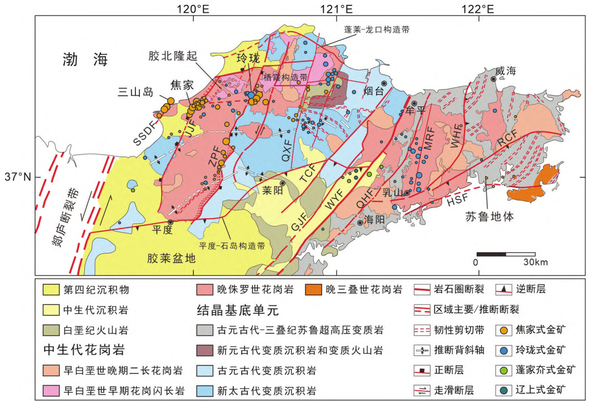  
图 1　 胶东金矿省地质与金矿床分布简图（据杨立强等，2024）GJF⁃郭即断裂；HSF⁃海阳⁃石岛断裂；JJF⁃焦家断裂；MRF⁃牟乳断裂；QHF⁃青岛⁃海阳断裂；QXF⁃栖霞断裂；RCF⁃荣成断裂；SSDF⁃三山岛断裂；TCF⁃桃村断裂；WHF⁃威海断裂；WYF⁃五莲⁃烟台断裂；ZPF⁃招平断裂  
Fig. 1　 Simplified geological map of Jiaodong gold province showing the distribution of gold deposits （ after Yang et al. ，2024）  

# 1. 2. 3　 赋矿围岩的物理⁃化学属性  

除上述控矿构造之外，赋矿建造的物理⁃化学属性是控制金矿床产出的另一关键因素（图 2）。 其中，能干性（如抗张强度）越强的岩石越易于发生脆性破裂，越有利于为成矿流体运移提供特定的通道；反应活性指数（如 $\mathrm{Fe}\times\left[\mathrm{Fe}\times\mathrm{Fe}\right]$ $+\mathrm{Mg}+\mathrm{Ca}]$ ）越高的岩石越富铁，越有利于流体⁃岩石反应（如硫化反应）的发生，从而成为最优选的赋矿围岩（Groveset al. ，2020b）。  

胶东金矿主要的赋矿围岩为晚侏罗世钙碱性花岗岩、早白垩世早期高钾钙碱性花岗岩、前寒武纪变质岩和早白垩世莱阳群底砾岩，它们分别赋存约 $77\%.10\%.11\%$ 和 $2\%$ 的金矿床（宋明春等，2018）。 最重要的矿石类型为黄铁绢英岩，此外，中⁃基性脉岩与金矿脉的时空分布紧密相伴，而太古代TTG 片麻岩和古元古代片麻岩则往往不利于金矿床的产出，这种情况的出现可能均受控于它们的物理⁃化学属性（图2）。其中，黄铁绢英岩和中⁃基性脉岩具有最强的抗张强度和很高的反应活性指数，符合其属于胶东金矿最重要矿石类型及与金矿脉时空紧密相伴的特征；晚侏罗世玲珑黑云母花岗岩和早白垩世早期郭家岭花岗闪长岩具有很强的抗张强度和中等的反应活性指数，在成矿过程中易发生脆性破裂而具有更高的流体通量，且流体致裂会引起流体压力从超静岩压力到静水压力的骤降（Sibson，1992；Cox et al. ，2001），从而导致流体不 混 溶 和 巨 量 金 沉 淀 富 集 （ Loucks and Mavrogenes，  

1999），这也与大型⁃超大型金矿床均产出于其中的事实一致。 而太古代胶东群变质岩具有最高的反应活性指数和最低的抗张强度，虽然能够通过硫化反应（Phillips and Groves，1983；Böhlke，1988）或／ 和其他水⁃岩反应导致金沉淀（Evans，2010），但往往规模不大，与其内仅产出有小型金矿床的现象吻合。  

总之，多重控矿构造和多样赋矿建造联合控制了不同规模和不同类型金矿化的发育，导致了金矿床工业类型及其地质⁃地球化学特征的多样性，具体如下所述。  

# 1. 3　 矿床地质特征  

胶东金矿的主要矿化样式包括焦家式（破碎带蚀变岩型）、玲珑式（石英脉型）、蓬家夼式（蚀变砾岩／ 角砾岩型）、辽上式（黄铁矿⁃碳酸盐脉型）四种，其中前两者占全区探明金资源储量的 $90\%$ 以上、后两者属于焦家式的特殊类型（图3）。  

# 1. 3. 1　 焦家式金矿  

焦家式金矿主要有两种产出状态（杨立强等，2019，2024；宋明春等，2020，2023）：（1）沿早前寒武纪变质岩系（或莱阳群底部砾岩）与晚中生代花岗岩类接触界面展布的主拆离断层下盘的蚀变碎裂（花岗）岩中，构造⁃蚀变⁃矿化仅发育于主断裂下盘、具有明显的单侧分带结构；（2）沿晚中生代不  

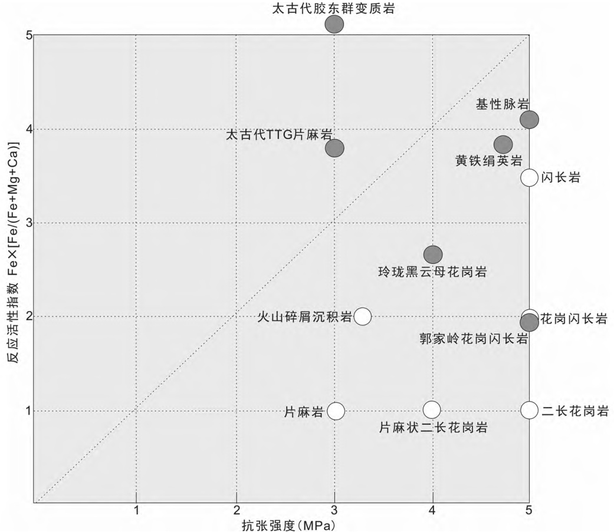  
图 2　 胶东金矿赋矿围岩的物理⁃化学属性图解（据 Groves et al. ，2020b 修改）由于难以获得具有代表性的量化值，X 轴和 Y 轴经验性地编号为1 ～5. $\mathrm{Fe}\times\left[\mathrm{Fe}\times\mathrm{Fe}+\mathrm{Mg}+\mathrm{Ca}\right]$ ： $1=0.5\sim0.6;2=\sim1.0;3=2.3\sim2.7;4=$ $3.2\sim55;5=9\sim28$ . 岩石地球化学数据来源于 Yang et al. （2016a），Deng et al. （2020a），刘向东等（2019），Wang et al. （2024a）；岩石力学参数来源于水利水电科学研究院（1991），山东省地质矿产局第六地质大队（ $1996^{\textcircled{1}}$ ）  

Fig. 2　 Illustration of the physical⁃chemical properties of the ore⁃hosting wall rocks of the Jiaodong gold deposits （ modified fromGroves et al. ，2020b）  

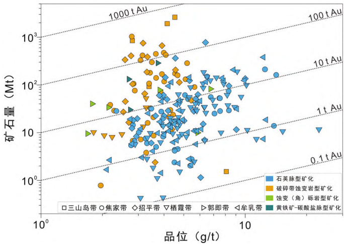  
图3　 胶东不同金矿带和矿化类型的品位⁃吨位图Fig. 3 　 Grade⁃tonnage diagram of different gold belts andmineralization types in Jiaodong  

同期次或不同岩相花岗岩类接触界面展布的次级断裂两侧的蚀变碎裂岩中，断裂上、下盘发育似对称的构造⁃蚀变⁃矿化分带结构（但下盘强度往往略大于上盘）：由以断层泥为标志的主裂面至远离主裂面，构造变形强度逐渐减弱，构造岩类型由断层泥 $\rightarrow$ 碎裂岩 $\rightarrow$ 花岗质碎裂岩 $\rightarrow$ 碎裂花岗岩变化，蚀变类型由黄铁绢英岩化 $\longrightarrow$ 绢英岩化⁃硅化 $\rightarrow$ 钾长石化⁃绢英岩化变化，矿化样式由细脉⁃浸染状 $\rightarrow$ 细脉⁃网脉状 $\rightarrow$ 脉状变化。  

焦家式金矿的矿体数量少，单个矿体规模大；矿体形态总体较为简单，多为脉状、透镜状和似层状。 靠近主裂面的矿体产状总体与其一致，长度可达 $1000\sim1200\mathrm{m}$ ，延深可达$800\sim1500\mathrm{m}$ ，矿化连续稳定；远离主裂面逐渐出现与之斜交和／或反倾的矿体。 控矿断裂产状变化、次级断裂发育和断裂交汇及分支部位均是有利赋矿空间。 主要发育黄铁绢英岩、黄铁绢英岩化花岗质碎裂岩和黄铁绢英岩化花岗岩三类金矿石；矿石构造主要为浸染状、网脉状和（细）脉状等；主要金属矿物为黄铁矿、方铅矿、闪锌矿、黄铜矿、磁黄铁矿和毒砂等，脉石矿物主要为石英、绢云母、钾长石和方解石等。 金品位整体相对稳定，一般不具特高值（图3）。  

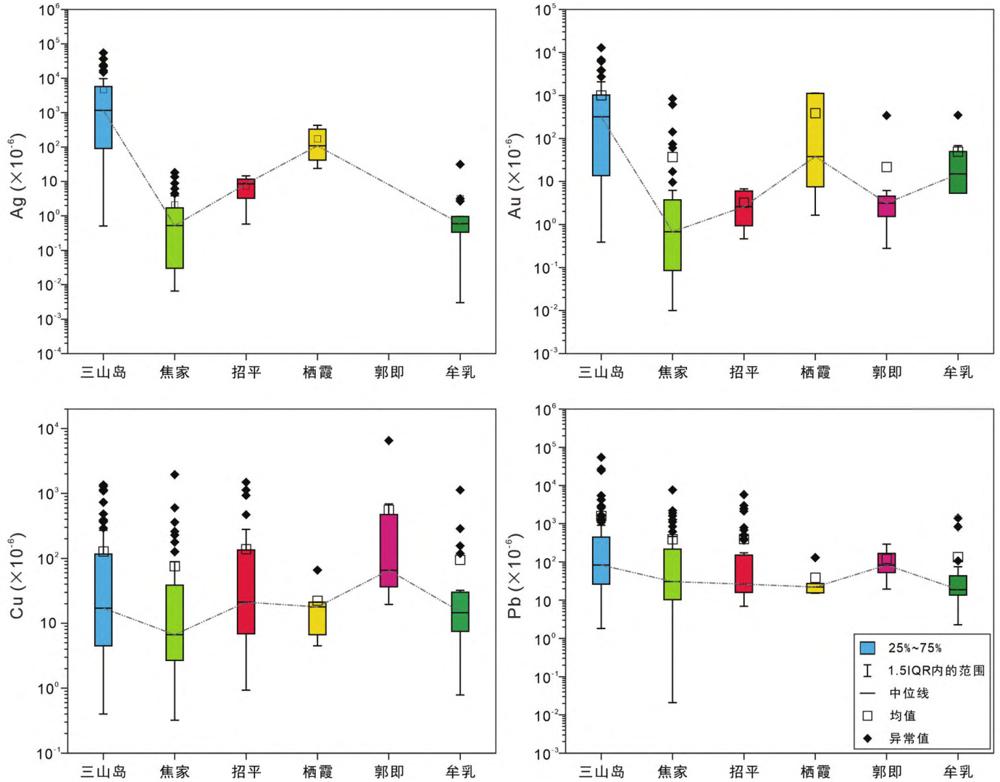  
图4　 胶东不同金矿带金矿石和蚀变岩中成矿元素含量箱线图  

全岩地球化学数据来源：三山岛金矿带来源于邓军等（2010），Li et al. （2013），赵睿等（2015），高建伟等（2023）；焦家金矿带来源于张炳林等（2014），张潮等（2016），卫清等（2018），刘向东等（2019），袁月蕾等（2023）；招平金矿带来源于张炳林等（2017），杜泽忠等（2020），于昆（2014）；栖霞金矿带来源于智云宝等（2020）；郭即金矿带数据（未收集到 $\mathrm{Ag}$ 含量）来源于孙兴丽（2014）；牟乳金矿带来源于李旭芬等（2011），陈海燕等（2012），王真（2013），倪璋懿等（2022）． 图 5 数据来源同此图Fig. 4　 Box plots of ore⁃forming element contents in gold ores and altered rocks from different gold belts in Jiaodong  

# 1. 3. 2　 玲珑式金矿  

玲珑式金矿常产于远离主拆离断裂下盘系列近平行、等间距、左行右阶式排列的次级陡倾张性断裂和大型节理裂隙中（Deng et al. ，2019；杨立强等，2019；Sai et al. ，2020；宋明春等，2020，2022；何江涛，2021）。 金矿体主要赋存在赋矿构造走向转折部位或倾角陡⁃缓变化部位形成的构造扩容空间内，通常由单条或多条含金石英脉群组成；矿体产状与控矿断裂一致，分枝复合、尖灭侧现和尖灭再现特征明显，单个矿体的规模一般较小。 矿体形态、产状和规模随含金石英脉的形态、产状、规模和组合样式而变；其中，厚大且矿化连续的含金石英单脉中矿体呈脉状，有时因石英脉中矿化强度和连续性的差异导致矿体呈透镜状和扁豆状。 围岩蚀变主要以含金石英脉两侧的不连续脉状绢英岩化和硅化蚀变及较为连续的钾化蚀变为特征，蚀变带分布范围有限、多为 $2\sim3\mathrm{m}$ 。  

矿石类型主要为含金石英⁃硫化物脉和黄铁矿⁃石英⁃方解石脉，发育致密块状、团块状、浸染状和细脉⁃网脉状构造。矿石矿物主要为黄铁矿，其次为黄铜矿、方铅矿、闪锌矿、磁黄铁矿，以及少量银金矿、自然金、碲金银矿、自然银和碲铋矿等；脉石矿物主要为石英、方解石、绢云母和钾长石等。 应该特别指出的是，牟乳带还可见梳状和角砾状构造，且其硫化物（黄铁矿、方铅矿和闪锌矿等）含量明显高于胶北地体中的同类金矿（亦称邓格庄式／硫化物⁃石英脉型）。 其金品位明显高于焦家式金矿、特别是矿脉复合或脉体膨大部位具特高值，变异性较大（图 3）。  

# 1. 3. 3　 蓬家夼式金矿  

蓬家夼式金矿产于莱阳群底部砾岩中的低角度层间滑脱带内（聂爱国等，1999；邹为雷等，2001；杨立强等，2019）。矿体呈透镜状、层状或似层状，单体规模较大，矿体厚度 0. 8$\sim4.5\mathrm{m}$ ，走向 $70^{\circ}\sim110^{\circ}$ 、延伸较为稳定，倾向 SE 或 S、倾角$45^{\circ}\sim60^{\circ}$ （随地层产状而变化）。  

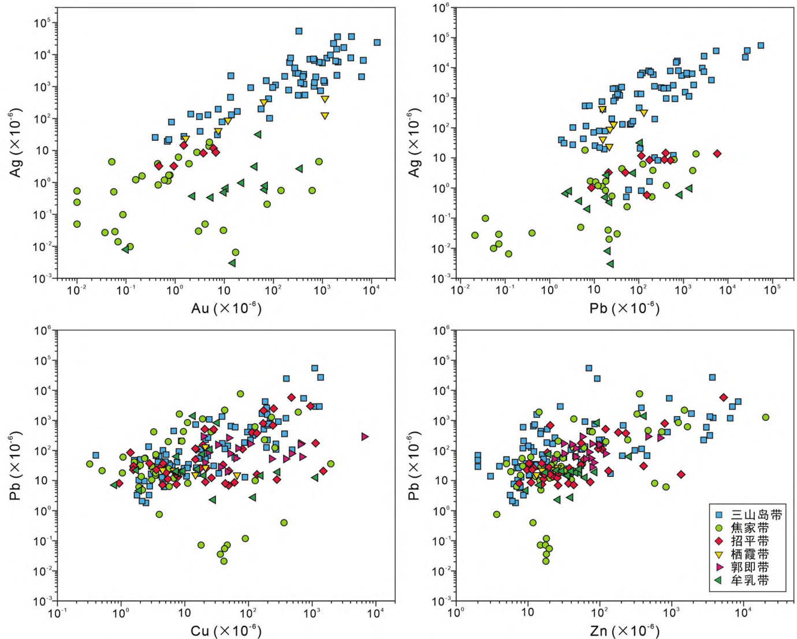  
图5　 胶东不同金矿带金矿石和蚀变岩中成矿元素相关性图解 Fig. 5　 Correlation diagrams of ore⁃forming elements in gold ore and altered rock from different gold belts in Jiaodong  

主要矿石类型为黄铁矿化构造角砾岩和黄铁矿化底砾岩（含少量砂岩），角砾和砾石由硅化大理岩（偶见长英质）构成，胶结物为热液黄铁矿⁃石英脉；矿石构造主要为角砾状，其次为浸染状、条带状和网脉状。 矿石矿物主要有黄铁矿、磁黄铁矿、黄铜矿、方铅矿、闪锌矿、毒砂和银金矿等，脉石矿物主要为方解石、石英和绿泥石等。 矿石品位为 $1,69\sim$ $6.79\mathrm{g/t}$ ，整体较为稳定，和焦家式吻合（图 3）。  

# 1. 3. 4　 辽上式金矿  

辽上式金矿产于沿荆山群变质岩与晚侏罗世弱片麻状二长花岗岩接触界面及其下盘系列陡倾次级断裂⁃裂隙中（丁正江等，2015；李国华等，2017；王志新等，2017；梁辉等，2022），矿体主要呈似层状、透镜状、楔状和马鞍状。  

金矿石以含黄铁矿⁃碳酸盐（细）脉为特征，主要有含黄铁矿⁃碳酸盐脉花岗岩、含黄铁矿⁃碳酸盐脉变质岩和黄铁矿⁃碳酸盐脉三种类型，后者的金品位最高。 矿石构造主要有浸染状、稠密浸染状、脉状、角砾状和团块状。 金属矿物主要为黄铁矿，其次为黄铜矿、磁黄铁矿、方铅矿、磁铁矿和自然金等；不同矿石类型中的脉石矿物组合不同，主要有白云石、方解石、石英、绢云母和透辉石等。 金品位 $1.0\sim5.5\mathrm{g/t}$ ，整体较为稳定，和焦家式一致（图 3）。  

# 1. 4　 矿床地球化学  

# 1. 4. 1　 矿化元素  

胶东金矿石和蚀变岩中主要矿化元素包括 $\mathbf{Au}_{\mathbf{\Sigma}_{\mathrm{{s}}}}\mathbf{Ag}_{\mathbf{\Sigma}}\mathbf{Cu}_{\mathbf{\Sigma}_{\mathrm{{s}}}}$ Pb 和 $\mathrm{Zn}$ （达到伴生矿工业利用要求，并有多种共／伴生关键金属超常富集；杨立强等，2020，2022），其含量均具有明显的空间非均一性。 六条金矿带中，三山岛金矿带具有最高的$\mathrm{Au,Ag}$ 和 Pb 元素含量，焦家金矿带中 Au 和 Ag 含量最低；Au 和 $\mathrm{Ag}$ 含量从西到东呈基本一致的“W”字形变化趋势；西部三条带中 $\mathrm{Au,Ag}$ 和 Cu 呈相似的“V”字形变化趋势；东部三条带中 $\mathrm{Au}$ 含量亦呈“V”字形变化，而 Cu 和 Pb 的变化趋势相反（图 4）。  

各成矿元素间具较好相关性，特别是 Au⁃Ag、Ag⁃Pb、Zn⁃Pb 和 $\mathrm{Pb}\mathbf{-Cu}$ 的相关性更强（图5），表明这些亲硫元素在金成矿作用过程中的地球化学行为类似（Pokrovski et al. ，2014）。  

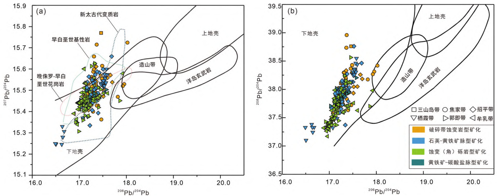  

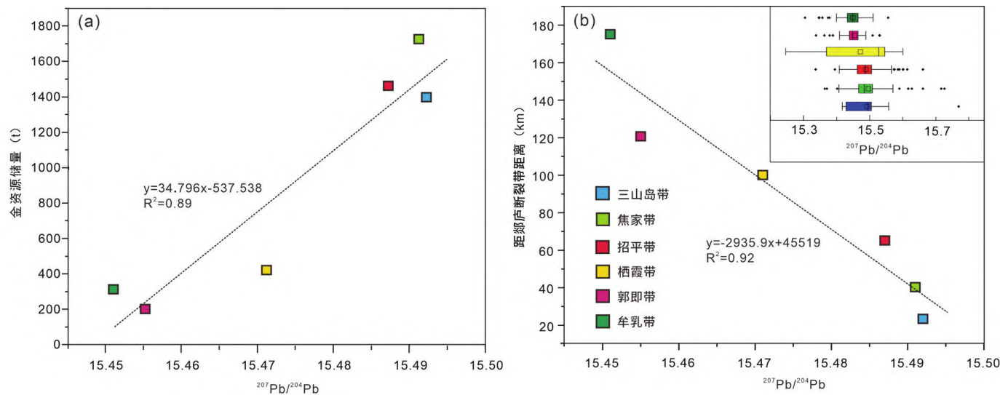  
图 6　 胶东金矿金属硫化物和不同地质体的 Pb 同位素组成图解（底图据 Zartman and Doe，1981）数据来源：金属硫化物的数据来自于 Deng et al. （2020a）及其中的相关文献，薄军委等（2021）和 Tian et al. （2022，2023）；晚侏罗⁃早白垩世花岗岩数据来自 Liu et al. （2021），Wu et al. （2020）和宋英昕等（2020）；白垩纪基性岩数据来源于 Ma et al. （2014）和龙群（2017）；新太古代变质岩数据来自 Deng et al. （2020a）及其中的相关文献 . 图 7 数据来源同此图Fig. 6　 Diagram of $\mathrm{Pb}$ isotopic compositions of metal sulfides in gold deposits and different geological bodies in Jiaodong （ base mapafter Zartman and Doe， 1981）  
图7　 胶东不同金矿带中金属硫化物 $\ensuremath{^{207}}\mathrm{Pb}/\ensuremath{^{204}}\mathrm{Pb}$ 与金资源储量图解（a）及 $\ensuremath{^{207}}\mathrm{Pb}/\ensuremath{^{204}}\mathrm{Pb}$ 与金矿带距郯庐断裂带距离相关性图解（b）Fig. 7　 Correlation diagrams of $\ensuremath{^{207}}\mathrm{Pb}/\ensuremath{^{204}}\mathrm{Pb}$ of metal sulfides with gold resource reserves （ a） and $\ensuremath{^{207}}\mathrm{Pb}/\ensuremath{^{204}}\mathrm{Pb}$ of metal sulfides withthe distance from the Tanlu fault zone （ b） in different gold belts in Jiaodong  

# 1. 4. 2　 铅同位素  

六条金矿带和四种矿化样式中金属硫化物 Pb 同位素整体组成相似、局部略显分散，表明其成矿物质的来源总体相同（图 6）。 金属硫化物的 $\ensuremath{{^206}}\ensuremath{\mathrm{Pb}}/\ensuremath{{^204}}\ensuremath{\mathrm{Pb}}$ （ $16.49\sim18.02)$ 、$^{207}\mathrm{Pb}/^{204}\mathrm{Pb}(15.25\sim15.77)$ 和 $^{208}\mathrm{Pb}/^{204}\mathrm{Pb}(37.1\sim38.96)$ 绝大部分落在下地壳区，少部分具有更强的放射性 $\mathrm{Pb}$ 同位素组成而落在下地壳之外，反映成矿物质具有混合来源（下地壳为主，外加一个更具放射性 $\mathrm{Pb}$ 的源区）。 金属硫化物与古老下地壳部分熔融的晚侏罗世花岗岩（Yang et al. ，2018）和壳幔混源的早白垩世花岗岩（Li et al. ，2018；Song et al. ，2020）及富集岩石圈地幔部分熔融的早白垩世基性脉岩（龙群，2017；Wang et al. ，2024b）三者的 Pb 同位素组成基本重合，说明更具放射性 Pb 的源区可能为富集岩石圈地幔，即胶东金矿成矿物质主要来自于被交代地幔改造的古老下地壳（杨立强等，2014；Dong et al. ，2023）。  

不同矿化样式中金属硫化物 Pb 同位素组成整体一致，而不同金矿带的略有差异、且与各带探明金资源储量和到郯庐断裂带的距离相关性较好（图 7）。 如自西向东各金矿带  

  
图8　 胶东不同金成矿带和矿化类型中载金黄铁矿的汞同位素图解  

（a） $\Delta^{199}\mathrm{Hg}$ 与 $\mathrm{THg}$ 图； （b） $\Delta^{199}\mathrm{Hg}$ 与 $\Delta^{201}\mathrm{Hg}$ 图解； （c） $\Delta^{199}\mathrm{Hg}/\Delta^{201}\mathrm{Hg}$ 与金品位相关图 . 数据来源： Wang et al. $2024\mathrm{a}$ ） 和 Zhang et al.（2024）  

  
Fig. 8　 Diagrams of mercury isotope in gold － bearing pyrites from different gold belts and mineralization types in Jiaodong   
图9　 胶东不同金成矿带和矿化类型的黄铁矿多硫同位素图解  
Fig. 9　 Diagrams of multi⁃sulfur isotopes of pyrite from different gold belts and mineralization types in Jiaodong  

（a） $\Delta^{33}\mathrm{S}$ 与 $\delta^{34}\mathrm{S}$ 图解，灰色三角形表示 LaFlamme et al. （2018）定义的硫同位素质量相关分馏范围（ $^{33}\uplambda$ 范围从 0. 508 到 0. 519）、MDF⁃S 为硫的质量分馏（用 $\delta^{34}\mathrm{S}$ 进行监测）；（b） $\Delta^{33}\mathrm{S}/\delta^{34}\mathrm{S}$ 与金属量相关图解；（c） $\Delta^{33}\mathrm{S}/\delta^{34}\mathrm{S}$ 与金矿带与郯庐断裂带之间距离的相关图解. 多硫同位素数据来源于 Qiu et al. （2023）  

的 $\ensuremath{^{207}}\mathrm{Pb}/\ensuremath{^{204}}\mathrm{Pb}$ 组成整体呈线性升高趋势；反映距离郯庐断裂带越近，金矿带金属硫化物中放射性成因 Pb 含量和幔源组分占比越多，金资源储量越大。  

# 1. 4. 3　 汞同位素  

胶东金矿中载金黄铁矿的 $\mathrm{THg}$ 浓度在招平金矿带中变化较大 $(4.99\times10^{-9}\sim1908\times10^{-9}$ ），其他金矿带中波动较小（图 8a）。 $\Delta^{201}\mathrm{Hg}$ 与 $\Delta^{199}\mathrm{Hg}$ 值之间存在正相关关系，比值接近 1（图 8b），这与水相汞（II）光还原过程中观察到的结果一致（Bergquist and $\mathrm{Blum},2007$ ）。 六条金矿带和四种矿化样式中的载金黄铁矿总体显示相对均一的 $\Delta^{199}~\mathrm{Hg}$ 值（接近$\sim0\text{\textperthousand}$ ，平均值 $\sim0.012\text{\textperthousand}$ ），与原始地幔和幔源岩浆型汞矿具有相似的 MIF⁃Hg 信号，表明岩石圈地幔控制了胶东金矿总体的 $\mathrm{Hg}$ 收支、成矿物质可能来源于交代岩石圈地幔（Wanget al. ， $2024\mathrm{a}$ ；Zhang et al. ，2024）；少数样品显示正或负的$\Delta^{199}\mathrm{Hg}$ 偏移（ $>0.1\text{\textperthousand}$ 或 $<-0.1\text{\textperthousand}$ ），反映了洋壳或陆壳物质对于交代岩石圈地幔的贡献（Wang et al. ， $2024\mathrm{a}$ ； Zhang etal. ，2024）。 $\Delta^{199}\mathrm{Hg}/\Delta^{201}\mathrm{Hg}$ 与金品位的二元图揭示了两者之间具有一定的负相关性（图 8c），表征了深部俯冲洋壳及其上覆沉积物对浅部金矿化品位的控制，即再循环的洋壳俯冲物质对交代岩石圈地幔的贡献越大、越有利于高品位金矿的产出。  

# 1. 4. 4　 多硫同位素  

胶东典型金矿床矿石中的黄铁矿多硫同位素分析结果表明（Qiu et al. ，2023）， $\Delta^{33}\mathrm{S}$ 在 $-0.14\%o\sim+0.09\%o$ 之间变化，平均值为 $-0.04\pm0.09\%o;\delta$ $\delta^{34}\mathrm{S}$ 较高，变化范围为 $3.2\text{\textperthousand}$ $\sim14.1\text{\textperthousand}$ 、平均值为 $9.0\pm3.7\%o$ （图 9a）。 所有样品均具有相对 恒 定 的 $\Delta^{33}\mathrm{~S~}$ 同 位 素 组 成 （ 接 近 $\sim0\text{\textperthousand}$ ， 平 均 值$-0.04\text{\textperthousand}$ ，未识别出 MIF⁃S 信号，排除了太古宙变质基底及其重熔花岗岩作为巨量金来源的可能性，表明含金流体来自更深部源区。 $\delta^{34}\mathrm{S}$ 值变化明显 $3.2\%o\sim14.1\%o)$ 且相对较重（平均 $9.0\pm3.7\%o.$ ，不同于地幔硫而显示壳源物质信号，其中重的 $\delta^{34}\mathrm{S}$ 可能来源于俯冲的古太平洋板片及其上覆沉积物（Qiu et al. ，2023）。  

六条金矿带黄铁矿 $\Delta^{33}\mathrm{S}/\delta^{34}\mathrm{S}$ 比值与已知金属量（图9b）及金矿带到郯庐断裂带距离之间具有良好的线性相关（图 $9\mathrm{c}$ ），结合区域载金黄铁矿相对恒定的 $\Delta^{33}\mathrm{S}$ 同位素组成，反映这种线性关系可能与 $\delta^{34}\mathrm{S}$ 值的变化有关：自西向东成矿期伸展程度的减弱导致成矿强度明显降低（Deng et al. ，  

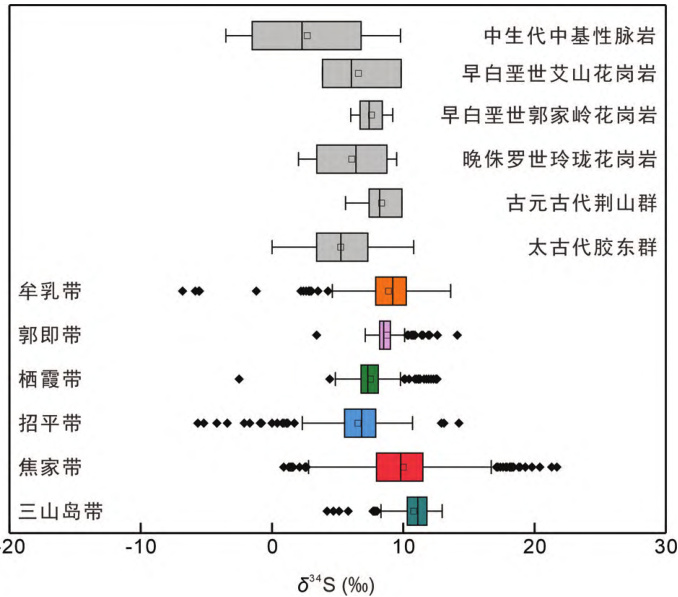  
图10　 胶东不同金矿带中金属硫化物 $\delta^{34}\mathrm{S}$ 组成变化数据来源： Deng et al. （ $2020\mathrm{a}$ ） 及其中的参考文献，Hu et al.（2020 ）， Zhang et al. （ 2020b ）， 朱 照 先 等 （ 2020 ）， Liu et al.（2021），Wu et al. （2021），Yao et al. （2021），薄军委等（2021），黄鑫（2021 ）， 李 杰 等 （ 2021 ）， 李 逸 凡 等 （ 2021 ）， 毛 兴 强 等（2022），许杨等（2021），Bao et al. （2022），Chi et al. （2022），Li etal. （2022， 2023） ，Sun et al. （2022） ，Xu et al. （2022） ，Du et al.（2023）， Qiu et al. （ 2023 ）， Tian et al. （ 2023 ）， Wang et al.（2024a，b）  

2023；Qiu et al. ，2023）。  

六条金矿带金属硫化物 $\delta^{34}\mathrm{S}$ 组成总体近似、变化范围相对较窄 $(5.53\%o\sim11.8\%o$ ），且与其直接围岩的 $\delta^{34}\mathrm{S}$ 一致（图10），表明其硫具有相同来源、并在复杂的壳幔交换过程中达到了同位素体系的均一化（Mao et al. ，2008）。 而从西到东$\delta^{34}\mathrm{S}$ 值具有先降后升的变化趋势，可能揭示了金成矿条件的细微差别 （ 王 义 文 等，2002； 侯 明 兰 等，2006； Deng et al. ，2015a，2020a；李杰等，2022）：整体较重的 $\delta^{34}\mathrm{S}$ 反映深部幔源流体源区受到了地壳物质的混染（Chen et al. ，2005；Mao etal. ，2008； 杨 立 强 等，2014； Deng et al. ， $2020\mathrm{a}$ ； Hu et al. ，2022）；招平和栖霞金矿带较低的 $\delta^{34}\mathrm{S}$ 值说明其可能经历了强烈的成矿流体不混溶或流体⁃岩石反应，与其赋矿围岩具有高反应活性指数的特征一致（图2）。  

# 1. 4. 5　 氦⁃氩同位素  

六条金成矿带中热液黄铁矿流体包裹体的大部分 He⁃Ar同位素数据投影在地壳与地幔流体过渡带（图 11），显示壳幔混合组成特征。 其中，栖霞金矿带的 $^3\mathrm{He}{}^{4}\mathrm{He}(0.041\sim$ 11. 4）、牟乳金矿带的 $\mathrm{R}/\mathrm{Ra}\left(0.037\sim3.612\right)$ 和招平金矿带的 $^{40}\mathrm{Ar}/^{36}\mathrm{Ar}(365.9\sim7935.12)$ 变化范围最大，牟乳金矿带的部分数据点落在地壳流体区中（图 11b）。 由于矿石位于地壳寄主岩中，且这些数据可能包括次生流体的贡献，因此目前对这些数据的意义尚不清楚；唯一重要的因素被认为是来自 $0\%\sim30\%$ 范围内数据的地幔成分，异常值高达 $100\%$ （Zhang et al. ，2012；Shen et al. ，2013；Xue et al. ，2013）。  

三山岛、焦家、招平和牟乳金成矿带成矿流体 ${^{40}\mathrm{Ar}}/{^{36}\mathrm{Ar}}$ 比值明显偏离大气饱和水的氩同位素组成（图 11b），而郭即金矿带成矿流体 ${^{40}\mathrm{Ar}}/{^{36}\mathrm{Ar}}$ 比值接近于大气饱和水氩的同位素组成（张连昌等，2002；张运强等，2012；薛建玲等，2013），数据来源： Deng et al. （2020a） 及其中的参考文献，吕婧祎等（2023），马顺溪等（2020），王勇军等（2020），Li et al. （2020），Jiang et al. （2020），魏瑜吉等（2020），薄军委等（2021），Wu etal. （ 2021 ） ， Lan et al. （ 2022 ） ， Tian et al. （ 2022 ） ， Wang et al.（2022）  

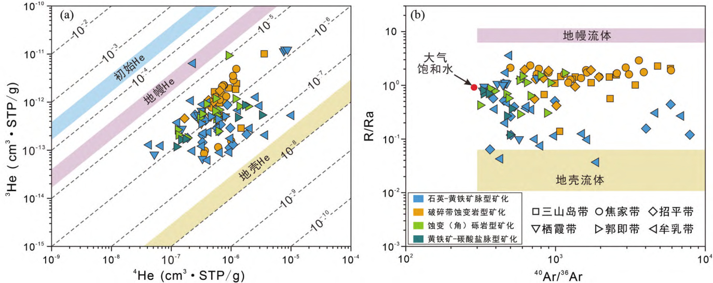  
Fig. 10 　 Diagram of $\delta^{34}\mathrm{S}$ composition variation of metal sulfides from different gold belts in Jiaodong   
图11　 胶东不同金成矿带和矿化类型中热液黄铁矿流体包裹体 $^{3}\mathrm{He}{-}^{4}\mathrm{He}(\mathrm{a})$ 和 R／ Ra⁃ ${^{40}\mathrm{Ar}}/{^{36}\mathrm{Ar}}(\mathrm{b})$ 图主要储层组成区域资料来自 Mamyrin and Tolstikhin（1984）；氦⁃氩同位素来源于 Deng et al. （2020a）及其中的参考文献，Li et al. （2023）和 Xuet al. （2023）Fig. 11 $^3\mathrm{He}$ vs. $^{4}\mathrm{He}$ （a） and R ／ Ra vs. ${^{40}\mathrm{Ar}}/{^{36}\mathrm{Ar}}$ （ b） diagrams of fluid inclusions in hydrothermal pyrite from different gold beltsand mineralization types in Jiaodong  

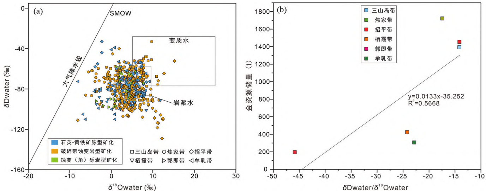  
图 12　 胶东不同金矿带和矿化类型中热液石英和绢云母的氢⁃氧同位素图解（a）及 δDwater／ $'\delta^{18}$ Owater 与金资源储量相关性图解（b）数据来源： Deng et al. （2020a）及其中的参考文献，王金辉（2020），魏瑜吉等（2020），Liu et al. （2021），Wu et al. （2021），黄鑫（2021），李杰等（2021），李逸凡等（2021），Tian et al. （2022），Wang et al. （2022），毛兴强等（2022），Du et al. （2023），Zhao et al. （2023）Fig. 12　 Hydrogen⁃oxygen isotopic diagram of hydrothermal quartz and sericite （ a ） and the correlation diagram of δDwater ／$\delta^{18}$ Owater with gold resource reserves （ b） from different gold belts and mineralization types in Jiaodong  

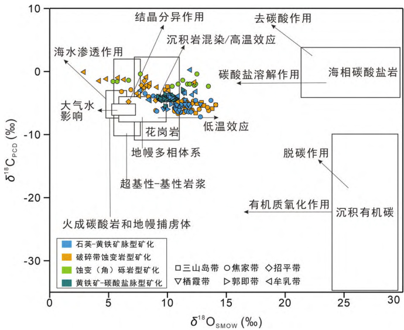  
图13　 胶东不同金矿带和矿化类型中碳酸盐矿物的碳⁃氧同位素图解  

Fig. 13 Carbon⁃oxygen isotope diagram of carbonate minerals from different gold belts and mineralization types in Jiaodong  

表明郭即金矿带的流体包裹体中含有较多的大气降水组分，三山岛、焦家、招平和牟乳金矿带成矿流体中幔源流体贡献较大，郭即金矿带的相对较小，栖霞金矿带介于它们之间。  

不同矿化类型中热液黄铁矿流体包裹体的大部分 He⁃Ar同位素组成差异明显，其中焦家式金矿的成矿流体组成更接近于地幔组成，玲珑式金矿成矿流体组成在地幔与地壳组成过渡带中具有较大的变化范围（图 11）。  

# 1. 4. 6　 碳⁃氢⁃氧同位素  

不同金成矿带和矿化类型中热液石英和绢云母的氢⁃氧同位素组成整体非常相似，均分布在大气水线与变质流体和岩浆流体之间区域，这可能是由于成矿后次生流体和流体⁃围岩反应对原生成矿流体造成了混染、而并非深源流体与大气水的混合（Goldfarb and Groves，2015）。  

六条金矿带的氢⁃氧同位素组成略有差异（图 12a），其中三山岛、焦家和招平金矿带的相对接近原生岩浆水，有较小部分大气水的加入；而从栖霞经郭即至牟乳金矿带，其氢⁃氧同位素组成逐渐趋近于大气降水线。 同时，蓬家夼式金矿相对于其他类型有较轻的氢⁃氧同位素组成，反映胶莱盆地北缘相对开放的构造环境。 六条金矿带的氢⁃氧同位素组成和金资源量之间具有明显的正相关性（图 12b），可能表征了由西向东成矿流体通量和流体⁃岩石反应强度逐渐降低。  

胶东金矿碳酸盐矿物的 $\delta^{18}0_{\mathrm{sM0W}}$ 值 $(2.9\%o\sim14.1\%o)$ 和$\delta^{13}\mathrm{C}_{\mathrm{poB}}$ 值 $(\phantom{+}-7.2\%o\sim0.24\%o)$ 的总体变化范围不大，明显高于淡水 $\mathrm{CO}_{2}$ 和有机质的碳同位素组成、略高于地壳和大气$\mathrm{CO}_{2}$ 的 $\delta^{13}\mathrm{~C~}$ 并低于海相碳酸盐。 6 条金矿带 $\delta^{18}\mathrm{O}_{\mathrm{SM0W}}$ 和$\delta^{13}\mathrm{C}_{\mathrm{poB}}$ 比值在多相地幔体系附近的花岗岩区域，均具有低温蚀变趋势，三山岛、焦家和招平金矿带中受低温蚀变影响更明显，说明这三条金矿带成矿晚阶段流体⁃岩石反应程度更强（图 13）。  

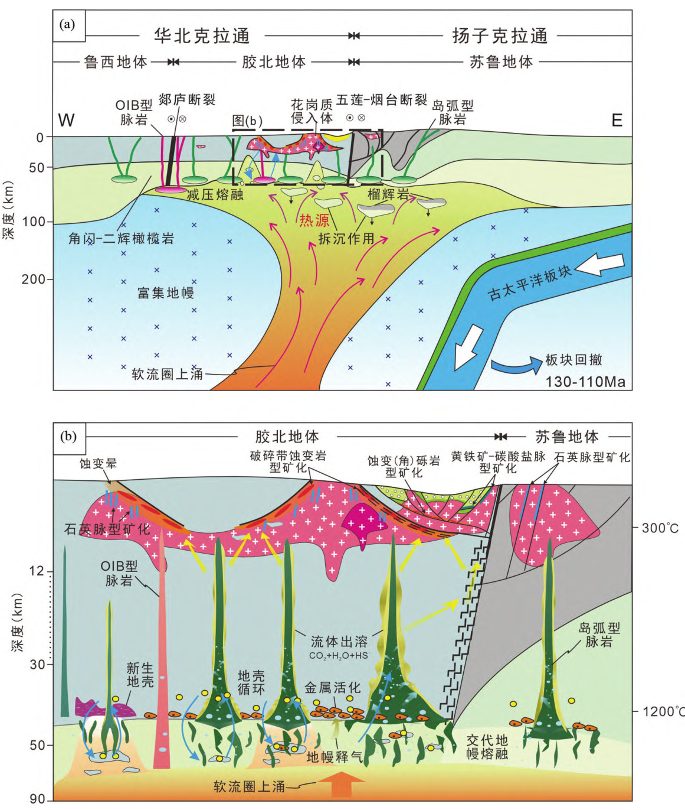  
图 14　 胶东型金矿成矿模型（据 Deng et al. ，2023 修改）  
（a）成矿期软流圈大规模上涌与富集地幔部分熔融；（b）成矿期基性岩浆和富集地幔脱气形成幔源流体， 流体活化下地壳硫化物堆晶中金属产生成矿流体Fig. 14　 Metallogenic model of Jiaodong⁃type gold deposits （modified after Deng et al. ，2023）  

# 2 成因模式  

综上可见，胶东下地壳经历了活化改造和 Au 再富集作用（Deng et al. ，2023；Dong et al. ，2023），和矿石具有较为一致的同位素（Pb⁃S 等）组成特征（Deng et al. ，2020a），表明巨量金主体来源于再循环的下地壳（杨立强等，2014）；成矿流体 He⁃Ar 和 C⁃O 同位素组成与富集地幔多相体系范围一致（Li and Santosh，2014；Deng et al. ，2020a），且同成矿期基性脉岩来源于被水和碳酸盐熔／流体交代的富集岩石圈地幔（Ma et al. ，2014；Deng et al. ，2017），说明成矿流体来自起源于富集岩石圈地幔（Groves et al. ，2020a；Deng et al. ，2023）。其中，古元古代东⁃西古陆的碰撞拼贴、晚古生代古特提斯洋板块俯冲造山、三叠纪华南⁃华北陆陆碰撞和深俯冲复合可能导致富集地幔岩石圈的形成和含水矿物及挥发份的聚集，成为含金流体的重要源区（Deng et al. ，2020b）；贯通岩石圈地幔顶部与地壳深部 EW 向大陆深俯冲带和基底构造带以及地壳浅部 NE⁃NNE 向逆冲断层系可能是其关键控制因素，高压⁃超高压条件下来自不同地壳源的流体的交代作用可能是其关键机制（Deng et al. ，2019，2022）。  

  
图 15　 胶东型金矿勘查模型Fig. 15　 Exploration model of Jiaodong⁃type gold deposits  

而上地壳拆离断裂带汇聚于中地壳滑脱构造带、与下地壳逆冲构造带及陡立超壳深大断裂带一起构成贯通地幔顶部和全地壳的流体输运系统（俞贵平等，2020；Deng et al. ，2023），有利于深部含金流体的快速运移、而不会形成广泛的熔体（Goldfarb and Santosh，2014）。 约 $120\mathrm{Ma}$ 时，古太平洋板块俯冲⁃回撤的方向变化及其诱发的软流圈上涌引起上覆富集岩石圈地幔部分熔融和交代置换及地壳强烈改造（图14a），导致富集地幔和壳幔过渡带中 Au 的活化迁移与含金流体的释放，随幔源流体进入贯穿地壳的断裂系统（图14b）。 壳⁃幔相互作用过程中，区域挤压 $\rightarrow$ 伸展变形交替，诱发了赋矿围岩快速隆升和减压降温，导致控矿断裂系统的地震泵吸作用于脆⁃韧性转换带 $\rightarrow$ 脆性角砾岩带附近发生了大规模的金成矿作用（杨立强等，2014；Yang et al. ，2016b）。 贯穿岩石圈地幔和全地壳的成矿流体通道系统对金矿的形成和定位至关重要（Deng et al. ，2023；Yang et al. ，2024），金成矿强度与富集地幔岩石圈对地壳的改造程度及其至幔源流体主通道的距离呈线性正相关（图 7⁃图 9 和图 12）。  

胶东中成和浅成金矿床共存，说明其成矿深度范围广、且成矿后经历了显著的差异隆升和剥蚀，已知浅成金矿床的深部可能发育中成金矿床（ Zhang et al. ，2020a；Qiu et al. ，2023）。 金矿床地质⁃地球化学特征和成矿深度热力学估算表明，成矿深度总体西深东浅：胶北隆起中成金矿较为发育，而苏鲁地体以浅成金矿为主（Fan et al. ，2003；Wen et al. ，2015；Guo et al. ，2017）；胶北地体北部发育胶东目前唯一已知浅成金锑矿床（孙绪德等，2018），牟乳金矿带具有明显的锑元素异常（张连昌等，2001）。 部分岩金矿床已剥露到地表、且古河流和近海沉积物中发育大量砂金矿床（高殿海，1990），说明金矿形成后遭受了明显的剥蚀。 热年代学研究表明金矿形成后整体经历了较为缓慢的隆升和剥蚀，不同区域剥蚀量介于 $2\sim7\mathrm{km}$ 不等，深部矿体保留良好（柳振江等，2010；Zhang et al. ，2019，2020b；杨伟等，2023）；相较胶北地体，苏鲁地体成矿后伸展程度低、冷却速度慢、剥蚀程度略低（Qiu et al. ，2023）。  

尽管胶东金矿不同尺度的鉴别特征及其形成的关键因素明显不同于全球已知的其他金矿类型，难以被已有成矿模式所涵盖（Goldfarb and Santosh，2014），可能属于一种新的金矿类型———胶东型（Deng et al. ，2015a，2020c，2023），但其成因模式仍然具有一定普适性，例如华北、华南、西伯利亚、西澳伊尔岗、北美怀俄明和南美圭亚那等大陆内部大量金矿床的成矿地球动力学背景、主要控矿因素和成矿作用过程及机制等与胶东金矿一致（ Yang et al. ， 2014；Deng and Wang，2016； Deng et al. ， 2018； McDivitt et al. ， 2020； Qiu et al. ，2020），特别是东亚及其邻区的克拉通边缘和内部众多金矿床的成矿背景、控矿因素、成矿流体特征和成矿物质来源等均与胶东金矿吻合，可能属于同一类型金矿床（Goldfarb etal. ，2005，2007；Deng et al. ，2022，2023）。  

# 3 勘查模型  

由上可见，拆离断裂系 $^+$ （黄铁）绢英岩化⁃钾化蚀变带$^+$ 基底活化带 $^+$ 幔源流体通道是胶东金成矿系统的找矿标志。 据此，我们确立了“拆离断裂系与基底活化带及幔源流体通道复合控矿”勘查思路和“四步式” 勘查模型（图 15）：（1）利用深反射地震探测、大地电磁测深和岩石圈物质组成架构示踪结果，揭示幔源流体通道表征的大型金矿区／带可能发育的空间范围，明确区域成矿远景区（杨立强等，2023；Yang et al. ，2024）；（2）通过构造⁃岩相填图、控矿构造应力分析、重磁测量和高精度磁法测量，探查拆离断裂与基底活化带交汇部位约束的金矿田可能产出的空间位置，选定成矿有利地段（王偲瑞等，2020；杨立强等，2024）；（3）借助蚀变⁃流体填图和电法测量，查明含金流体活动中心和蚀变⁃矿化分带空间 结 构， 圈 定 矿 床 尺 度 的 预 测 靶 区 （ Zhang et al. ，2020b）；（4）实施蚀变矿物和构造地球化学测量，定位金矿化中心及其顶底板和预测靶位，提交隐伏金矿体的验证工程设计（邓军等，2010）。  

应该特别指出的是，控矿构造和赋矿建造的多样性导致了胶东型金矿的矿化样式及其地质⁃地球化学特征的多样性，显然其相应的勘查技术方法也有一定差异；应用上述成因模式和找矿标志及勘查模型指导成矿预测和工程部署的过程中，需要充分考虑它们之间紧密的时空和成因关联。 三山岛、焦家、招平、栖霞、郭即和牟乳六条高产金矿带近年的系列找矿突破验证了成因模式和勘查模型的合理性和适用性（邓军等，2010；陈玉民等，2016；于学峰等，2019；宋明春等，2020，2022，2024），表明区域找矿潜力巨大、胶东型金矿是全球研究热点和重要勘查方向、主攻目标是资源量大且品位和产状稳定的蚀变岩型金矿床／ 体（Deng et al. ，2023）。  

# 4 结语  

胶东金矿不同于全球其他已知的金矿床类型，不能被已有理论模型所涵盖。 在系统阐释其矿床地质⁃地球化学特征、成矿系统时⁃空结构和主控矿因素及动力学背景等不同尺度鉴别特征的基础上，明确了其成矿地球动力学背景和深部驱动、巨量金属和流体及络合物来源、输运通道和方式、源→汇过程和机制、成矿后变化和保存等成矿系统形成的关键因素，提出了胶东型金矿的成因模式与勘查模型。  

胶东型金矿的成矿流体来自于经历了多期改造的富集岩石圈地幔，成矿金属具有壳幔混源的特征，含金流体通道具有壳幔贯通性，成矿深度跨度大，成矿强度明显受控于距幔源流体主通道的远近和富集地幔对地壳的改造程度及含金流体中幔源组分占比（距离越近、改造越强、占比越多，则金资源储量越大），地幔被俯冲洋壳及其上覆沉积物交代的程度控制了金品位的高低（程度越强，则品位越高）。  

系列找矿突破验证了成因模式和勘查模型的合理性和适用性，胶东型金矿是全球研究热点和重要勘查方向、主攻目标是资源量大且品位和产状稳定的破碎带蚀变岩型金矿。  

致谢　 　 论文的完成得益于与 David I． Groves 院士、侯增谦院士、Richard J． Goldfarb 教授、王庆飞教授、宋明春教授、张静教授、刘学飞教授、王建平教授、李楠副研究员、和文言副教授、高雪副教授和杨林副教授等的探讨；野外工作得到山东省地质矿产勘查开发局、山东黄金集团有限公司和各金矿山工作人员的大力支持及帮助；研究生刘向东、王立功、魏瑜吉、徐瀚涛、申世龙、张龙啸、吴珂惠等参与了部分研究工作；两位审稿专家提出了许多建设性意见，谨此致谢。 感谢编辑部的大力支持和帮助！  

# References  

Bao C， Chen B， Liu CJ， Zheng JH and Liu SJ． 2022． Decompressioninduced enrichment and precipitation of gold in the polymetallicsulfide stage of the Northwest Jiaodong gold deposits， eastern NorthChina Craton． Ore Geology Reviews， 148： 105048  
Bergquist BA and Blum JD． 2007． Mass⁃dependent and independentfractionation of $\mathrm{Hg}$ isotopes by photoreduction in aquatic systems．Science， 318（5849）： 417 － 420  
Bo JW， Ding ZJ， Song MC， Qiu KF， Sun FY， Ji P， Xu H and Zhang R．2021． C， O， S and Pb isotopic compositions and genesis of theLiaoshang gold deposit in Jiaodong Peninsula． Acta Petrologica etMineralogica， 40（2） ： 321 － 336 （ in Chinese with English abstract）  
Böhlke JK． 1988． Carbonate⁃sulfide equilibria and “ stratabound ”disseminated epigenetic gold mineralization： A proposal based onexamples from Alleghany， California， U． S． A． ． AppliedGeochemistry， 3（5）： 499 － 516  
Chen HY， Li SR， Zhang XB， Zhang YQ， Zhou QF， Cui JC， Liu ZH andSong YB． 2012． Wall rock alteration and gold mineralization in theJinqingding gold deposit， eastern Shandong Province． Bulletin ofMineralogy， Petrology and Geochemistry， 31 （ 1 ）： 5 － 13 （ inChinese with English abstract）  
Chen YJ， Pirajno F and Qi JP． 2005． Origin of gold metallogeny andsources of ore⁃forming fluids， Jiaodong Province， Eastern China．International Geology Review， 47（5）： 530 － 549  
Chen YM， Fan HR， Cui L， Wang SK， Sun ZF， Zeng QD， Ma FS， WangJT， Liu K， Sun ZF， Yang KF， Hao TY， Feng T， Suo JC， Liu RF，Li W， Hu FF， Wang LG， Xiao FL， Wang XD， Jin NX， Deng QH，Wang F， Cai XN， Zhang HF， Guo J， Zhang JG， Yin JF， Chang JS，Wang YW， Lan HB， Cai YC， Wang YB， Wen BJ， Lan TG， Li XC，Zhang LL， Zhu XL， Zhang S， Liu XP， Lei YX and Xu TB． 2016．Modeling of Large⁃scale Gold Mineralization and Genesis in theNorthwest Jiaonan Region． Beijing： Geological Publishing House （ inChinese）  
Chi NJ， Han ZZ， Liu CE， Zhang W， Zhang YH， Shan W， Li ZS， Li M，Wang XF and Sun YQ． 2022． Metallogenic mechanism of theHouge,zhuang gold deposit， Jiaodong， China： Evidence from fluidinclusion， in situ trace element and sulfur isotope compositions．Frontiers in Earth Science， 10： 1009715  
China Institute of Water Resources and Hydropower Research． 1991．Manual of Rock Mechanical Parameters． Beijing： China Water ＆Power Press （ in Chinese）  
Cox SF， Knackstedt MA and Braun J． 2001． Principles of structuralcontrol on permeability and fluid flow in hydrothermal systems． In：Richards JP and Tosdal RM （ eds． ） ． Structural Controls on OreGenesis． Society of Economic Geologists， 14： 1 － 24  
Deng J， Chen YM， Liu K， Yang LQ， Hou CQ， Wang JT， Yu B， LvGX， Bi HT， Sun ZF， Wang SH， Ding YX， Li H， Yuan WM， SunZF， Xiu GL， Wang C， Qi ZJ， Wang SF， Li W， Li W， Guo CY，Guo B， Li SL and Yuan DC． 2010． Exploration of Gold MetallogenicSystem and Resources in Jiaodong Sanshandao Fault Zone． Beijing：Geological Publishing House （ in Chinese）  
Deng J， Liu XF， Wang QF and Pan RG． 2015a． Origin of the Jiaodong⁃type Xinli gold deposit， Jiaodong Peninsula， China： Constraints fromfluid inclusion and C⁃D⁃O⁃S⁃Sr isotope compositions． Ore GeologyReviews， 65： 674 － 686  
Deng J， Wang CM， Bagas L， Carranza EJM and Lu YJ． 2015b．Cretaceous⁃Cenozoic tectonic history of the Jiaojia Fault and goldmineralization in the Jiaodong Peninsula， China： Constraints fromzircon U⁃Pb， illite K⁃Ar and apatite fission track thermochronometry．Mineralium Deposita， 50（8）： 987 － 1006  
Deng J and Wang QF． 2016． Gold mineralization in China： Metallogenicprovinces， deposit types and tectonic framework． GondwanaResearch， 36： 219 － 274  
Deng J， Liu XF， Wang QF， Dilek Y and Liang YY． 2017． Isotopiccharacterization and petrogenetic modeling of Early Cretaceous maficdiking： Lithospheric extension in the North China Craton， easternAsia． Geological Society of America Bulletin， 129（11 － 12） ： 1379－ 1407  
Deng J， Wang CM， Bagas L， Santosh M and Yao EY． 2018． Crustalarchitecture and metallogenesis in the south⁃eastern North ChinaCraton． Earth⁃Science Reviews， 182： 251 － 272  
Deng J， Yang LQ， Li RH， Groves DI， Santosh M， Wang ZL， Sai SX andWang SR． 2019． Regional structural control on the distribution ofworld⁃class gold deposits： An overview from the giant Jiaodong GoldProvince， China． Geological Journal， 54（1） ： 378 － 391  
Deng J， Yang LQ， Groves DI， Zhang L， Qiu KF and Wang QF． 2020a．An integrated mineral system model for the gold deposits of the giantJiaodong province， eastern China． Earth⁃Science Reviews， 208：103274  
Deng J， Wang QF， Santosh M， Liu XF， Liang YY， Yang LQ， Zhao Rand Yang L． 2020b． Remobilization of metasomatized mantlelithosphere： A new model for the Jiaodong gold province， easternChina． Mineralium Deposita， 55（2）： 257 － 274  
Deng J， Qiu KF， Wang QF， Goldfarb R， Yang LQ， Zi JW， Geng JZ andMa Y． 2020c． In situ dating of hydrothermal monazite andimplications for the geodynamic controls on ore formation in theJiaodong gold province， eastern China． Economic Geology， 115（3）： 671 － 685  
Deng J， Wang QF， Liu XF， Zhang L， Yang LQ， Yang L， Qiu KF， GuoLN， Liang YY and Ma Y． 2022． The formation of the Jiaodong goldprovince． Acta Geologica Sinica， 96（6）： 1801 － 1820  
Deng J， Wang QF， Zhang L， Xue SC， Liu XF， Yang L， Yang LQ， QiuKF and Liang YY． 2023． Metallogenetic model of Jiaodong⁃type golddeposits， eastern China． Science China （ Earth Sciences） ， 66（10） ：2287 － 2310  
Ding ZJ， Sun FY， Liu FL， Liu JH， Peng QM， Ji P， Li BL and ZhangPJ． 2015． Mesozoic geodynamic evolution and metallogenic series ofmajor metal deposits in Jiaodong Peninsula， China． Acta PetrologicaSinica， 31（10） ： 3045 － 3080 （ in Chinese with English abstract）  
Dong LL， Yang ZM， Liu YH and Song MC． 2023． Possible source of Auin the Jiaodong area from lower crustal sulfide cumulates： Evidencefrom oxygen states and chalcophile elements contents of Mesozoicmagmatic suites． Ore Geology Reviews， 153： 105268  
Du ZZ， Cheng ZZ， Yao XF， Yu XF， Chen H， Li SH and Bao XL．2020． Element migration regularity during hydrothermal alteration inthe Xiejiagou gold deposit， eastern Shandong Province． GeologicalBulletin of China， 39 （8 ） ： 1137 － 1152 （ in Chinese with Englishabstract）  
Du ZZ， Cheng ZZ， Yao XF and Bao XL． 2023． Two⁃stage superimposedgold mineralization in the Xiejiagou gold deposit， ShandongProvince： Insights from fluid inclusions， H⁃O⁃S isotopes and traceelements． Minerals， 13（9）： 1210  
Evans KA． 2010． A test of the viability of fluid⁃wall rock interactionmechanisms for changes in opaque phase assemblage inmetasedimentary rocks in the Kambalda⁃St． Ives goldfield， WesternAustralia． Mineralium Deposita， 45（2）： 207 － 213  
Fan HR， Zhai MG， Xie YH and Yang JH． 2003． Ore⁃forming fluidsassociated with granite⁃hosted gold mineralization at the Sanshandaodeposit， Jiaodong gold province， China． Mineralium Deposita， 38（6）： 739 － 750  
Gao DH． 1990． Geological metallogenic conditions of placer gold inJiaodong area． Geology and Exploration， $26(7):6-9$ （ in Chinesewith English abstract）  
Gao JW， Liu WQ， Deng HJ， Shen JF and Zhao GC． 2023． Hydrothermalalteration characteristics and migration rules of trace elements in theNorth Sanshandao sea gold deposit， Shandong， China． NorthwesternGeology， 56（1） ： 245 － 253 （ in Chinese with English abstract）  
Goldfarb RJ， Baker T， Dubé B， Groves DI， Hart CJR and Gosselin P．2005． Distribution， character and genesis of gold deposits inmetamorphic terran． In： Hedenquist JW， Thompson JFH， GoldfarbRJ and Richards JP （ eds． ）． One Hundredth Anniversary Volume．Society of Economic Geologists， 407 － 450  
Goldfarb RJ， Hart C， Davis G and Groves D． 2007． East Asian gold：Deciphering the anomaly of Phanerozoic gold in Precambrian cratons．Economic Geology， 102（3）： 341 － 345  
Goldfarb RJ and Santosh M． 2014． The dilemma of the Jiaodong golddeposits： Are they unique？ Geoscience Frontiers， 5（2） ： 139 － 153  
Goldfarb RJ and Groves DI． 2015． Orogenic gold： Common or evolvingfluid and metal sources through time． Lithos， 233： 2 － 26  
Goldfarb RJ， Qiu KF， Deng J， Chen YJ and Yang LQ． 2019． Orogenicgold deposits of China． In： Chang ZS and Goldfarb RJ （ eds． ） ．Mineral Deposits of China． Society of Economic Geologists， 22： 263－ 324  
Goldfarb RJ and Pitcairn I． 2023． Orogenic gold： Is a genetic associationwith magmatism realistic？ Mineralium Deposita， 58（1） ： 5 － 35  
Groves DI， Santosh M， Deng J， Wang QF， Yang LQ and Zhang L．2020a． A holistic model for the origin of orogenic gold deposits andits implications for exploration． Mineralium Deposita， 55 （2 ） ： 275－ 292  
Groves DI， Santosh M and Zhang L． 2020b． A scale⁃integratedexploration model for orogenic gold deposits based on a mineralsystem approach． Geoscience Frontiers， 11（3）： 719 － 738  
Groves DI and Santosh M． 2021． Craton and thick lithosphere margins：The sites of giant mineral deposits and mineral provinces． GondwanaResearch， 100： 195 － 222  
Guo LN， Goldfarb RJ， Wang ZL， Li RH， Chen BH and Li JL． 2017． Acomparison of Jiaojia⁃ and Linglong⁃type gold deposit ore⁃formingfluids： Do they differ？ Ore Geology Reviews， 88： 511 － 533  
He JT． 2021． Gold mineralization and post⁃ore denudation in the Muping⁃Rushan gold belt， Jiaodong Peninsula， eastern China． Ph． D．Dissertation． Beijing： China University of Geoscience （ in Chinese）  
Hou ML， Jiang SY， Jiang YH and Ling HF． 2006． S⁃Pb isotopegeochemistry and Rb⁃Sr geochronology of the Penglai gold field in theeastern Shangdong Province． Acta Petrologica Sinica， 22（10） ： 2525－ 2533 （ in Chinese with English abstract）  
Hu HL， Fan HR， Santosh M， Liu X， Cai YC and Yang KF． 2020． Ore⁃forming processes in the Wang,ershan gold deposit （ Jiaodong，China） ： Insight from microtexture， mineral chemistry and sulfurisotope compositions． Ore Geology Reviews， 123： 103600  
Hu HL， Fan HR， Lan TG， Xu Y， Cai YC， Yang KF and Dai ZH． 2022．New constraints for crustal sulfur contamination of gold source：Evidence from complex $\delta^{34}\mathrm{S}$ of pyrite in the northwestern Jiaodonggold province， China． Precambrian Research， 378： 106773  
Huang X． 2021． Discussion on the characteristics and genesis of theDaliuhang gold deposit in Jiaodong． Northwestern Geology， 54（4） ：129 － 141 （ in Chinese with English abstract）  
Jiang YH， Du FG， Qing L and Ni CY． 2020． Elemental and multipleisotopic evidences of enriched lithospheric mantle origin of theXiadian gold deposit in the Jiaodong Peninsula， East China． OreGeology Reviews， 127： 103824  
LaFlamme C， Fiorentini ML， Lindsay MD and Bui TH． 2018．Atmospheric sulfur is recycled to the crystalline continental crustduring supercontinent formation． Nature Communications， 9： 4380  
Lan T， Fan YC， Lu JL， Hao LB， Zhao XY， Sun XH， Guo JK and HouYR． 2022． Origin of the Dayingezhuang gold deposit in the Jiaodongdistrict， eastern China： Insights from trace element character ofpyrite and C⁃O⁃S isotope compositions． Journal of GeochemicalExploration， 236： 106986  
Li GH， Ding ZJ， Song MC， Li JJ， Li XZ， Ji P， Zhang PJ and Wang ZX．2017． The Liaoshang pyrite⁃carbonate veined deposit： A new type ofgold deposit in Jiaodong Peninsula． Acta Geoscientica Sinica， 38（3） ： 423 － 429 （ in Chinese with English abstract）  
Li J， Zhang LP， Song MC， Liang JL， Li SY， Song YX， Bao ZY andDing ZJ． 2021． Formation mechanism of Shuiwangzhuang golddeposit in Jiaodong Peninsula： Constraints from S⁃H⁃O isotopes andfluid inclusions． Earth Science， 46 （5） ： 1569 － 1584 （ in Chinesewith English abstract）  
Li J， An MY， Song MC， Wang MY， Ding ZJ， Bao ZY and Wang SS．2022． Sulfur isotopic composition and its source of Jiaodong golddeposit． Geological Bulletin of China， 4 （ 6 ） ： 993 － 1009 （ inChinese with English abstract）  
Li JJ， Zhang PP， Li GH， Liu WG， Zhao ZL， Li XZ， Ding ZJ， Fu C，Tang WL， Dang ZC and Tian JP． 2020． Formation of the Liaoshanggold deposit， Jiaodong Peninsula， eastern China： Evidence fromgeochronology and geochemistry． Geological Journal， 55 （8） ： 5903－ 5913  
Li JJ， Dang ZC， Fu C， Zhang PP， Tian JP and He JT． 2023． Genesis ofthe Yangjiakuang gold deposit， Jiaodong peninsula， China：Constraints from S⁃He⁃Ar⁃Pb isotopes， and Sm⁃Nd and U⁃Pbgeochronology． Frontiers in Earth Science， 11： 1048509  
Li L， Santosh M and Li SR． 2015． The ‘ Jiaodong type’ gold deposits：Characteristics， origin and prospecting． Ore Geology Reviews， 65：589 － 611  
Li SR and Santosh M． 2014． Metallogeny and craton destruction： Recordsfrom the North China Craton． Ore Geology Reviews， 56： 376 － 414  
Li SZ， Hao DF， Han ZZ， Zhao GC and Sun M． 2003． Paleoproterozoicdeep processes and tectono⁃thermal evolution in Jiao⁃Liao Massif．Acta Geologica Sinica， 77（3）： 328 － 340 （in Chinese with Englishabstract）  
Li XC， Fan HR， Santosh M， Hu FF， Yang KF and Lan TG． 2013．Hydrothermal alteration associated with Mesozoic granite⁃hosted goldmineralization at the Sanshandao deposit， Jiaodong Gold Province，China． Ore Geology Reviews， 53： 403 － 421  
Li XF， Liu JC， Mi NZ， Yu H， Liu YM and Zhang X． 2011． Geologicalcharacteristics and genesis of Tongxishan gold deposit， RushanCounty， Shandong Province． Contributions to Geology and MineralResources Research， 26 （ 1 ）： 39 － 45 （ in Chinese with Englishabstract）  
Li XH， Fan HR， Zhang YW， Hu FF， Yang KF， Liu X， Cai YC andZhao KD． 2018． Rapid exhumation of the northern Jiaobei Terrane，North China Craton in the Early Cretaceous： Insights from Al⁃in⁃hornblende barometry and U⁃Pb geochronology． Journal of AsianEarth Sciences， 160： 365 － 379  
Li XH， Fan HR， Zhu RX， Steele⁃MacInnis M， Yang KF and Liu CJ．2022． Texture， geochemistry and geochronology of titanite andpyrite： Fingerprint of magmatic⁃hydrothermal fertile fluids in theJiaodong Au province． American Mineralogist， 107（2）： 206 － 220  
Li YF， Li HK， Han XL， Geng K， Zhang YB and Chen GD． 2021．Genesis of Xiadian gold deposit in Jiaodong： Evidence from fluidinclusions and isotopes． Gold science and Technology， 29（2） ： 184－ 199 （ in Chinese with English abstract）  
Liang H， Han ZZ， Wang LG， Tian RC， Wang LM， Wang JH， Zhi YB，Zhang W and Liu HD． 2022． The fluid inclusions， H⁃O⁃C⁃S⁃Pbisotopic characteristics and genesis of the Liaoshang gold deposit inJiaodong Peninsula． Geological Bulletin of China， 41 （6） ： 1053 －1067 （ in Chinese with English abstract）  
Liu XD， Deng J， Zhang L， Lin SY， Zhou ML， Song YZ， Xu XL andLian CQ． 2019． Hydrothermal alteration of the Sizhuang golddeposit， northwestern Jiaodong Peninsula， eastern China． ActaPetrologica Sinica， 35（5 ） ： 1551 － 1565 （ in Chinese with Englishabstract）  
Liu XY， Tan J， He HY and Gan JR． 2021． Origin of the Tudui⁃Shawanggold deposit， Jiaodong Peninsula， North China Craton： Constraintsfrom fluid inclusion and H⁃O⁃He⁃Ar⁃S⁃Pb isotopic compositions． OreGeology Reviews， 133： 104125  
Liu ZJ， Wang JP， Zheng DY， Liu JJ， Liu J and Fu C． 2010． Explorationprospect and post⁃ore denudation in the northwestern Jiaodong GoldProvince， China： Evidence from apatite fission trackthermochronology． Acta Petrologica sinica， 26 （ 12 ） ： 3597 － 3611（ In Chinese with English abstract）  
Long Q． 2017． A geochemical study of Mesozoic intermediate to maficdykes in the Jiaodong area． Ph． D． Dissertation． Hefei： Universityof Science and Technology of China （ in Chinese with Englishabstract）  
Loucks RR and Mavrogenes JA． 1999． Gold solubility in supercriticalhydrothermal brines measured in synthetic fluid inclusions． Science，284（5423）： 2159 － 2163  
Lü JY， Wang JH， Mao MQ， Zhang W， Wang YP， Yu XW， Wang LGand Zhang GL． 2023． The genesis of the Haiyu gold deposit in thenorthern part of Sanshandao gold metallogenic belt in the easternShandong： Constraints from geological characteristics and fluidinclusion study． Acta Mineralogica Sinica， 43 （4） ： 521 － 532 （ inChinese with English abstract）  
Ma L， Jiang SY， Hou ML， Dai BZ， Jiang YH， Yang T， Zhao KD， PuW， Zhu ZY and Xu B． 2014． Geochemistry of Early Cretaceouscalc⁃alkaline lamprophyres in the Jiaodong Peninsula： Implication forlithospheric evolution of the eastern North China Craton． GondwanaResearch， 25（2）： 859 － 872  
Ma SX， Bai YN， Sun YL and Shu JD． 2020． Fluid inclusions and stableisotopes study of Yanshan gold deposit in the Penglai area， easternShandong Province． Acta geologica Sinica， 94 （11）： 3391 － 3403（ in Chinese with English abstract）  
Mamyrin BA and Tolstikhin IN． 1984． Helium Isotopes in Nature．Amsterdan： Elsevier， 3： 38 － 165  
Mao JW， Wang YT， Li HM， Pirajno F， Zhang CQ and Wang RT． 2008．The relationship of mantle⁃derived fluids to gold metallogenesis in theJiaodong Peninsula： Evidence from D⁃O⁃C⁃S isotope systematics．Ore Geology Reviews， 33（3 － 4）： 361 － 381  
Mao XQ， Wang ED， Yang Q and Zhao XD． 2022． Genesis of Xinli golddeposit in Jiaodong Peninsula， Shandong Province． GeologicalBulletin of China， 41（10）： 1855 － 1868 （ in Chinese with Englishabstract）  
McDivitt JA， Hagemann SG， Baggott MS and Perazzo S． 2020． Geologicsetting and gold mineralization of the Kalgoorlie Gold Camp， YilgarnCraton， Western Australia． In： Sillitoe RH， Goldfarb RJ， Robert Fand Simmons SF （ eds． ）． Geology of the World,s Major GoldDeposits and Provinces． Society of Economic Geologists， 23： 251 －274  
Ni JL， Wang RJ， Liu JL， Wang ZZ， Li CY， Ji L and Zhang J． 2024．Paleo⁃Pacific plate subduction direction change （ 122 ～ 118Ma ） ：Insight from late kinematic plutons in the Wulian metamorphic corecomplex， Jiaodong Peninsula， eastern China． GSA Bulletin， doi：10． 1130 ／ B37080． 1  
Ni ZY， Li J and Liu JQ． 2022． Element migration during the period ofhydrothermal alteration of Dadengge gold⁃polymetallic deposit inJiaodong area． Shandong Land and Resources， 38（7）： 1 － 11 （ inChinese with English abstract）  
Nie AG， Zhang ZR， Chen SZ and Jia XY． 1999． On a new type of golddeposits： The Pengjiakuang type in Jiaolai Basin． Geology⁃Geochemistry， 27（4） ： 83 － 86 （ in Chinese with English abstract）  
Phillips GN and Groves DI． 1983． The nature of Archaean gold⁃bearingfluids as deduced from gold deposits of western Australia． Journal ofthe Geological Society of Australia， 30（1 － 2） ： 25 － 39  
Pokrovski GS， Akinfiev NN， Borisova AY， Zotov AV and Kouzmanov K．2014． Gold speciation and transport in geological fluids： Insightsfrom experiments and physical⁃chemical modelling． In： Garofalo PSand Ridley JR （ eds． ） ． Gold⁃Transporting Hydrothermal Fluids inthe Earth,s Crust． Geological Society， London， Special Publications，402： 9 － 70  
Qiu KF， Goldfarb RJ， Deng J， Yu HC， Gou ZY， Ding ZJ， Wang ZK andLi DP． 2020． Gold deposits of the Jiaodong Peninsula， easternChina． In： Sillitoe RH， Goldfarb RJ， Robert F and Simmons SF（ eds． ） ． Geology of the World,s Major Gold Deposits and Provinces．Society of Economic Geologists， 23： 753 － 773  
Qiu KF， Deng J， Laflamme C， Long ZY， Wan RQ， Moynier F， Yu HC，Zhang JY， Ding ZJ and Goldfarb R． 2023． Giant Mesozoic gold oresderived from subducted oceanic slab and overlying sediments．Geochimica et Cosmochimica Acta， 343： 133 － 141  
Sai SX， Deng J， Qiu KF， Miggins DP and Zhang L． 2020． Textures ofauriferous quartz⁃sulfide veins and ${^{40}\mathrm{Ar}}/{^{39}}$ Ar geochronology of theRushan gold deposit： Implications for processes of ore⁃fluidinfiltration in the eastern Jiaodong gold province， China． OreGeology Reviews， 117： 103254  
Shen JF， Li SR， Santosh M， Meng K， Dong GC， Wang YJ， Yin N， MaGG and Yu HJ． 2013． He⁃Ar isotope geochemistry of iron and golddeposits reveals heterogeneous lithospheric destruction in the NorthChina Craton． Journal of Asian Earth Sciences， 78： 237 － 247  
Sibson RH． 1992． Implications of fault⁃valve behaviour for rupturenucleation and recurrence． Tectonophysics， $211\left(1-4\right):282-293$   
Song MC， Song YX， Ding ZJ and Li SY． 2018． Jiaodong gold deposits：Essential characteristics and major controversy． Gold Science andTechnology， 26（4） ： 406 － 422 （ in Chinese with English abstract）  
Song MC， Lin SY， Yang LQ， Song YX， Ding ZJ， Li J， Li SY and ZhouML． 2020． Metallogenic model of Jiaodong Peninsula gold deposits．Mineral Deposits， 39 （ 2 ）： 215 － 236 （ in Chinese with Englishabstract）  
Song MC， Zhou JB， Song YX， Wang B， Li SY， Li J and Wang SS．2020． Mesozoic Weideshan granitoid suite and its relationship tolarge⁃scale gold mineralization in the Jiaodong Peninsula， China．Geological Journal， 55（8）： 5703 － 5724  
Song MC， Yang LQ， Fan HR， Yu XF， Ding ZJ， Zhang YW， Qiu KF， LiJ， Zhang L， Wang B and Li SY． 2022． Current progress ofmetallogenic research and deep prospecting of gold deposits in theJiaodong Peniusula during 10 years for exploration breakthroughstrategic action． Geological Bulletin of China， 41 （6 ） ： 903 － 935（ in Chinese with English abstract）  
Song MC， Song YX， Li J， Liu HB， Li J， Dong LL， He CY and WangRS． 2023． Thermal doming⁃extension metallogenic system ofJiaodong type gold deposits． Acta Petrologica Sinica， 39 （5） ： 1241－ 1260 （ in Chinese with English abstract）  
Song MC， Wang HJ， Liu HB， He CY， Wei YT， Li J， Cao JJ， Niu SY，Tian JX， Li XZ， Zhang SK， Zhang W， Li DP， Wang YP， DongLL， Li J， Wang HH， Gao JL， Zhu YZ， Chen DL and Wang RS．2024． Deep characteristics of ore⁃controlling faults in Jiaoxibei golddeposits and its implications for prospecting： Evidence fromgeophysical surveys． Geology in China， 51（1） ： 1 － 16 （ in Chinesewith English abstract）  
Song YX， Yu XF， Li DP， Geng K， Wei PF， Zuo XM and Wang XF．2020． Petrogenesis of the Beijie pluton from the northwesternJiaodong Peninsula： Constraints from zircon U⁃Pb age，petrogeochemistry and Sr⁃Nd⁃Pb isotopes． Acta Petrologica Sinica，36（5）： 1477 － 1500 （in Chinese with English abstract）  
Sun WP， Feng YZ， Lai C and Zhu ZX． 2022． A high⁃efficiency goldprecipitation model associated with Fe carbonates： Example from theJiudian deposit of the world⁃class Jiaodong gold province． OreGeology Reviews， 145： 104894  
Sun XD， Tang CH， Yu S and Yang K． 2018． Geological characteristicsand genesis of Chakuang gold⁃antimony deposit in Yantai， ShandongProvince． Gold， 39 （ 11 ）： 14 － 18 （ in Chinese with Englishsummary）  
Sun XL． 2014． Geological characteristics and genesis of the Xilaokou golddeposit in the margin of the Jiaolai basin， Jiaodong gold province．Ph． D． Dissertation． Beijing： China University of Geosciences（ Beijing） （ in Chinese with English abstract）  
Tian JP， Li JJ， Wu X， Fu C， Dang ZC， Zhang PP， He JT， Tang WLand Tian RC． 2023． Genesis of the Daliuhang gold deposit，Jiaodong Peninsula， eastern China： Constraints from H⁃O⁃S⁃Pb⁃He⁃Ar isotopes and geochronology． Minerals， 13（10） ： 1339  
Tian RC， Li DP， Tian JP， Yu XW， Zhang W， Zhu PG， Li ZS and ShuL． 2022． Genesis of the Jiudian gold deposit， Jiaodong Peninsula，eastern China： Fluid inclusion and C⁃H⁃O⁃Pb isotope constraints．Ore Geology Reviews， 149： 105086  
Wang H， Lan TG， Fan HR， Huang ZL， Hu HL， Chen YH， Tang YWand Li J． 2022． Fluid origin and critical ore⁃forming processes forthe giant gold mineralization in the Jiaodong Peninsula， China：Constraints from in situ elemental and oxygen isotopic compositions ofquartz and LA⁃ICP⁃MS analysis of fluid inclusions． ChemicalGeology， 608： 121027  
Wang JH． 2020． A study of the He⁃Ar isotopic composition and thesource of metallogenic fluid in the gold concentration area ofNorthwestern Jiaodong． Acta Petrologica et Mineralogica， 39 （ 2 ） ：172 － 182 （ in Chinese with English abstract）  
Wang QF， Liu XF， Yin RS， Weng WJ， Zhao HS， Yang L， Zhai DG， LiDP， Ma Y， Groves DI and Deng J． 2024a． Metasomatized mantlesources for orogenic gold deposits hosted in high⁃grade metamorphicrocks： Evidence from Hg isotopes． Geology， 52（2）： 115 － 119  
Wang SR， Yang LQ， Cheng H， Li DP， Shan W， Yuan JJ． 2020． Effectof basement structure on the spatial distribution of gold deposits：Structure stress transfer modeling of Jiaojia fault． Acta PetrologicaSinica， 36（5） ： 1529 － 1546 （ in Chinese with English abstract）  
Wang X， Wang ZC， Zhang W， Ma L， Chen WJ， Cai YC， Foley S，Wang CY， Li JW， Deng J， Feng YT， Zong KQ， Hu ZC and LiuYS． 2024b． Sulfur isotopes of lamprophyres and implications for thecontrol of metasomatized lithospheric mantle on the giant Jiaodonggold deposits， eastern China． GSA Bulletin， doi： 10． 1130 ／B37274． 1  
Wang YJ， Liu Y， Huang X， Xu C， Shen LJ， Zhang YZ and Zhang ZM．2020． Characteristics of ore⁃forming fluids and geological significanceof Fanjiazhuang gold deposit in Muping⁃Rushan Metallogenic Belt，Jiaodong Peninsula． Journal of Jilin University （ Earth ScienceEdition） ， 50（4） ： 1012 － 1028 （ in Chinese with English abstract）  
Wang YW， Zhu FS and Gong RT． 2002． Tectonic isotope geochemistryfurther study on sulphur isotope of Jiaodong Gold ConcentrationArea． Gold， 23（4） ： 1 － 16 （ in Chinese with English abstract）  
Wang Z． 2013． The hydrothermal alternation and the mineralizationconditions of temperature andpressure of the Songjizhuang golddeposit in Rushan， Jiaodong region． Master Degree Thesis． Beijing：China University of Geosciences （ Beijing） （ in Chinese with Englishabstract）  
Wang ZX， Jiao XM， Ding ZJ， Liu XM， Li GH， Ji XB and Tang JZ．2017． Feature of ore⁃controlling structure and prospecting directionfor the Liaoshang⁃type gold deposit in the northeastern margin ofJiaolai basin， Shandong Province． Gold Science and Technology， 25（3） ： 61 － 69 （ in Chinese with English abstract）  
Wei Q， Fan HR， Lan TG and Liu X． 2018． Hydrothermal alteration andelement migration in the Sizhuang gold deposit， Jiaodong （ gold ）province， China． Bulletin of Mineralogy， Petrology andGeochemistry， 37 （ 2 ）： 283 － 293 （ in Chinese with Englishabstract）  
Wei YJ， Qiu KF， Guo LN， Liu XD， Tang L， Shi QF and Gao XK．2020． Characteristics and evolution of ore⁃fluids of theDayingezhuang gold deposit， Jiaodong gold province． ActaPetrologica Sinica， 36（6 ） ： 1821 － 1832 （ in Chinese with Englishabstract）  
Wen BJ， Fan HR， Santosh M， Hu FF， Pirajno F and Yang KF． 2015．Genesis of two different types of gold mineralization in the Linglonggold field， China： Constrains from geology， fluid inclusions andstable isotope． Ore Geology Reviews， 65： 643 － 658  
Wu HJ， He YS， Li SG， Zhu CW and Hou ZH． 2020． Partial melts ofintermediate⁃felsic sources in a wedged thickened crust： Insightsfrom granites in the Sulu Orogen． Journal of Petrology， 61 （ 5 ） ：egaa053  
Wu JH， Chen YL， Zheng CY， Li H， Yonezu K， Tang YY and Zong Q．2021． Genesis of the Longkou⁃Tudui gold deposit， JiaodongPeninsula， eastern China： Constraints from zircon U⁃Pb dating， fluidinclusion studies and C⁃H⁃O⁃S stable isotopes． Ore GeologyReviews， 139： 104449  
Xu Y， Lan TG， Shu L， Hu HL， Chen YH and Wang H． 2021．Enrichment mechanisms of arsenic in pyrite from Sanshandao golddeposit （ Jiaodong Peninsula， China ） and implications for goldmetallogenesis． Mineral Deposits， 40 （3 ） ： 419 － 431 （ in Chinesewith English abstract）  
Xu YW， Mao GZ， Liu XT， An PR， Wang Y and Cao MP． 2022．Genesis of the Zhaoxian gold deposit， Jiaodong Peninsula， China：Insights from in⁃situ pyrite geochemistry and S⁃He⁃Ar isotopes， andzircon U⁃Pb geochronology． Frontiers in Earth Science， 10： 886975  
Xu YW， Mao GZ， Geng HY， He TL， Xu QL， Meng YK， Cao MP， YangFJ， An PR， Song LG， Dou YX， Wang Y， Yu XW and Shen Y．2023． Ore⁃forming materials and fluids and ore⁃controlling factors ofthe Liaoshang gold deposit in Jiaodong Peninsula， NE China． OreGeology Reviews， 154： 105330  
Xue JL， Li SR， Sun WY， Zhang YQ， Zhang X and Liu CL． 2013．Helium and argon lsotopic composition in fluid inclusions and thesource of ore⁃forming materials of Denggezhuang gold deposit inJiaodong peninsula． Journal of Jilin University （ Earth ScienceEdition） ， 43（2） ： 400 － 414 （ in Chinese with English abstract）  
Yang LQ， Deng J， Goldfarb RJ， Zhang J， Gao BF and Wang ZL． 2014．${}^{40}\mathrm{Ar}/{}^{39}$ Ar geochronological constraints on the formation of theDayingezhuang gold deposit： New implications for timing andduration of hydrothermal activity in the Jiaodong gold province，China． Gondwana Research， 25（4）： 1469 － 1483  
Yang LQ， Deng J， Wang ZL， Zhang L， Guo LN， Song MC and ZhengXL． 2014． Mesozoic gold metallogenic system of the Jiaodong goldprovince， eastern China． Acta Petrologica Sinica， 30 （9） ： 2447 －2467 （ in Chinese with English abstract）  
Yang LQ， Deng J， Wang ZL， Zhang L， Goldfarb RJ， Yuan WM，Weinberg RF and Zhang RZ． 2016a． Thermochronologic constraintson evolution of the Linglong Metamorphic Core Complex andimplications for gold mineralization： A case study from the Xiadiangold deposit， Jiaodong Peninsula， eastern China． Ore GeologyReviews， 72： 165 － 178  
Yang LQ， Deng J， Wang ZL， Guo LN， Li RH， Groves DI，Danyushevsky LV， Zhang C， Zheng XL and Zhao H． 2016b．Relationships between gold and pyrite at the Xincheng gold deposit，Jiaodong Peninsula， China： Implications for gold source anddeposition in a brittle epizonal environment． Economic Geology， 111（1）： 105 － 126  
Yang LQ， Guo LN， Wang ZL， Zhao RX， Song MC and Zheng XL．2017． Timing and mechanism of gold mineralization at theWang,ershan gold deposit， Jiaodong Peninsula， eastern China． OreGeology Reviews， 88： 491 － 510  
Yang LQ， Dilek Y， Wang ZL， Weinberg RF and Liu Y． 2018． LateJurassic， high Ba⁃Sr Linglong granites in the Jiaodong Peninsula，East China： Lower crustal melting products in the eastern NorthChina Craton． Geological Magazine， 155（5）： 1040 － 1062  
Yang LQ， Deng J， Song MC， Yu XF， Wang ZL， Li RH and Wang SR．2019． Structure control on formation and localization of giantdeposits： An example of Jiaodong gold deposits in China．Geotectonica et Metallogenia， 43（3 ） ： 431 － 446 （ in Chinese withEnglish abstract）  
Yang LQ， Li RH， Gao X， Qiu KF and Zhang L． 2020． A preliminarystudy of extreme enrichment of critical elements in the Jiaodong golddeposits， China． Acta Petrologica Sinica， 36（5） ： 1285 － 1314 （ inChinese with English abstract）  
Yang LQ， Deng J， Groves DI， Santosh M， He WY， Li N， Zhang L，Zhang RR and Zhang HR． 2022． Metallogenic ‘ factories ’ andresultant highly anomalous mineral endowment on the craton marginsof China． Geoscience Frontiers， 13（2） ： 101339  
Yang LQ， Wei YJ， Wang SR， Zhang L， Ju L， Li RH， Gao X and QiuKF． 2022． A preliminary study of reserve estimate and resourcepotential assessment of critical elements in the Jiaodong golddeposits， China． Acta Petrologica Sinica， 38 （ 1 ） ： 9 － 22 （ inChinese with English abstract）  
Yang LQ， He WY， Gao X， Wang SR， Li N， Qiu KF， Zhang L， Ma Q，Su YP， Li DP， Zhang ZY and Yu H． 2023． New method to tracethe three⁃dimensional compositional structure of cratonic lithosphere．Earth Science Frontiers， 30 （ 6 ） ： 391 － 405 （ in Chinese withEnglish abstract）  
Yang LQ， Li N， Groves DI， Han R， Ji XZ， Zhai SY， Wang CC， Qiu KFand Deng J． 2024． A Late Triassic gold metallogenic event withinthe extended tectonic evolution of the West Qinling Orogen， centralChina： Constraints from U⁃Pb and Ar⁃Ar geochronology in theYangshan gold district． Ore Geology Reviews， 165： 105890  
Yang LQ， Yang W， Zhang L， Gao X， Shen SL， Wang SR， Xu HT， JiaoXC and Deng J． 2024． Developing structural control models forhydrothermal metallogenic systems： Theoretical andmethodologicalprinciples and applications． Earth Science Frontiers， 31（1） ： 239 －266 （ in Chinese with English abstract）  
Yang W， Zhang L， Zhang BL， Wang SR， Li DP， Ye GL， Liu XD andQin XH． 2023． Apatite fission⁃track thermochronology andmagmatism⁃mineralization geochronology constraints on the tectono⁃thermal history of the Xiadian gold deposit， Jiaodong Peninsula，eastern China． Acta Petrologica Sinica， 39 （ 2 ） ： 357 － 376 （ inChinese with English abstract）  
Yao XF， Cheng ZZ， Du ZZ， Pang ZS， Yang YQ and Liu K． 2021．Petrology， geochemistry and Sr⁃Nd⁃S isotopic compositions of the ore⁃hosting biotite monzodiorite in the Luanjiahe gold deposit， JiaodongPeninsula， China． Journal of Earth Science， 32（1） ： 51 － 67  
Yu GP， Xu T， Liu JT and Ai YS． 2020． Late Mesozoic extensionalstructures and gold mineralization in Jiaodong peninsula， easternNorth China Craton： An inspiration from ambient noise tomographyon data from a dense seismic array． Chinese Journal of Geophysics，63（5）： 1878 － 1893 （in Chinese with English abstract）  
Yu K． 2014． Geochemical characteristics of the gold deposits on Zhaopingfault zone and its implications． Master Degree Thesis． Hefei： HefeiUniversity of Technology （ in Chinese with English abstract）  
Yu XF， Yang DP， Li DP， Shan W， Xiong YX， Chi NJ， Liu PR and YuLH． 2019． Mineralization characteristics and geological significancein 3000m depth of Jiaojia gold metallogenic belt， JiaodongPeninsula． Acta Petrologica Sinica， 35 （ 9 ） ： 2893 － 2910 （ inChinese with English abstract）  
Yuan YL， Liu SC， Liu XG， Chen YF， Xu YQ， Fan X and Huo QL．2023． The structural⁃alteration zoning and mineralization ofDayingezhuang gold deposit， Jiaodong Peninsula． Geological Bulletinof China， 42（4） ： 576 － 588 （ in Chinese with English abstract）  
Zartman RE and Doe BR． 1981． Plumbotectonics： The model．Tectonophysics， $75\big(1-2\big):135-162$   
Zhai MG， Fan HR， Yang JH and Miao LC． 2004． Large⁃scale cluster ofgold deposits in east Shandong： Anorogenic metallogenesis． EarthScience Frontiers， 11 （ 1 ） ： 85 － 98 （ in Chinese with Englishabstract）  
Zhai MG， Zhao L， Zhu XY， Jiao SJ， Zhou YY and Zhou LG． 2020．Review and overview for the frontier hotspot： Early continents andstart of plate tectonics． Acta Petrologica Sinica， 36 （ 8 ） ： 2249 －2275 （ in Chinese with English abstract）  
Zhang BL， Yang LQ， Huang SY， Liu Y， Liu WL， Zhao RX， Xu YB andLiu SG． 2014． Hydrothermal alteration in the Jiaojia gold deposit，Jiaodong， China． Acta Petrologica Sinica， 30（9） ： 2533 － 2545 （ inChinese with English abstract）  
Zhang BL， Shan W， Li DP， Xiao BJ， Wang ZL and Zhang RZ． 2017．Hydrothermal alteration in the Dayingezhuang gold deposit，Jiaodong， China． Acta Petrologica Sinica， 33（7） ： 2256 － 2272 （ inChinese with English abstract）  
Zhang C， Huang T， Liu XD， Liu Y， Zhao H and Wang XD． 2016．Hydrothermal alteration of the Xincheng gold deposit， northwesternJiaodong， China． Acta Petrologica Sinica， 32（8） ： 2433 － 2450 （ inChinese with English abstract）  
Zhang JY， Qiu KF， Yin RS， Long ZY， Feng YC， Yu HC， Gao ZY andDeng J． 2024． Lithospheric mantle as a metal storage reservoir fororogenic gold deposits in active continental margins： Evidence fromHg isotopes． Geology， doi： 10． 1130 ／ G51871． 1  
Zhang L， Yang LQ， Weinberg RF， Groves DI， Wang ZL， Li GW， LiuY， Zhang C and Wang ZK． 2019． Anatomy of a world⁃class epizonalorogenic⁃gold system： A holistic thermochronological analysis of theXincheng gold deposit， Jiaodong Peninsula， eastern China．Gondwana Research， 70： 50 － 70  
Zhang L， Weinberg RF， Yang LQ， Groves DI， Sai SX， Matchan E，Phillips D， Kohn BP， Miggins DP， Liu Y and Deng J． 2020a．Mesozoic orogenic gold mineralization in the Jiaodong Peninsula，China： A focused event at 120 ± 2Ma during cooling of pregoldgranite intrusions． Economic Geology， 115（2） ： 415 － 441  
Zhang L， Groves DI， Yang LQ， Wang GW， Liu XD， Li DP， Song YX，Shan W， Sun SC and Wang ZK． 2020b． Relative roles of formationand preservation on gold endowment along the Sanshandao gold beltin the Jiaodong gold province， China： Importance for province⁃ todistrict⁃scale gold exploration． Mineralium Deposita， $55(2):325-$ 344  
Zhang LC， Shen YC， Zeng QD and Zou WL． 2001． Minerallizingaccumulation features of rich ores and deep⁃seated prediction forDenggezhuang gold deposit in Jiaodong． Journal of Earth Sciencesand Environment， 23（1） ： 1 － 5 （ in Chinese with English abstract）  
Zhang LC， Shen YC， Li HM， Zeng QD， Li GM and Liu TB． 2002．Helium and argon isotopic compositions of fluid inclusions andtracing to the source of ore⁃forming fluids for Jiaodong gold deposits．Acta Petrologica Sinica， 18 （ 4 ） ： 559 － 565 （ in Chinese withEnglish abstract）  
Zhang YQ， Li SR， Chen HY， Zhang XB， Zhou QF， Cui JC， Song YBand Guo J． 2012． Trace element and He⁃Ar isotopic evidence ofpyrite for the source of ore⁃forming fluids in the Jinqingding golddeposit， eastern Shandong Province． Geology in China， 39（1） ： 195－ 204 （ in Chinese with English abstract）  
Zhang YW， Fan HR， Santosh M， Xie LW， Hu FF， Liu X， Hu HL andLi XH． 2022． Iron and sulfur isotope fractionation during pyritedissolution⁃reprecipitation revealed by in⁃situ isotopic analyses in theMuping gold deposit （ Jiaodong， China） ． Journal of Asian EarthSciences， 230： 105217  
Zhao R， Liu XF， Pan RG and Zhou M． 2015． Element behaviors duringalteration and mineralization： A case study of the Xinli （ altered rocktype） gold deposit， Jiaodong Peninsula． Acta Petrologica Sinica， 31（11） ： 3420 － 3440 （ in Chinese with English abstract）  
Zhao R， Wang QF， Deng J， Santosh M， Liu XF， Liang YY and ChengHY． 2019． Characterizing episodic orogenesis and magmatism ineastern China based on detrital zircon from the Jiaolai Basin．American Journal of Science， 319（6）： 500 － 525  
Zhao SR， Li ZK， Lin ZW， Gao JF， Sun HS， Li MYH and Zhao XF．2023． Magmatic fluids responsible for lode gold mineralization in thegiant Linglong deposit at Jiaodong， North China Craton： Constraintsfrom Li⁃O isotopes． Chemical Geology， 638： 121696  
Zheng YF， Xiao WJ and Zhao GC． 2013． Introduction to tectonics ofChina． Gondwana Research， 23（4）： 1189 － 1206  
Zheng YF， Zhao ZF and Chen RX． 2019． Ultrahigh⁃pressuremetamorphic rocks in the Dabie⁃Sulu orogenic belt： Compositionalinheritance and metamorphic modification． In： Zhang LF， Zhang Z，Schertl HP and Wei C （ eds． ）． HP⁃UHP Metamorphism andTectonic Evolution of Orogenic Belts． Geological Society， London，Special Publications， 474（1） ： 89 － 132  
Zhi YB， Sun HR and Li FH． 2020． Geological and geochemical featuresof Hushan gold deposit in Qixia， Shandong Province． Journal of JilinUniversity （ Earth Science Edition ） ， 50 （ 5 ） ： 1552 － 1569 （ inChinese with English abstract）  
Zhu ZX， Zhao XF， Lin ZW and Zhao SR． 2020． In situ trace elementsand sulfur isotope analysis of pyrite from Jinchiling gold deposit inthe Jiaodong region： Implications for ore genesis． Earth Science， 45（3） ： 945 － 959 （ in Chinese with English abstract）  
Zou WL， Shen YC， Zeng QD， Yang JZ and Li GM． 2001． To comparePengjiakuang gold deposit with Fayunkuang gold deposit in thegeological and geochemical characteristics． Gold， 22（3） ： 1 － 7 （ inChinese with English abstract）  
附中文参考文献  
薄军委， 丁正江， 宋明春， 邱昆峰， 孙丰月， 纪攀， 许虹， 张然．2021． 胶东辽上金矿床 C、O、S、Pb 同位素组成及矿床成因． 岩石矿物学杂志， 40（2）： 321 －336  
陈海燕， 李胜荣， 张秀宝， 张运强， 周起凤， 崔举超， 刘振豪， 宋玉波． 2012． 胶东金青顶金矿床围岩蚀变特征与金矿化． 矿物岩石地球化学通报， 31（1）： 5 －13  
陈玉民， 范宏瑞， 崔仑等． 2016． 胶西北大规模金成矿作用与成因模型． 北京： 地质出版社  
邓军， 陈玉民， 刘钦， 杨立强， 侯成桥， 王君亭， 禹斌， 吕古贤， 毕洪涛， 孙宗峰， 王树海， 丁岳祥， 李惠， 袁万明， 孙之夫， 修国林，王成， 齐兆军， 王善飞， 李威， 李文， 郭春影， 郭彬， 李思玲， 原冬成． 2010． 胶东三山岛断裂带金成矿系统与资源勘查． 北京：地质出版社， 371  
丁正江， 孙丰月， 刘福来， 刘建辉， 彭齐鸣， 纪攀， 李碧乐， 张丕建．2015． 胶东中生代动力学演化及主要金属矿床成矿系列． 岩石学报， 31（10）： 3045 － 3080  
杜泽忠， 程志中， 姚晓峰， 于晓飞， 陈辉， 李少华， 鲍兴隆． 2020． 胶东谢家沟金矿热液蚀变作用过程的元素迁移规律． 地质通报，39（8）： 1137 － 1152  
高殿海． 1990． 胶东地区砂金成矿地质条件． 地质与勘探， 26（7）： 6－ 9  
高建伟， 刘文卿， 邓会娟， 申俊峰， 赵国春． 2023． 胶东三山岛北部海域金矿蚀变特征与微量元素迁移规律． 西北地质， 56（1）：245 － 253  
何江涛． 2021． 胶东牟乳成矿带金矿成矿作用及改造保存． 博士学位论文． 北京： 中国地质大学（北京）  
侯明兰， 蒋少涌， 姜耀辉， 凌洪飞． 2006． 胶东蓬莱金成矿区的 S⁃Pb同位素地球化学和 Rb⁃Sr 同位素年代学研究． 岩石学报， 22（10）： 2525 － 2533  
黄鑫． 2021． 胶东大柳行金矿矿床特征及成因探讨． 西北地质， 54（4）： 129 － 141  
李国华， 丁正江， 宋明春， 李俊建， 李秀章， 纪攀， 张丕建， 王志新．2017． 胶东新类型金矿———辽上黄铁矿碳酸盐脉型金矿． 地球学报， 38（3）： 423 － 429  
李杰， 张丽鹏， 宋明春， 梁金龙， 李世勇， 宋英昕， 鲍中义， 丁正江．2021． 胶东水旺庄金矿床成矿机制： 来自 S⁃H⁃O 同位素和流体包裹体的制约． 地球科学， 46（5）： 1569 －1584  
李杰， 安梦莹， 宋明春， 王美云， 丁正江， 鲍中义， 王珊珊． 2022． 胶东金矿硫同位素组成特征及其来源． 地质通报， 41（6）： 993 －1009  
李三忠， 郝德峰， 韩宗珠， 赵国春， 孙敏． 2003． 胶辽地块古元古代构造⁃热演化与深部过程． 地质学报， 77（3）： 328 －340  
李旭芬， 刘建朝， 米乃哲， 于虎， 柳玉明， 张雪． 2011． 山东乳山铜锡山金矿床地质特征及成因探讨． 地质找矿论丛， 26（1）： 39 －45  
李逸凡， 李洪奎， 韩学林， 耿科， 张玉波， 陈国栋． 2021． 胶东夏甸金矿床成因： 流体包裹体及同位素证据． 黄金科学技术， 29（2）： 184 － 199  
梁辉， 韩作振， 王立功， 田瑞聪， 王来明， 王金辉， 智云宝， 张文， 刘汉栋． 2022． 胶东辽上金矿床的流体包裹体、氢⁃氧⁃碳⁃硫⁃铅同位素特征及矿床成因． 地质通报， 41（6）： 1053 －1067  
刘向东， 邓军， 张良， 林少一， 周明岭， 宋宇宙， 徐晓磊， 连琛芹．2019． 胶西北寺庄金矿床热液蚀变作用． 岩石学报， 35（5）：1551 － 1565  
柳振江， 王建平， 郑德文， 刘家军， 刘俊， 付超． 2010． 胶东西北部金矿剥蚀程度及找矿潜力和方向———来自磷灰石裂变径迹热年代学的证据． 岩石学报， 26（12）： 3597 －3611  
龙群． 2017． 胶东地区中生代中基性岩墙地球化学研究． 博士学位论文． 合肥： 中国科学技术大学  
吕婧祎， 王金辉， 毛美桥， 张文， 王英鹏， 于晓卫， 王立功， 张贵丽．2023． 胶东三山岛北部海域金矿床成因： 地质特征与流体包裹体的制约． 矿物学报， 43（4）： 521 －532  
马顺溪， 白宜娜， 孙永联， 舒记德． 2020． 胶东蓬莱大柳行金矿田燕山金矿床流体包裹体特征和氢⁃氧同位素研究． 地质学报， 94（11）： 3391 － 3403  
毛兴强， 王恩德， 杨群， 赵兴东． 2022． 山东省胶东半岛新立金矿床成因． 地质通报， 41（10）： 1855 － 1868  
倪璋懿， 李杰， 刘吉强． 2022． 胶东大邓格金⁃多金属矿床热液蚀变过程中的元素迁移． 山东国土资源， 38（7）： 1 －11  
聂爱国， 张竹如， 陈世桢， 贾小瑛． 1999． 胶莱盆地一种新金矿类型———蓬家夼式金矿床研究． 地质地球化学， 27（4）： 83 －86  
水利水电科学研究院． 1991． 岩石力学参数手册． 北京： 水利电力出版社 China Institute of Water Resources and Hydropower Research．中英文差别很大！ 是否只保留第一单位？  
宋明春， 宋英昕， 丁正江， 李世勇． 2018． 胶东金矿床： 基本特征和主要争议． 黄金科学技术， 26（4）： 406 －422  
宋明春， 林少一， 杨立强， 宋英昕， 丁正江， 李杰， 李世勇， 周明岭．2020． 胶东金矿成矿模式． 矿床地质， 39（2）： 215 －236  
宋明春， 杨立强， 范宏瑞， 于学峰， 丁正江， 张永文， 邱昆峰， 李杰，张良， 王斌， 李世勇． 2022． 找矿突破战略行动十年胶东金矿成矿理论与深部勘查进展． 地质通报， 41（6）： 903 －935  
宋明春， 宋英昕， 李杰， 刘洪波， 李健， 董磊磊， 贺春艳， 王润生．2023． 胶东型金矿热隆⁃伸展成矿系统． 岩石学报， 39（5）： 1241－ 1260  
宋明春， 王洪军， 刘洪波， 贺春艳， 魏印涛， 李杰， 曹静杰， 牛树银，田京祥， 李秀章， 张尚坤， 张文， 李大鹏， 王英鹏， 董磊磊， 李健， 王怀洪， 高继雷， 朱裕振， 陈大磊， 王润生． 2024． 胶西北金矿控矿断裂深部特征及对找矿的启示———来自地球物理探测的证据． 中国地质， 51（1）： 1 －16  
宋英昕， 于学峰， 李大鹏， 耿科， 尉鹏飞， 左晓敏， 王秀凤． 2020． 胶东西北部北截岩体岩石成因： 锆石 U⁃Pb 年龄、岩石地球化学与Sr⁃Nd⁃Pb 同位素制约． 岩石学报， 36（5）： 1477 － 1500  
孙绪德， 唐存华， 于森， 杨坤． 2018． 山东烟台岔夼金锑矿床地质特征及成因探讨． 黄金， 39（11）： 14 －18  
孙兴丽． 2014． 山东胶莱盆地西涝口金矿床的特征和成因． 博士学位论文． 北京： 中国地质大学（北京）  
王金辉． 2020． 胶西北金成矿区 He、Ar 同位素组成及成矿流体来源研究． 岩石矿物学杂志， 39（2）： 172 －182  
王偲瑞， 杨立强， 成浩， 李大鹏， 单伟， 袁建江． 2020． 基底构造对矿床定位的控制机制： 焦家金矿带构造应力转移模拟． 岩石学报， 36（5）： 1529 － 1546  
王勇军， 刘颜， 黄鑫， 徐昌， 沈立军， 张业智， 张兆民． 2020． 胶东牟乳成矿带范家庄金矿床成矿流体特征及其地质意义． 吉林大学学报（地球科学版）， 50（4）： 1012 － 1028  
王义文， 朱奉三， 宫润谭． 2002． 构造同位素地球化学———胶东金矿集中区硫同位素再研究． 黄金， 23（4）： 1 －16  
王真． 2013． 胶东乳山宋家庄金矿热液蚀变与成矿温压条件． 硕士学位论文． 北京： 中国地质大学（北京）  
王志新， 焦秀美， 丁正江， 刘晓敏， 李国华， 纪旭波， 唐俊智． 2017．胶莱盆地东北缘辽上式金矿构造控矿特征及找矿方向． 黄金科学技术， 25（3）： 61 － 69  
卫清， 范宏瑞， 蓝廷广， 刘玄． 2018． 胶东寺庄金矿热液蚀变作用与元素迁移规律． 矿物岩石地球化学通报， 37（2）： 283 －293  
魏瑜吉， 邱昆峰， 郭林楠， 刘向东， 汤磊， 史启发， 高学坎． 2020． 胶东大尹格庄金矿床成矿流体特征与演化． 岩石学报， 36（6）：1821 － 1832  
许杨， 蓝廷广， 舒磊， 胡换龙， 陈应华， 王洪． 2021． 胶东三山岛金矿床黄铁矿 As 富集机制及其对金成矿作用的指示． 矿床地质，40（3）： 419 － 431  
薛建玲， 李胜荣， 孙文燕， 张运强， 张旭， 刘春岚． 2013． 胶东邓格庄金矿床流体包裹体氦、氩同位素组成及其成矿物质来源示踪．吉林大学学报（地球科学版）， 43（2）： 400 －414  
杨立强， 邓军， 王中亮， 张良， 郭林楠， 宋明春， 郑小礼． 2014． 胶东中生代金成矿系统． 岩石学报， 30（9）： 2447 －2467  
杨立强， 邓军， 宋明春， 于学峰， 王中亮， 李瑞红， 王偲瑞． 2019． 巨型矿床形成与定位的构造控制： 胶东金矿集区剖析． 大地构造与成矿学， 43（3）： 431 － 446  
杨立强， 李瑞红， 高雪， 邱昆峰， 张良． 2020． 胶东金矿床中关键金属超常富集特征与机理初探． 岩石学报， 36（5）： 1285 －1314  
杨立强， 魏瑜吉， 王偲瑞， 张良， 巨蕾， 李瑞红， 高雪， 邱昆峰．2022． 胶东金矿床中关键金属资源储量估算与潜力初探． 岩石学报， 38（1）： 9 － 22  
杨立强， 和文言， 高雪， 王偲瑞， 李楠， 邱昆峰， 张良， 马强， 苏玉平， 李大鹏， 张智宇， 于红． 2023． 克拉通岩石圈三维物质架构示踪方法． 地学前缘， 30（6）： 391 －405  
杨立强， 杨伟， 张良， 高雪， 申世龙， 王偲瑞， 徐瀚涛， 贾晓晨， 邓军． 2024． 热液成矿系统构造控矿理论． 地学前缘， 31（1）： 239－ 266  
杨伟， 张良， 张炳林， 王偲瑞， 李大鹏， 叶广利， 刘向东， 秦秀合．2023． 胶东夏甸金矿床构造⁃热历史： 成岩⁃成矿年代学与磷灰石裂变径迹热年代学综合约束． 岩石学报， 39（2）： 357 －376  
俞贵平， 徐涛， 刘俊彤， 艾印双． 2020． 胶东地区晚中生代伸展构造与金成矿： 短周期密集台阵背景噪声成像的启示． 地球物理学  

报， 63（5）： 1878 － 1893  
于昆． 2014． 招平断裂带金矿床岩石地球化学特征及其地质意义：以玲珑、大尹格庄、夏甸为例． 硕士学位论文． 合肥： 合肥工业大学  
于学峰， 杨德平， 李大鹏， 单伟， 熊玉新， 迟乃杰， 刘鹏瑞， 于雷亨．2019． 胶东焦家金矿带 $3000\mathrm{m}$ 深部成矿特征及其地质意义． 岩石学报， 35（9）： 2893 － 2910  
袁月蕾， 刘晟辰， 柳旭光， 陈言飞， 许亚青， 范潇， 霍庆龙． 2023． 胶东大尹格庄金矿床构造蚀变分带特征与成矿关系． 地质通报，42（4）： 576 － 588  
翟明国， 范宏瑞， 杨进辉， 苗来成． 2004． 非造山带型金矿———胶东型金矿的陆内成矿作用． 地学前缘， 11（1）： 85 －98  
翟明国， 赵磊， 祝禧艳， 焦淑娟， 周艳艳， 周李岗． 2020． 早期大陆与板块构造启动———前沿热点介绍与展望． 岩石学报， 36（8）：2249 － 2275  
张炳林， 杨立强， 黄锁英， 刘跃， 刘文龙， 赵荣新， 徐咏彬， 刘胜光．2014． 胶东焦家金矿床热液蚀变作用． 岩石学报， 30（9）： 2533－ 2545  
张炳林， 单伟， 李大鹏， 肖丙建， 王中亮， 张瑞忠． 2017． 胶东大尹格庄金矿床热液蚀变作用． 岩石学报， 33（7）： 2256 －2272  
张潮， 黄涛， 刘向东， 刘育， 赵海， 王旭东． 2016． 胶西北新城金矿床热液蚀变作用． 岩石学报， 32（8）： 2433 －2450  
张连昌， 沈远超， 曾庆栋， 邹为雷． 2001． 胶东邓格庄金矿床矿化富集规律及深部预测． 西安工程学院学报， 23（1）： 1 －5  
张连昌， 沈远超， 李厚民， 曾庆栋， 李光明， 刘铁兵． 2002． 胶东地区金矿床流体包裹体的 ${\mathrm{He}},{\mathrm{Ar}}$ 同位素组成及成矿流体来源示踪． 岩石学报， 18（4）： 559 － 565  
张运强， 李胜荣， 陈海燕， 张秀宝， 周起凤， 崔举超， 宋玉波， 郭杰．2012． 胶东金青顶金矿床成矿流体来源的黄铁矿微量元素及He⁃Ar 同位素证据． 中国地质， 39（1）： 195 － 204  
赵睿， 刘学飞， 潘瑞广， 周勉． 2015． 胶东新立构造蚀变岩型金矿床元素地球化学行为． 岩石学报， 31（11）： 3420 －3440  
智云宝， 孙海瑞， 李风华． 2020． 山东栖霞笏山金矿床成因———元地球化学与流体包裹体证据． 吉林大学学报（地球科学版）， 50（5）： 1552 － 1569  
朱照先， 赵新福， 林祖苇， 赵少瑞． 2020． 胶东金翅岭金矿床黄铁矿原位微量元素和硫同位素特征及对矿床成因的指示． 地球科学， 45（3）： 945 － 959  
邹为雷， 沈远超， 曾庆栋， 杨金中， 李光明． 2001． 蓬家夼金矿与发云夼金矿地质地球化学特征对比研究———兼议层间滑动角砾岩型金矿成矿模式． 黄金， 22（3）： 1 －7  