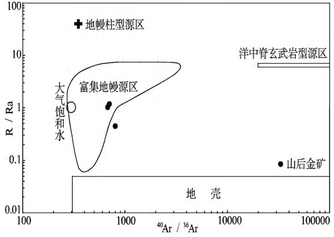
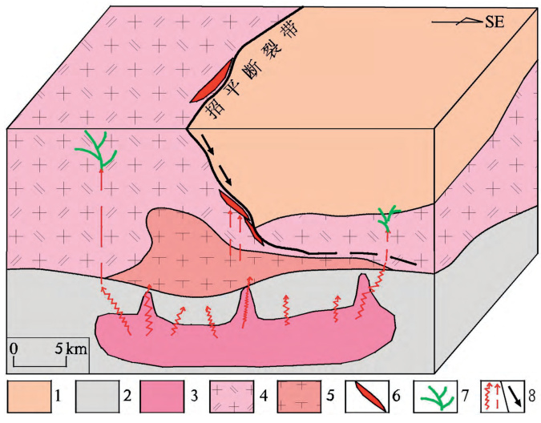

# 胶东山后金矿成矿流体氦氩同位素地球化学特征  

王巧云，张文，郭晶，郝兴中，郭艳，吴红霞，祝培刚，刘丽，杨振毅山东省地质调查院，济南，250014  

关键词：He-Ar 同位素；成矿流体；山后金矿  

山后金矿位于胶西北金矿集区的招远—平度断裂带（以下简称招平断裂带）南部。本文通过测试分析黄铁矿稀有气体（He-Ar）同位素，深入分析山后金矿的成矿流体和成矿物质来源，并探讨该金矿的成矿机制。  

# 1 矿床地质特征  

该矿床受北东向断裂的控制，赋存于招平断裂带主断面下盘 $40\;\mathrm{m}$ 范围内，位于- $-500\;\mathrm{m}$ 标高以上（张瑞忠，2017；柳志进等，2017）。区内为压扭性断裂，断裂带蚀变发育，主要有绢云母化、黄铁矿化、硅化等，局部被石英脉、黄铁矿石英脉、煌斑岩脉等充填（图1）。矿床中共圈定16 个矿体，其中主矿体占矿区资源储量的 $65.5\%$ ；次要矿体和其他14 个矿体均为小矿体。  

主矿体呈缓倾斜脉状赋存于构造蚀变岩中，走向 $32^{\circ}$ ，倾向南东，倾角 $40^{\circ}$ ，控制矿体长 $257\;\mathrm{m}$ ，斜深 $885\;\mathrm{m}$ ，赋存标高 $+156\mathrm{\sim}487~\mathrm{m}$ 。矿体厚 $0.63\substack{\sim}$ $20.26\;\mathrm{m}$ ，平均厚 $4.02\;\mathrm{m}$ ，厚度变化系数 $82.15\%$ ，属于厚度稳定型矿体。金品位在 $1.01\!\times\!10^{-6}\!\sim$ $123.08\!\times\!10^{-6}$ ，平均品位 $3.21\!\times\!10^{-6}$ 。次要矿体的产状与主矿体一致，控制矿体长 $181\mathrm{~m~}$ ，斜深 $693\;\mathrm{m}$ 。矿体厚 $0.45\!\sim\!4.67\;\mathrm{m}$ ，平均厚度 $2.01\;\mathrm{m}$ ，厚度变化系数 $62\%$ 。金最高品位 $6.95\!\times\!10^{-6}$ ，最低为 $1.11\!\times\!10^{-6}$ ，平均为 $2.58\!\times\!10^{-6}$ 。  

石英、长石、绢云母、方解石等矿物在显微镜下粒径一般为 $0.05\!\sim\!1.0\,\mathrm{mm}$ ，多呈粒状或鳞片状，彼此呈镶嵌紧密状分布。石英呈不规则粒状，波状消光；绢云母呈鳞片状，有的发生绿泥石化，多呈条纹条带状集合体围绕粒状矿物分布。金属矿物主要由黄铁矿、磁铁矿、黄铜矿、闪锌矿、方铅矿组成，黄铁矿呈半自形晶粒结构，浸染状构造，粒径一般为 $0.05{\sim}2.5\,\mathrm{mm}$ ；磁铁矿呈半自形晶粒结构，粒径一般为 $0.01\!\sim\!0.1\;\mathrm{mm}$ 。金含量一般在 $2\!\times\!10^{-6}\!\sim$ $4\!\times\!10^{-6}$ ，平均值为 $3.01\!\times\!10^{-6}$ 。  

  
图1 山后矿区地质简图  

1—第四系；2—荆山群野头组；3—荆山群禄格庄组；4—变粒岩；5—胶东群；   
6—玲珑序列崔召单元；7—煌斑岩；8—石英脉；9—金矿体；10—断层泥；   
11—绢英岩化花岗质碎裂岩；12—花岗质碎裂岩；13—研究区  

# 2 样品及分析方法  

# 2.1 样品采集  

本次研究在主矿体 $-200\;\mathrm{m}$ 中段和主断面下盘（ $0\!\sim\!85\;\mathrm{m}$ 范围）的黄铁绢英岩化花岗质碎裂岩内采集了矿石14 件、花岗岩4 件。在岩相学和矿相  

学研究基础上，选择2 件矿石和1 件花岗岩挑选黄铁矿进行He-Ar 同位素测试。  

# 2.2 分析方法  

黄铁矿包裹体中He-Ar 同位素测试在核工业北京地质研究院分析测试研究中心完成。实验流程和测试方法详见《 $^{40}\mathrm{Ar}^{39}\mathrm{Ar}$ 同位素地质年龄及氩同位素比值测定》，测试仪器为Helix SFT 型惰性气体质谱仪，He 和 $\operatorname{Ar}$ 分别在特定值的阱电流时，灵敏度分别优于 $2\!\times\!10^{-4}\,\mathrm{A/Torr}$ 和 $7{\times}10^{-4}\,\mathrm{A/Torr}$ ，测量结果以大气He、Ar 同位素组成为测量标准。  

# 3 分析结果  

山后金矿的黄铁矿流体包裹体的氦氩同位素测试结果见表1。黄铁矿流体包裹体 $\mathrm{^3He/^{4}H e}$ 为$0.31\!\times\!10^{-6}\!\sim\!0.79\!\times\!10^{-6}$ ，是空气的 $\mathrm{^3He/^{4}H e}$ （Ra）的$0.45\!\sim\!1.15$ 倍，平均 $0.91\;\mathrm{Ra}$ ，约为地壳氦（ $0.01\mathrm{\sim}$ $0.05\;\mathrm{Ra}\,]$ ）的 $18\!\sim\!90$ 倍，高于地壳氦，但远低于典型地幔氦（ $6{\sim}9\ \mathrm{Ra}$ ）（Stuart et al.，1995；Burnardet al.，1999）； $^{40}\mathrm{Ar}/^{36}\mathrm{Ar}$ 的范围为 $679.32\!\sim\!804.23$ ，平均值724.83，约为大气降水的 $^{40}\mathrm{Ar}/^{36}\mathrm{Ar}$ 值（298）的2.43 倍，具有较高的 $^{40}\mathrm{Ar}/^{36}\mathrm{Ar}$ 。  

# 4 讨论  

# 4.1 成矿流体来源  

研究表明，作为重要的载金矿物黄铁矿中流体包裹体对He、Ar 具有理想的封闭性，是用于研究流体包裹体He、Ar 同位素组成的理想寄主矿物（HuRuizhong et al.，2004；丁德建等，2014）。地壳流体中的稀有气体有三个明显不同的源区，即饱和空气雨水中的稀有气体、地幔中的稀有气体和地壳中放射成因的稀有气体。在不同的源区He、Ar 同位素组成具有明显的差异性，因此He、Ar 同位素被广泛应用于示踪成矿流体。  

本文样品的 $\mathrm{^3He/^{4}H e}$ 为 $0.45\!\sim\!1.15\;\mathrm{Ra}$ ，介于地幔氦和地壳氦之间，说明成矿流体具有壳幔混合的特征，表明山后金矿成矿流体是地壳流体与地幔流体混合的产物。研究表明（段超等，2016；杜佛光等，2019），根据He-Ar 同位素体系的 $^{40}\mathrm{Ar}/^{36}\mathrm{Ar}$ 和 $\mathrm{^3He/^{4}H e}$ 的特征值可以判断地幔流体至少有3 个主要源区：地幔柱型源区、洋中脊玄武岩型源区和富集地幔源区。富集地幔源区由于受到俯冲作用带来的洋壳物质的交代富集，造成其 $^{40}\mathrm{Ar}/^{36}\mathrm{Ar}$ 和$\mathrm{^3He/^{4}H e}$ 比值均低于洋中脊玄武岩型源区。因此，华北克拉通东部新生代玄武岩中地幔捕虏体的$\mathrm{^3He/^{4}H e}$ 接近或低于 $1\ \mathrm{Ra}$ ，显示富集地幔源区的特征（ $\operatorname{Hu}$ Ruizhong et al.，2004；毛景文等，2005）。本文样品的 $\mathrm{^3He/^{4}H e}$ 平均 $0.91\;\mathrm{Ra}$ ，接近或低于 $1\ \mathrm{Ra}$ ，如图2 所示，由此推测山后金矿成矿流体来自富集地幔。  

  
图2 山后金矿流体包裹体 $^{40}\mathrm{Ar}/^{36}\mathrm{Ar}^{3}\mathrm{He}/^{4}\mathrm{He}$ （R/Ra）图解（段超等，2016；杜佛光等，2019）  

# 4.2 成矿物质来源  

山后金矿黄铁矿 $^{87}\mathrm{Sr}/^{86}\mathrm{Sr}$ 平均值为0.7173，低于大陆地壳锶同位素的平均值0.719（Faure，1986），而明显高于地幔锶的初始值0.705，与围岩玲珑花岗岩和郭家岭花岗岩以及前寒武纪变质岩的锶同位素组成相似，与伟德山期花岗岩及同时代的中基性脉岩（煌斑岩、辉长岩、闪长玢岩） $^{87}\mathrm{Sr}/^{86}\mathrm{Sr}$ 的高峰值相同，表明成矿物质来源的复杂性，很可能胶东岩群、玲珑花岗岩、郭家岭花岗岩以及同时代的伟德山期花岗岩和中基性脉岩均参与了成矿作用。Sr-Nd 同位素组成特征与玲珑花岗岩、郭家岭花岗岩、中基性脉岩以及前寒武纪变质岩相似，推测成矿物质主要来源于玲珑花岗岩、郭家岭花岗岩和前寒武纪变质基底。  

# 4.3 成矿模式  

根据本文的He、Ar 同位素的研究结果，山后金矿的成矿流体为富集地幔流体和地壳流体的混合流体。前人对胶东地区大地构造背景研究表明，晚侏罗世时期，由于太平洋板块向库拉板块的俯冲作用，郯庐断裂带发生了大规模的左行平移，形成了一系列的NE—NEE 向控矿断裂构造，导致古太平洋俯冲洋壳交代的富集地幔融解，形成壳幔混合岩浆带。华北克拉通岩石圈地幔拆沉，软流圈上涌，导致该区域的地壳大规模伸展隆起。而受到早白垩世的碰撞造山运动的影响，胶北隆起区形成了一系列的NNE 向脆性断裂及周边的次级脆性断裂，为岩浆-热液的上升提供了有利的空间和通道。热液流体上升的过程中混染地壳流体，当运移至深度 $5\!\sim\!8$ $1\mathrm{m}$ 的低压带后，成矿流体由于大气降水的混入，其温度、压力、pH 值、氧逸度等均发生变化，导致载金矿物在次级陡倾断裂部位沉淀富集，形成了岩浆期后热液型金矿（图3）。  

  
图3 研究区金矿成矿模式图  

1—前寒武纪变质基底；2—下地壳；3—岩浆房；4—玲珑花岗岩；5— 郭家岭花岗岩；6—金矿体；7—中基性脉岩；8—岩浆流体/成矿流体/ 大气降水  

# 5 结论  

山后金矿的成矿流体为壳幔混合流体，在成矿晚期有大气降水加入。本文认为招平金矿带成矿物质主要来源于玲珑花岗岩、郭家岭花岗岩和前寒武纪变质基底。在成矿过程中，招平金矿带深部成矿流体和浅部大气降水在右行张剪性断裂裂隙系统中混合，形成了浸染状、细脉浸染状矿脉。因此，山后金矿是典型的岩浆期后热液型矿床，金矿类型为构造蚀变岩型。  

丁德建, 梁金龙, 孙卫东, 郭俊华, 李贺, 叶先仁. 2014. 阳山金矿成矿流体的He-Ar 同位素示踪. 矿物岩石地球化学通报, 33(6): $813\sim$ 819.  
杜佛光, 姜耀辉, 青龙, 倪春雨. 2019. 胶东夏甸金矿成矿流体及成矿物质来源：H-O、He-Ar、Sr-Nd-Pb 同位素证据. 高校地质学报, 25(5):$686\!\sim\!696.$ .  
段超, 刘锋, 韩丹, 李延河. 2016. 稀有气体同位素测试技术及其在矿床学研究中的应用. 地质学报, 90(8): 1908～1921.  
柳志进, 张新勇, 戚静洁, 丁宪华, 张辉, 赵晓亮. 2017. 胶东山后金矿流体包裹体及H-O-S 同位素特征. 地质科技情报, 36(6):190～196.  
毛景文, 李厚民, 王义天, 张长青, 王瑞廷. 2005. 地幔流体参与胶东金矿成矿作用的氢氧碳硫同位素证据. 地质学报, 79(6): 839～857.  
张瑞忠. 2017. 招平金矿带构造控矿机理及深部成矿预测. 导师: 杨立强. 北京: 中国地质大学(北京)博士学位论文, 1\~166.  
Burnard P G, Hu Ruizhong, Turner G, Bi X W. 1999. Mantle, crustal andatmospheric noble gases in Ailaoshan gold deposits, Yunnan Province,China. Geochimica et Cosmochimica Acta, 63(10): 1595～1604.  
Faure G. 1986. Principles of Isotope Geology. New York: John Wiley andSons Inc., $1\!\sim\!589$ .  
Hu Ruizhong, Burnard P G, Bi Xianwu, Zhou Meifu, Peng Jiantang, SuWenchao, Wu Kaixing. 2004. Helium and argon isotope geochemistryof alkaline intrusion associated gold and copper deposits along the RedRiver-Jinshajiang Fault Belt, SW China. Chemical Geology, 203(3-4):$305\!\sim\!317$ .  
Stuart F M, Burnard P G, Taylor R P, Turner G. 1995. Resolving mantle andcrustal contributions to ancient hydrothermal fluids: He–Ar isotopes influid inclusions from Dae Hwa W–Mo mineralisation, South Korea.Geochimica et Cosmochimica Acta, 59: 4663～4673.  

WANG Qiaoyun, ZHANG Wen, GUO Jing, HAO Xingzhong, GUO Yan, WU Hongxia, ZHU Peigang, LIU Li, YANG Zhenyi: Geochemical characteristics of helium and argon isotopes of ore-forming fluid in Shanhou gold deposit, Jiaodong Peninsula  

Keywords: He-Ar isotopes; ore-forming fluid; Shanhou gold deposit  

参 考 文 献/ References  
表1 山后金矿黄铁矿流体包裹体氦、氩同位素组成  

  