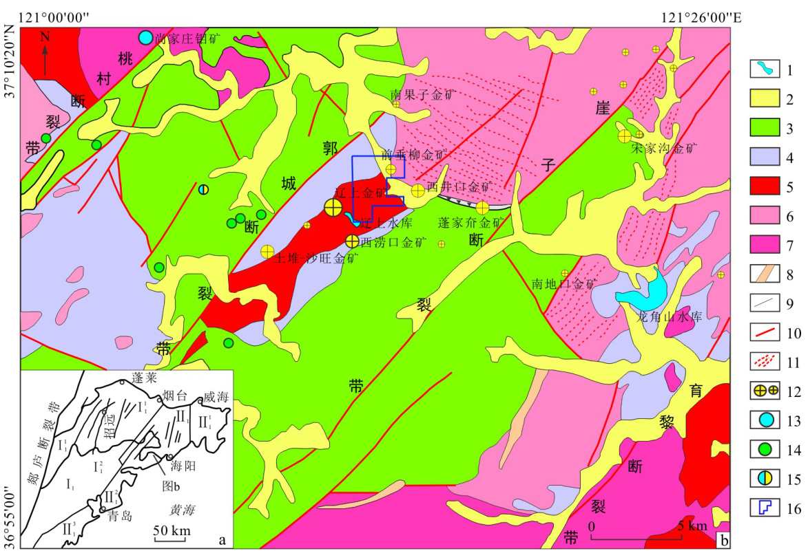
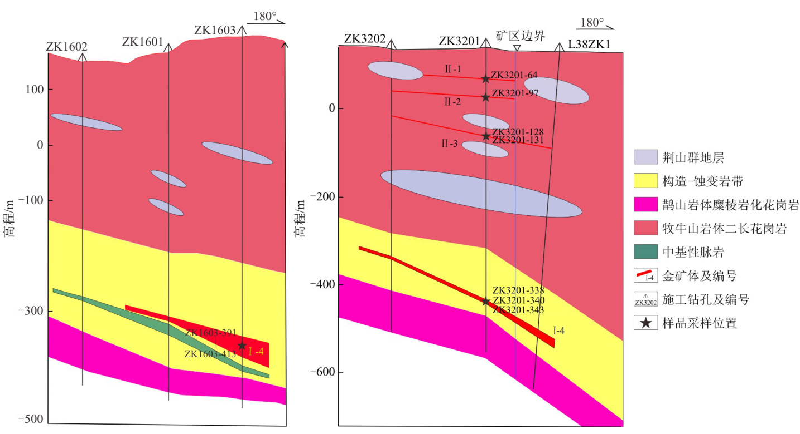
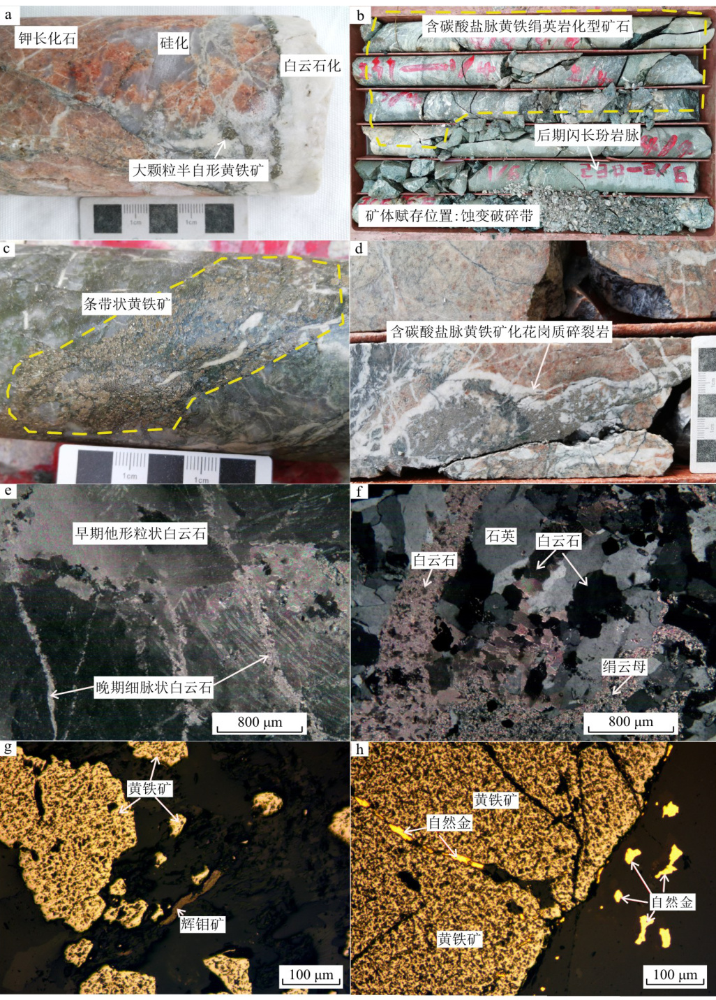
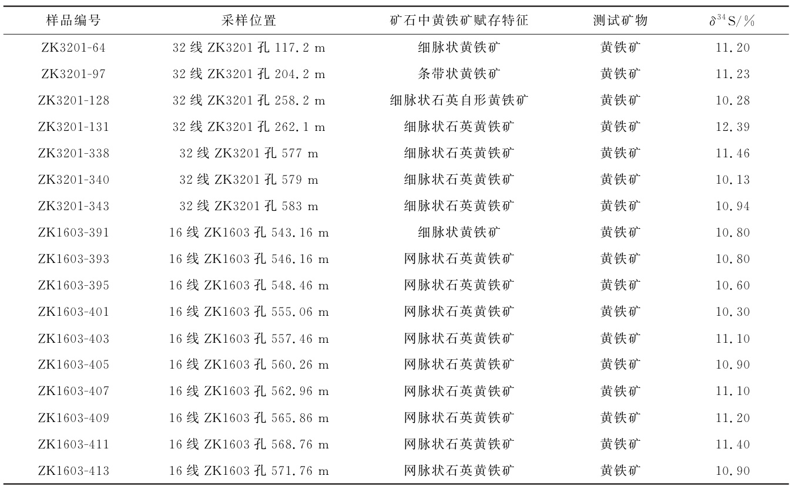
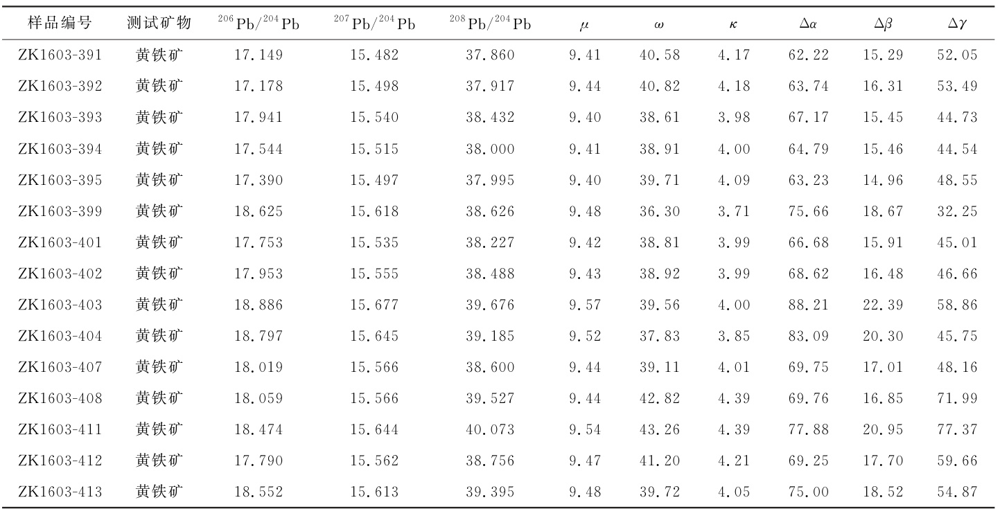
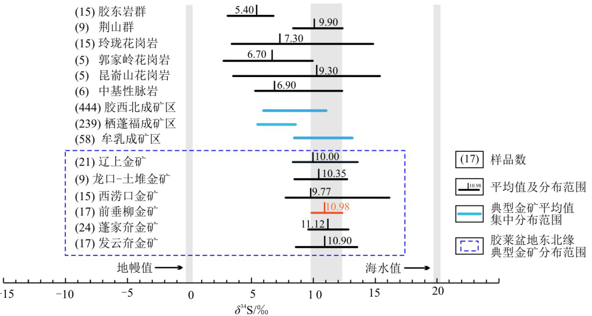
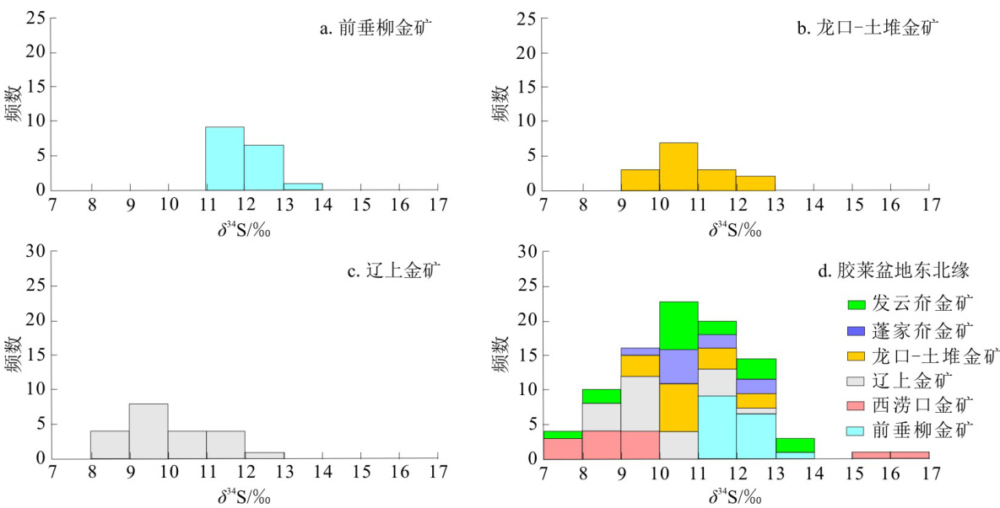
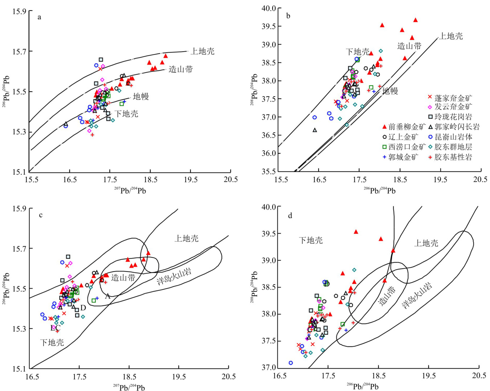
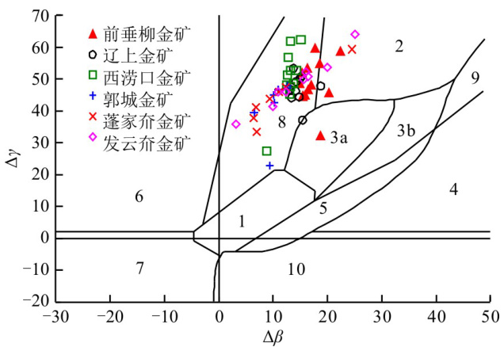

韩小梦,郭云成,段留安,等.胶莱盆地东北缘前垂柳金矿床S、Pb同位素组成:对成矿物质来源的指示[J].地质科技通报, 2023,42(3):210-221.   
HanXiaomeng,GuoYuncheng,DuanLiuan,etal.SandPbisotopiccompositionsoftheQianchuiliuGoldDepositonthenortheasternmarginoftheJiaolaiBasin:Implicationonthesourceofore-formingmaterial[J].BulletinofGeologicalScienceand Technology,2023,42(3):210-221.  

# 胶莱盆地东北缘前垂柳金矿床S、Pb同位素组成:  

对成矿物质来源的指示  

韩小梦1,郭云成1,段留安12,王建田1,赵鹏飞1,王利鹏1,喻光明3(1.中国地质调查局烟台海岸带地质调查中心,山东烟台264000;2.自然资源部深部金矿勘查开采技术创新中心/山东省深部金矿探测大数据应用开发工程实验室,山东威海264209;3.中国地质调查局自然资源综合调查指挥中心,北京100032)  

摘 要:前垂柳金矿为胶东胶莱盆地东北缘新发现的蚀变岩型金矿床,金矿体主要赋存于牧牛山岩体(二长花岗岩)、荆山群地层和鹊山岩体(糜棱岩化二长花岗岩)之间厚大的构造蚀变带内,截止目前推测资源量达到中型规模,但矿床的成矿物质来源尚不明确。基于前人研究及野外调查,选择典型矿体中含金黄铁矿作为研究对象,开展了S、Pb同位素分析,探讨了矿床的成矿物质来源。测试结果显示:矿石硫化物 $\delta^{34}\,\mathrm{S}$ 值总体为 $10.\,13\%\sim$ $12.\,39\%$ ,极差为 $2.\,26\%$ ,平均值 $10.\,98\%$ ,均一程度高,具高 $\delta^{34}\,\mathrm{S}$ 值特征,反映了深部成矿流体上侵过程中混染了更多的地层中的硫,显示了荆山群地层对成矿有一定贡献;矿石铅同位素 $^{206}\,\mathrm{Pb}/^{204}\,\mathrm{Pb}$ 比值为 $17.149\!\sim$ $18.\,886\,{,}^{207}\,\mathrm{Pb}{/}^{204}\,\mathrm{Pb}$ 比值为 $15.\,482\!\sim\!15.\,677$ , $^{208}\,\mathrm{Pb}/^{204}\,\mathrm{Pb}$ 比值为 $37.\;860\!\sim\!40.\;073$ ,显示前垂柳金矿铅为壳幔混合来源,且具有下地壳铅的特征。该矿床S、Pb同位素特征显示成矿物质来源为壳幔混源,与周边辽上、蓬家夼等典型矿床成矿物质来源一致,反映了该区燕山期大规模成矿事件,预示了胶莱盆地东北缘具有较大的找矿潜力。  

关键词:胶莱盆地东北缘;前垂柳金矿;S同位素;Pb同位素;物质来源中图分类号:P618.51 文章编号:2096-8523(2023)03-0210-12 收稿日期:2022-11-25doi:10.19509/j.cnki.dzkq.tb20220659 开放科学(资源服务)标识码(OSID):  

# SandPbisotopiccompositionsoftheQianchuiliuGoldDeposit onthenortheasternmarginoftheJiaolaiBasin: Implicationonthesourceofore-formingmaterial  

HanXiaomeng1,GuoYuncheng1,DuanLiuan1,2,WangJiantian1, ZhaoPengfei1,WangLipeng1,YuGuangming3  

(1.YantaiGeologicalSurveyCenterofCoastalZone,ChinaGeologicalSurvey,YantaiShandong264000, China;2.MinistryofNaturalResourcesTechnologyInnovationCenterforDeepGoldResources ExplorationandMining/ShandongProvincialEngineeringLaboratoryofApplicationandDevelopment ofBigDataforDeepGoldExploration,WeihaiShandong264209,China;3.CommandCenterof NaturalResourcesComprehensiveSurvey,ChinaGeologicalSurvey,Beijing100032,China)  

Abstract:TheQianchuiliuGoldDepositonthenortheasternmarginoftheJiaolaiBasinisanewlydiscoverd alteredrocktypegolddeposit,andisamedium-sizedgolddeposithostedinthestructuralalterationzone  

betweenMuniushan,JingshanGroupandQueshanmonzoniticgranites.However,thesourceofore-formingmaterialsandtheoregenesisarenotclear.Basedonpreviousfieldandanalyticalstudies,theauthors conductedsulfurandleadisotopicanalysesongold-bearingpyritefromtypicaloresastheresearchtarget. The $\delta^{34}\,\mathrm{S}$ valuesarehighandhomogeneousrangingfrom $10.\ 13\%-12.\ 39\%$ ,withanaverageof $10.\ 98\%$ andpolaroddsof $2,\,26\%$ .ThesesulfurisotopicresultsrevealamixingprocessofsulfurintheJingshan Groupduringtheupwellingofdeepore-formingfluid.Theratiosof $^{206}\,\mathrm{Pb}/^{204}\,\mathrm{Pb}$ , $^{207}\,\mathrm{Pb}/^{204}\,\mathrm{Pb}$ ,and $^{208}\,\mathrm{Pb}/^{204}\,\mathrm{Pb}$ varyfrom $17.\,149\!-\!18.\,886\,,\,15.\,482\!-\!15.\,677$ ,and $37.\,860\!-\!40.\,073$ ,respectively,suggestinga crust-mantlemixedsource.Inconclusion,sulfurandleadisotopeanalysisresultsoftheQianchuiliuGold Depositshowacrust-mantlemixedsourceandaresimilartothoseoftypicalgolddepositsinthisregion. ThegolddepositsonthenortheasternmarginoftheJiaolaiBasinformedatthelarge-scaleYanshanian metallogenicevent,indicatinggreatprospectingpotentialinthisarea.   
Keywords:northeasternmarginoftheJiaolaiBasin;QianchuiliuGoldDeposit;sulfurisotope;leadisotope;materialsource  

胶莱盆地东北缘位于华北板块和秦岭 大别苏鲁碰撞造山带交汇部位(图1-a),区内岩浆活动强烈,构造发育,总体受区内北东向的桃村断裂、郭城断裂、朱吴 崖子左行走滑断裂构造及其形成的拉分盆地边缘的铲式滑脱构造系统控制[2-4](图1-b)。区内分布有辽上(特大型)、土堆 沙旺(大型)、蓬家夼(大型)、发云夼(大型)、西涝口(大型)和西井口(中型)等一系列金矿床,累计探获金资源量超过$200\,\mathrm{~t~}$ ,是继胶东中东部牟乳成矿带之后新发现的重要金矿集中区[5-8]。因此近年受到国内外地质学者[9-17]重点关注,对该区金矿勘查找矿、成矿理论和成矿预测等开展了一系列研究,取得了诸多重要进展。例如“辽上式”新类型金矿的发现[14],丰富了胶东金矿成矿理论体系。前人研究认为胶莱盆地东北缘地区典型金矿床成矿流体、成矿物质来源具有多元性,主要观点有:成矿物质来源于牧牛山岩体和地壳深部,成矿流体来源于深部岩浆演化[15];成矿物质来源于幔源岩浆流体[16];成矿物质来源于壳幔混源[2-3,17-18],总体上尚未形成统一认识。  

前垂柳矿区位于胶莱盆地东北缘的辽上金矿和西涝口金矿之间,依据段留安等[19]提出的找矿思路,经2年的勘查工作,提交推断资源量已近大型规模,为近年来该区新发现的金矿床。Duan等[20]初步总结了该区控矿规律为“近东西向构造控矿”,指出辽上、前垂柳、西涝口深部矿体为一个整体的东西向矿体,赋存在深部东西向产状缓倾的大型构造破碎蚀变带内。目前该区已开展了岩浆岩锆石年龄等研究[1,19-20],但尚未开展成矿物质来源研究工作。为查清矿床成因,笔者选取含金黄铁矿进行S、Pb同位素分析研究,并与区域典型金矿床、赋矿围岩S、Pb同位素特征进行对比分析,初步探讨前垂柳矿区成矿物质来源,为区域成矿规律研究及下步工作提供支撑。  

# 1 区域地质背景  

前垂柳金矿处于胶莱盆地东北缘成矿区中部(图1-b),区内壳幔作用强烈,构造岩浆活动频繁,成矿条件优越。区内分布地层由老到新主要为: $\textcircled{1}$ 古元古界荆山群,总体呈北东向展布,主要分布在郭城断裂带下盘,岩性主要为黑云片岩、斜长透辉岩、黑云变粒岩、大理岩等,原岩为经受高角闪岩相区域变质的海相碎屑岩。在该区域范围内,古元古界荆山群往往作为金矿赋矿围岩[21-22]。 $\textcircled{2}$ 中生代地层从下到上依次为莱阳群、青山群和王氏群。莱阳群广泛分布在蓬家夼南部胶莱盆地内,与玲珑序列二长花岗岩和荆山群呈断层或角度不整合接触,为一套陆相碎屑沉积岩。青山群分布于郭城断裂带和桃村断裂带之间,岩性为凝灰质砂岩、砾岩、安山岩、流纹岩等,为一套陆相中基性、中酸性火山岩。王氏群仅少量分布在区域西北部,为一套陆相碎屑沉积岩。$\textcircled{3}$ 新生界第四系,主要分布于河流两侧、沟谷及河床地带,沉积类型为残坡积、冲洪积,岩性为砂、砾石、砂质亚黏土[21-24]。 。  

区内断裂构造发育,按展布方向可分为NE 向、NNE向、近EW 向、NW 向4组。 $\textcircled{1}$ NE 向郭城、桃村、崖子和育黎等区域性超壳断裂带,为盆地边界断裂带,控制了盆地的形成与演化,同时也是深部岩浆作用的重要通道,辽上、土堆、南果子等金矿即位于郭城断裂带下盘[18]。 $\textcircled{2}$ NNE 向断裂,主要为郭城断裂带旁侧的次级断裂,倾角较缓,属压扭性断裂,为该区金矿的主要控矿构造,土堆、南果子金矿即受该组断裂控制。 $\textcircled{3}$ 近  向断裂,以蓬家夼断裂为主,位于蓬家夼至东井口一带,处于荆山群与玲珑花岗岩衔接部位的荆山群中。蓬家夼大型金矿和西井口金矿即受该断裂控制。 $\textcircled{4}\mathrm{NW}$ 向断裂,出露规模一般较小,多为NE向断裂的共轭断裂,与金矿形成  

  
1.水库;2.第四系;3.下白垩统陆相沉积岩、火山岩;4.古元古界变质岩;5.前寒武纪侵入岩;6.晚侏罗世二长花岗岩;7.早白垩世花岗闪长岩;8.燕山晚期岩脉;9.地质界线;10.断裂;11.韧性剪切带;12.金矿床(点);13.钼矿床;14.铜矿点;15.铅锌矿点;16.胶莱盆地东北缘前垂柳矿区位置;Ⅰ.华北板块; $\mathrm{~I~}_{1}$ .胶莱-胶北断隆; $\mathrm{~I~}_{1}^{1}$ .胶北断隆; $\mathrm{~I~}_{1}^{2}$ .胶莱断陷;Ⅱ.秦岭-大别-苏鲁碰撞造山带; $\mathbb{I}_{\mathrm{~1~}}$ .胶南-威海断隆; $\mathbb{I}_{\mathrm{~1~}}^{\mathrm{~1~}}$ .文登-威海断拱; $\mathbb{I}_{\;1}^{\;2}$ .胶莱断陷; $\mathbb{I}_{\;1}^{\;3}$ .胶南-临沭断拱  

图1 前垂柳金矿区及周边金矿区地质简图[1] Fig.1 GeologicalmapoftheQianchuiliuGoldMiningareaandnearbygoldmineraldeposits  

# 关系不大。  

区内侵入岩发育,按照时代大致分为三大类:前寒武纪侵入岩(牧牛山岩体)、晚侏罗世二长花岗岩(鹊山岩体)和早白垩世花岗闪长岩(伟德山岩体)。前寒武纪牧牛山岩体呈NE向展布于郭城断裂带下盘,为下地壳重融型二长花岗岩 $(1\ 840\ \mathrm{Ma})^{[1]}$ ;晚侏罗世鹊山岩体主要分布于胶莱盆地东北缘外侧,呈岩株状分布于荆山群地层中,岩性为弱片麻状细中粒含石榴二长花岗岩 $\mathit{\Omega}^{\left(\mathrm{163\sim149\,\,\,Ma}\,\right)^{[5}}$ ],为陆壳重熔型花岗岩,与金矿床有着密切的空间联系,是区内成矿期主要的近矿围岩;而早白垩世伟德山花岗闪长岩 $(125\!\sim\!110\,\,\mathrm{Ma})^{[23]}$ 主要分布在区域西北部和东南部地区,与荆山群、晚侏罗世玲珑花岗岩体呈侵入、渐变过渡或断层接触关系,与金矿化关系密切[19-21]。另外发育少量燕山晚期幔源型中基性岩脉,岩性主要为闪长玢岩、煌斑岩脉 $125\sim112$ $\mathrm{Ma})^{[5]}$ ,中基性岩脉多呈NE、NEE 向高角度侵位于荆山群地层和牧牛山岩体中。  

# 2 矿床地质特征  

前垂柳金矿位于烟台市牟平区观水镇西南约  

$18~\mathrm{km}$ 处,行政区划属牟平区观水镇,矿区西侧为辽上金矿,南东侧为西涝口金矿和西井口金矿。区内出露地层主要为古元古界荆山群,少量中生界白垩系莱阳群及新生界第四系。矿区构造整体受NE 向郭城断裂带、崖子断裂带和近EW 向蓬家夼层间滑脱断裂带共同影响,主要发育近EW 向、NE 向和NW 向3组次级断裂构造,其中近EW 向、NE 向构造最为发育,是区内主要的导矿和容矿构造。岩浆岩主要出露于矿区中南部,根据前人研究[1,20]地表出露岩浆岩为牧牛山岩体弱片麻状中粗粒二长花岗岩,岩石中可见透镜体状、层状和块状地层捕虏体(图2),捕虏体岩性为斜长角闪岩、大理岩和变粒岩等,常被后期多期次煌斑岩脉和闪长玢岩脉穿插。区内矿化蚀变发育,其中黄铁矿化、绢英岩化和碳酸盐化与金矿化关系密切。  

前垂柳金矿截止目前累计施工钻孔9个,共发现金矿体17条,主要金矿体6条,共计圈算推断资源量近 $20\,\mathrm{~t~}$ 。金矿体主要分布在  线、  线(图),走向近东西向,倾向南,倾角 $13^{\circ}\!\sim\!21^{\circ}$ ,控制长度$80\!\sim\!640\ensuremath{\,\mathrm{~m~}}$ 不等,呈透镜状、脉状、似层状分布于厚大的破碎蚀变带中。其中Ⅰ-4 号主矿体赋存标高$-\,30\,3\!\sim\!-450\,\mathrm{~m~}$ ,控制长度 $640\,\mathrm{~m~}$ ,倾向控制延深  

  
图2 前垂柳金矿区16线和32线钻孔剖面图Fig.2 DrillingprofileofLine16andLine32intheQianchuiliuGoldMinearea  

$220\,\textrm{m}$ (未封闭),平均铅垂厚度 $12.\;07\;\mathrm{~m~}$ ,平均金品位 $3.\ 02\ \mathrm{g/t}$ ,最高金品位 $90.~90~\mathrm{g/t}$ ,矿石主要为含碳酸盐脉黄铁绢英岩化花岗质碎裂岩,具自形 半自形粒状、碎裂结构,浸染状、细脉状、网脉状、团块状构造,矿石矿物以黄铁矿为主,少量黄铜矿、辉钼矿等。脉石矿物主要有石英、钾长石、斜长石、白云石、绢云母等。主要载金矿物为黄铁矿,其次白云石和石英。  

通过野外和室内观察,并对比周边辽上金矿和西涝口金矿矿化特征,初步将前垂柳金矿划分为3个成矿阶段: $\textcircled{1}$ 早阶段的钾长石-金-黄铁矿-白云石脉阶段,肉红色钾长石和白色白云石中共生有粗粒自形 半自形五角十二面体和立方体黄铁矿,呈团块状或脉状展布(图 $3{-}\mathrm{a}\,$ ); $\textcircled{2}$ 中阶段的金-黄铁矿-碳酸盐-石英脉阶段,烟灰色石英脉和白色碳酸盐脉,脉体细小,主要产出微细粒半自形黄铁矿,以及少量自然金和辉钼矿。自然金多呈树枝状、浑圆状、星点状分布于碳酸盐、石英或黄铁矿裂隙中(图 $3{\it-}\mathrm{b}{\sim}\mathrm{h})$ ),该阶段为主要金成矿阶段,构成品位低、厚度大的矿体,局部富集形成自然金颗粒; $\textcircled{3}$ 晚阶段的黄铁矿-碳酸盐细脉阶段,此阶段见白色碳酸盐脉,少量中-细粒黄铁矿,偶尔可见黄铜矿和方铅矿。  

# 3 样品采集及测试方法  

本次分析测试的样品均采自前垂柳金矿区矿体的16线和32线钻孔岩心,其中Ⅰ-4号矿体最具代表性,为重点采样区。采样位置详见图2,所测样品均为主成矿阶段载金黄铁矿。  

本次样品的S、Pb同位素分析测试均在核工业北京地质研究院分析测试研究中心完成。其中 同位素分析采用的仪器为 气体同位素质谱仪,样品以《DZ/T0184.15-1997:硫酸盐中硫同位素组成的测定》为检测方法和依据,采用  国际标准。试验流程为:称取适量的样品(含硫 $15\,\mathrm{~mg}$ 左右),利用碳酸钠 氧化锌半熔法,提取出硫酸钡。取 $350\!\sim\!400~\mu\mathrm{g}$ 硫酸钡与五氧化二钒按 $1:3.\,5$ 的质量比混合均匀,装入锡囊中,采用  型元素分析仪和Delta $\mathrm{v}$ lus型稳定同位素气体质谱仪对样品进行硫同位素组成的分析,选择参考气离子流强度为 $3\,\mathrm{~V~}$ ,Conflo $\mathrm{{I}{\left[{\sqrt{\hbar}-H e}\right.}}$ 载气压力为 $1,\,01\,\times$ $10^{5}\ \mathrm{Pa}$ ,  系统 $\mathrm{He}$ 载气流量为 $100~\mathrm{mL/min}$ ,氧气流量为 $180~\mathrm{mL/min}$ ,加氧时间为 $3\,\mathrm{~s~}$ ,反应炉温度为$1\ 020\,^{\circ}\mathrm{C}$ ,色谱分离柱温度为 $90\,^{\circ}\mathrm{C}$ 。测量结果以CDT 为标准,记为 $\delta^{34}\,\mathrm{S}_{\mathrm{V-CDT}}$ 。分析精度优于$\pm\,0.\,2\%$ 。硫化物参考标准为 ,SO-6和NBS-127,其 $\delta^{34}\,\mathrm{S}$ 分别是 $0.\,45\%_{0}\pm0.\,16\%$ 、$-\,34,\,2\%_{0}\pm0.\,18\%$ 和 $20.\;30\%\pm0.\;19\%^{[25]}$ 。  

Pb同位素分析测试采用ISOPROBE-T 热表面电离质谱仪,仪器编号7734,相对湿度为 $30\,\%$ ,温度为 $20\,^{\circ}\mathrm{C}$ ,误差以 $2\sigma$ 计。试验流程为:准确称取$0.\,1\!\sim\!0.\,2\,\mathrm{~g~}$ 粉末样品于低压密闭溶样罐(PFA)中,用混合酸 $\mathrm{\Delta\HF+HNO_{3}+H C l O_{4}\uparrow}$ )溶解 $24\,\mathrm{~h~}$ 。待样品完全溶解后,蒸干,加入 $6~\mathrm{mol/L}$ 的盐酸转为氯化物蒸干。用 $\mathrm{1~mL~0.~5~mol/L}$ HBr溶解,离心分离,清液加入阴离子交换柱 $(~250~\,\mu\mathrm{L}~\,\mathrm{AG1}\times8$ 孔径$0.\ 154{\sim}0.\ 071\ \mathrm{~mm}\,(100{\sim}200$ 目)),用 $0.\ 5\:\mathrm{\mol/L}$ 淋洗杂质,用 $1\,\mathrm{\mL\,\,6\,\mol/L}$ 的 解析铅于聚四氟乙烯的烧杯中,蒸干备用。用磷酸硅胶将样品点在铼带上,用静态接受方式测量 $\mathrm{Pb}$ 同位素比值。NBS981未校正结果: $^{208}\,\mathrm{Pb}/^{206}\,\mathrm{Pb}=2.$ .164940$\pm0.\ 000\ 015\,,^{207}\,\mathrm{Pb}/^{206}\,\mathrm{Pb}\!=\!0.\ 914\ 338\pm0.\ 000\ 007\,,$ ,$^{204}\,\mathrm{Pb}/^{206}\,\mathrm{Pb}\!=\!0.\,059\,\,110\,\,7\\pm\!0.\,000\,\,000\,\,2$ ,全流程本地 $\mathrm{Pb{<}100\,\ p g}$ ,以 $\langle\mathrm{{DZ}/{T0184.}~12}{-1997}$ :岩石、矿物中微量铅的同位素组成的测定》为检测方法和依据,通过重复样分析结果的对比,误差优于 $10\,\%$ ,说明分析结果可靠。  

  
图3 前垂柳金矿床矿石照片和显微照片Fig.3 PhotographsandphotomicrographsoftheQianchuiliuGoldDeposit  

# 4 分析结果  

# 4.1 硫同位素  

本次测试的17件载金黄铁矿样品均从矿石粉末中挑选,样品的采样情况和 同位素测试结果见表1,结果表明:前垂柳金矿床浅部和深部矿体的硫同位素组成基本相同, $\delta^{34}\mathrm{S}$ 为 $10.\ 13\%\sim12.\ 39\%$ ,极差为 $2.\,26\%$ ,平均值为 $10.\,98\%$ ,样品硫同位素组成呈明显的正态分布,呈现变异小、较富集特征,说明硫同位素均一程度高。  

# 表1 前垂柳金矿床矿石硫同位素组成  

Table1 SulfurisotopecompositionoftheQianchuiliuGoldDeposit  

  

# 4.2 铅同位素  

本次测试的15件样品均为典型矿石中的载金黄铁矿,从分析结果(表2)看, $\mathrm{Pb}$ 同位素具有如下特征: $^{206}\,\mathrm{Pb}/^{204}\,\mathrm{Pb}$ 比值为 $17.\ 149\!\sim\!18.\ 886$ ,平均值为18.007,极差为1.737; $^{207}\,\mathrm{Pb}/^{204}\,\mathrm{Pb}$ 比值为15.482$\sim15$ .677,平均值为15.568,极差为0.195;$^{208}\,\mathrm{Pb}/^{204}\,\mathrm{Pb}$ 比值为 $37.\,860\!\sim40.\,073$ ,平均值为,极差为 。特征参数 $\mu$ 范围为 $9.\ 40\sim$ ,平均值为 $9.\,46\,;\omega$ 范围为 $36.\,30\!\sim\!43.\,26$ ,平均值为 $39.\,74\,{\sf;}\kappa$ 范围为 $3.\,71\!\sim\!4.\,39$ ,平均值为4.07。  

Table2 LeadisotopecompositionoftheQianchuiliuGoldDeposit   
表2 前垂柳金矿床矿石铅同位素组成  

  
注:Pb同位素特征参数 $\boldsymbol{\mu}$ 为 $^{238}\,\mathrm{U}/^{204}\,\mathrm{Pb}\,\lrcorner\omega$ 为 $\mathrm{^{232}\,T h/^{204}\,P b}\,{,}\kappa$ 为 $\mathrm{Th/U}\,.\Delta\alpha$ 为 $[\alpha/\alpha_{\textrm{m}}(t)-1]\times1\ 000\,.\Delta\beta$ 为 $[\beta/\beta_{\mathrm{m}}(t)\!-\!1]\!\times\!1\ 000\,,\Delta\gamma$ 为[γ/$\gamma_{\mathrm{~m~}}(\r_{t})-1\b{\]}\times1\ 000$ ,其中 $\alpha\,.\beta\,.\gamma$ 为测定值、 $\mathsf{\Omega}_{\mathsf{a}_{\mathrm{\Pi}}}({\boldsymbol{t}}\,)\,\sqrt{{\boldsymbol{\beta}}_{\mathrm{m}}({\boldsymbol{t}}\,)}\,\sqrt{{\boldsymbol{\gamma}}_{\mathrm{m}}({\boldsymbol{t}}\,)}$ )为 $t$ 时的地幔值,各参数使用GeoKit软件计算得到[26-27]  

# 5 讨 论  

# 5.1 硫的来源  

硫同位素是热液型金矿床成矿物质来源最好的指示剂,同时也指示硫的来源。因此根据前人研究[28-31],可以依据矿石硫化物 $\delta^{34}\,\mathrm{S}$ 值所获得的成矿溶液的总硫同位素组成推测矿石中硫的来源,从而探讨与金属硫化物伴生的成矿物质的来源。在低氧逸度、不存在硫酸盐条件下[30-32],硫化物 $\delta^{34}\mathrm{S}$ 值可以大致代表热液总硫同位素组成。通过对前垂柳金矿床矿石矿物组成研究可知,金属硫化物主要为黄铁矿,少量辉钼矿等,不含硫酸盐矿物,测试的主体矿物为含金黄铁矿,因此本次测试的 $\delta^{34}\mathrm{S}$ 值可以代表前垂柳金矿热液总硫同位素组成。  

不同来源硫的同位素组成不同[33-36]:地幔源硫的 $\delta^{34}\,\mathrm{S}$ 值接近于,来自于海水的 $\delta^{34}\,\mathrm{S}$ 值最高可达$+\,20\%$ 左右。已有胶东地区各类金矿床赋矿围岩$\delta^{34}\,\mathrm{S}$ 值显示(图4):荆山群 $(\,9.\ 90\%)\!>$ 昆嵛山花岗岩 $(\,9.\ 30\%)>$ 玲珑花岗岩 $(\,7.\ 30\%)>$ 中基性脉岩( $6.\ 90\%)>$ 郭家岭花岗岩 $(\,6.\,\,70\%)>$ 胶东岩群$(5.\,40\%)$ )的特征,同时具有牟乳成矿区 $(\,8.\,\,5\%_{0}\sim$  

$13.\,0\%)\!>$ 胶莱盆地东北缘成矿区(9. $77\%\sim$ $11.\,12\%)\!>$ 胶西北成矿区 $(\,6.\ 0\%0\!\sim\!10.\ 0\%)\!>$ 栖蓬福成矿区 $(\,5.\,5\,\%_{0}\!\sim\!8.\,5\,\%_{0}\,)$ )的特征。牟乳成矿区金矿床赋矿围岩为富 $\delta^{34}\mathrm{S}$ 昆嵛山花岗岩,相应该区金矿床的 $\delta^{34}\,\mathrm{S}$ 值最高;栖蓬福成矿区主要由相对贫 $\delta^{34}\,\mathrm{S}$ 早前寒武纪  岩系和胶东岩群组成,相应金矿床的 $\delta^{34}\,\mathrm{S}$ 值是胶东最低的。这说明金矿床的硫同位素组成与其赋矿围岩有关,成矿流体与赋矿围岩发生了充分的水 岩相互作用,围岩中的硫被活化并萃取到成矿流体中[36]。产于荆山群中金矿体硫同位素值略高,产于玲珑花岗岩中金矿体则硫同位素值略低[34-38]。综上所述,胶莱盆地东北缘金矿床$\delta^{34}\mathrm{S}$ 整体上略大于胶西北成矿区典型金矿床 $\delta^{34}\,\mathrm{S}$ ,预示了该区深部成矿流体在侵位过程中混染了更多的荆山群地层参与成矿。总体上,胶东地区金矿床及赋矿围岩 $\delta^{34}\,\mathrm{S}$ 具有相似性,具有较高的 $\delta^{34}\,\mathrm{S}$ ,尤其是代表幔源特征的中基性脉岩 $\delta^{34}\,\mathrm{S}$ 也远高于玄武岩、地幔 $\delta^{34}\,\mathrm{S}$ 值,这说明该区金成矿物源与流体可能源于深部岩浆热液,深部含矿流体在上升过程中进一步萃取了围岩中的金,近地表有天水的加入在深部热源的持续热动力作用下,混合的含矿流体最终因物理化学条件的变化在特定的环境下富集成矿。  

  
图4 胶莱盆地东北缘典型金矿床硫化物 $\delta^{34}\,\mathrm{S}$ 值对比分布图(图中数据综合本文及文献[31-37]) Fig.4 Distributionofsulfide $\delta^{34}\,\mathrm{S}$ valuesoftypicalgolddepositsonnortheasternmarginoftheJiaolaiBasin  

前垂柳金矿床 $\delta^{34}\,\mathrm{S}$ 测试结果为 $10.\ 13\%$ \~$12.\,39\%$ ,平均为 $10.\,98\%$ ,高于地幔值 $(\delta^{34}\mathrm{S}\!\approx\!0)$ ),小于海水的 $\delta^{34}\,\mathrm{S}$ 值 $(\delta^{34}\,\mathrm{S}{\leqslant}20\%_{0}$ ),呈明显的正态分布,较富集 $\delta^{34}\,\mathrm{S}$ ,呈均一程度高的特征,位于荆山群、玲珑花岗岩及中基性脉岩硫同位素组成范围的高值部分(图4),这与胶莱盆地东北缘金矿床 $\delta^{34}\,\mathrm{S}$ 特征相似(图5),反映了同属于胶东地区金成矿事件,具有相似的物质来源。前人研究表明胶莱盆地东北缘土堆 沙旺金矿床成矿热液的硫源为混合硫,继承了伴生脉岩深部岩浆源区同位素及元素比值特点,并萃取了围岩荆山群中的硫[2,16,39];辽上金矿成矿物质来源于地幔,部分来源于地壳,为壳幔混合作用的产物[18];而西涝口金矿成矿物质则来源于富集地幔区或源区混染[11]。李大兜[3]认为胶莱盆地东北缘成矿物质来源于深源岩浆的混合区,含矿流体在向上运移的过程中萃取了荆山群地层中的成矿物质。  

  
图5 前垂柳金矿床与区域典型金矿床硫同位素对比直方图(图中数据综合本文及文献[31-37])Fig.5 ComporinghistogramsofsulfurisotopesintheQianchuiliuGoldDepositandregionalgolddeposits  

总体上,该区金矿成矿物质来源于壳幔混源,前垂柳金矿位于辽上金矿与西涝口金矿之间、土堆 沙旺金矿北部地区,它们的矿床地质背景、矿石类型、$\delta^{34}\,\mathrm{S}$ 等特征一致,表明其物质来源一致,成矿流体均来源于深部,在上升过程中混染了大量地壳中荆山群中的硫,形成更加富金的成矿流体,并在特定条件下富集成矿。  

# 5.2 铅的来源  

热液环境中沉淀的硫化物(黄铁矿)不含U、Th或含U、Th极低,在矿物形成后不再受放射性成因铅的影响,其铅同位素组成特征主要取决于源区初始铅 $\times\mu$ 值、 $\mathbf{\Omega},\omega$ 值 $\,,\kappa$ 值和形成时间,成矿过程中的物理、化学作用不会改变其组成,只是随着矿质运移和沉淀而运动。因此铅同位素组成是示踪成矿物质来源最直接、最有效的一种方法[31,38-40]。  

从前垂柳金矿主成矿阶段载金黄铁矿中的铅同位素组成来看,其变化范围相对较大,表明铅同位素来源可能不来自同一源区,可能为混合来源。从其铅同位素特征值来看, $\mu$ 值为 $9.\ 40\!\sim\!9.\ 57$ ,平均值为 ,略低于地壳正常 $\mu$ 值 ,明显高于地幔$\mu$ 值 $7.\,3\!\sim\!8.\,0^{[41-43]}$ ,说明铅源主要来源于地壳; $\omega$ 值为 $36.\:30\!\sim\!43.\:26$ ,平均值为 ,高于地壳 $\omega$ 值$36.\,50\,{\mathrm{}}{\mathrm{;}}\kappa$ 值范围为 $3.\ 71\sim4.\ 39$ (表 ),平均值为,高于地幔 $\kappa$ 值 ,与地壳 $\mathrm{Th/U}$ 比值(约为4)相当,表明成矿物质来自U 亏损型源区[41-43]。在 $^{207}\,\mathrm{Pb}/^{204}\,\mathrm{Pb}-^{206}\,\mathrm{Pb}/^{204}\,\mathrm{Pb}$ 铅同位素增长曲线图(图 )中,数据点均落在上地壳和地幔演化曲线之间,主要集中在造山带演化曲线两侧,呈线性分布趋势,表明铅为古老的异常铅,并具有多阶段演化特点;在 $\mathrm{^{206}P b/^{204}P b-^{208}P b/^{204}P b}$ 铅同位素增长曲线图(图 )中,数据点主要落在下地壳和造山带演化曲线之间,个别落在下地壳和造山带曲线上,显示壳幔混合铅特征;在铅同位素构造环境判别图(图)中,数据点主要落在下地壳和造山带中,显示下地壳铅和壳幔混合铅的特征。在铅同位素构造环境判别图(图 )中,数据点主要落在下地壳区,个别落在造山带区,显示下地壳铅特征。另外在铅同位素 $\Delta\beta\!-\!\Delta\gamma$ 成因判别图解(图7)上,数据点主要落在造山带与上地壳铅的交界区域内,个别落在岩浆作用铅范围,显示壳幔混合铅的特征。综合上述图解可以看出,前垂柳金矿铅同位素为壳幔混合铅源,具明显下地壳铅的特征。  

区域上辽上金矿铅以壳幔混合铅源为主[18];西涝口金矿铅具多源性,成矿物质主要来源于下地壳,并有少量地幔物质参与成矿[33];蓬家夼和发云夼金矿铅为古老的异常铅,并具有多阶段演化的特点,以壳幔混合铅源为主[35];土堆 沙旺金矿铅来源于上地幔,成矿物质在迁移沉淀的过程中混合了部分壳源物质[3]。研究表明胶东群地层和胶东基性岩分布在地幔演化线的两侧[44-45],玲珑花岗岩具有陆壳重熔型花岗岩的特征,郭家岭型花岗岩为壳幔混合成因[46],昆嵛山岩体则是沉积岩与幔源岩浆岩的混合[5,38],从图6-a可以看出,三者投点几乎都落在造山带与地幔演化曲线之间,表明铅同位素来自于壳幔混合来源。通过对辽上、土堆-沙旺、蓬家夼及前垂柳等金矿矿石铅同位素数据进行统计发现, $^{206}\,\mathrm{Pb}/^{204}\,\mathrm{Pb}$ 值为 $16.\ 920\sim18.\ 886$ , $^{207}\,\mathrm{Pb}/^{204}\,\mathrm{Pb}$ 值为 $15.\ 307\sim15.\ 677$ , $^{208}\,\mathrm{Pb}/^{204}\,\mathrm{Pb}$ 值为 $37.\ 359\sim$ $39.\,676\,,\Delta\beta$ 值为 $3.\ 13\sim25.\ 03\,,\,\Delta\gamma$ 值为 $22.\ 77\sim$ 。在铅同位素模式图(图 $6\mathrm{-a}\,,\mathrm{b})$ )、构造环境判图7 前垂柳金矿床矿石铅同位素 $\Delta\gamma-\Delta\beta$ 成因判别图解(底图据文献[42];投影点数据综合本文及文献[33-39])  

  
图6 前垂柳金矿床矿石铅同位素模式图 $(a{\sim}b)$ )及构造环境判别图 $\langle\,\mathrm{c}\!\sim\!\mathrm{d}\,\rangle$ )(底图据文献[42];投影点数据综合本文及文献[33-39])Fig.6 Plumbotectonicmodelofleadisotope(a-b)anddiagramfordiscriminatingthetectonicsetting $\left(\,\mathrm{c}-\mathrm{d}\,\right)$ oftheQianchuiliuGoldDeposit  

  
1.地幔源铅;2.上地壳源铅;3.上地壳与地幔混合的俯冲铅:3a.岩 浆作用铅;3b.沉积作用铅;4.化学沉积型铅;5.海底热水作用铅;6. 中深变质作用 $\mathrm{Pb}\!:\!7.$ .深变质下地壳铅;8.造山带铅;9.古老页岩上 地壳铅;10.退变质铅  

Fig.7 $\Delta\gamma-\Delta\beta$ geneticclassificationdiagramshowingore mineralleadisotopicdistributionintheQianchuiliu GoldDeposit  

别图(图6-c,d)、铅同位素 $\Delta\beta\!-\!\Delta\gamma$ 成因判别图解(图7)上可以看出,数据点整体略显分散,主体相对均一,指示该区金矿床具有相同或相似的成矿构造背景和铅源,即铅源以壳幔混合铅源为主,具有明显下地壳铅的特征,说明该区成矿物质来源一致,应为同一成矿背景下发生的成矿作用[34,44]。总体上,胶莱盆地东北缘典型金矿床矿石铅与各时代地质体铅具有较大范围的重叠,说明该区典型金矿床矿石铅同位素在成矿物质来源方面与围岩具有一定的继承性与差异性[5,34-39]。  

综上认为,前垂柳金矿与区域典型金矿床具有相似的矿石硫和铅同位素来源,其成矿物质来源于壳幔混合,它们是同一成矿背景下成矿作用的产物。深部成矿流体在上升过程中混染了不同围岩中的硫和铅,萃取了其中的金元素,形成的含矿流体在合适的条件下富集成矿。同时也造成不同成矿区(胶西北、牟乳、胶莱盆地东北缘等)金矿床矿石硫和铅同位素略有差异的特性。  

# 6 结 论  

(1)前垂柳金矿区矿石黄铁矿 $\delta^{34}\mathrm{S}$ 值总体为$10.\;13\%\sim12.$ $39\%$ ,极差为 $26\%$ ,平均值为$10.\,98\%$ ,均一程度高,具高 $\delta^{34}\mathrm{S}$ 值特征,反映了深部成矿流体在上侵过程中混染了更多的地层中的硫,显示了荆山群地层对成矿有一定贡献。  

(2)矿区矿石黄铁矿 $^{206}\,\mathrm{Pb}/^{204}\,\mathrm{Pb}$ 比值为$17.\,149\!\sim\!18$ .886, $^{207}\,\mathrm{Pb}/^{204}\,\mathrm{Pb}$ 比值为15. $482\sim$ 15.677, $^{208}\,\mathrm{Pb}/^{204}\,\mathrm{Pb}$ 比值为 $37.\ 860\sim40.\ 073$ ,表明铅同位素来源于壳幔混合铅源,且明显具有下地壳铅的特征。  

(3)综合S、Pb同位素特征,可以得出前垂柳金矿床与区域典型金矿床成矿物质来源一致,均来源于壳幔混源,即深部成矿流体在上升侵位过程中萃取了地层中大量的金,形成多源含矿流体,最终因物理化学条件的变化在特定的部位富集成矿。  

# 参考文献:  

[1] 郭云成,段留安,韩小梦,等.胶东前垂柳金矿区花岗岩锆石UPb年代学和地球化学特征及其地质意义[J].现代地质,2022, 36(3):876-897. GuoYC,DuanLA,HanXM,etal.ZirconU-Pbdatingand geochemicalcharacteristicsofthegranitesfromthetheQianchuiliu Gold Mining area in the Jiaodong Peninsula and its geologicalsignificance[J].Geosciencs,2022,36(3):876-897(in ChinesewithEnglishabstract).   
[2] 陈原林,李欢,郑朝阳,等.胶莱盆地龙口-土堆金矿床成因:微 量元素特征与C-H-O-S 同位素约束[J].矿床地质,2021,40 (5):977-996. ChenYL,LiH,ZhengCY,etal.GenesisofLongkou-Tudui GoldDeposit,JiaolaiBasin:ConstraintsoftraceelementcharacteristicsandC-H-O-Sisotopes[J].MineralDeposits,2021, 40(5):977-996(inChinesewithEnglishabstract).   
[3] 李大兜.胶莱盆地东北缘龙口-土堆金矿区矿床成因及成矿模 式研究[J].现代矿业,2020,36(9):6-11. LiDD.StudyongenesisandmetallogenicmodelofLongkouTuduiGoldDepositinnortheasternmarginofJiaolaiBasin[J]. ModernMining,2020,36(9):6-11(inChinesewithEnglishabstract).   
[4] 赵宝聚,高明波,李亚东,等.胶莱盆地东北缘龙口-土堆矿区 金矿床成矿规律研究[J].地质学报,2019,93(增刊1):1-11. Zhao B J,Gao M B,Li Y D,et al.Study on metallogenic regularityofgolddepositsinLongkou-Tuduiminingareaonthe northeasternmarginofJiaolaiBasin[J].ActaGeologicaSinica, 2019,93(S1):1-11(inChinesewit-hEnglishabstract).   
[5] 宋明春,杨立强,范宏瑞,等.找矿突破战略行动十年胶东金矿 成矿理论与深部勘查进展[J].地质通报,2022,41(6):903- 935. SongMC,YangLQ,FanHR,etal.Currentprogressofmetallogenicresearchanddeepprospectingofgolddepositsinthe JiaodongPeniusuladuring10yearsforexplorationbreakthrough strategic action[J].Geological Bulletin of China,2022, 41(6):903-935(inChinesewithEnglishabstract).   
[6] 丁正江,孙丰月,赵财胜,等.山东胶莱盆地东北缘地区金矿成 矿系列[J].矿床地质,2010,29(增刊1):919-920. DingZJ,SunFY,ZhaoCS,etal.Goldmineralizationseriesin northeastmarginofJiaolaiBasin,Shandong[J].MineralDeposits,2010,29(S1):919-920(in Chinese with English abstract).   
[7] LiJJ,ZhangPP,LiGH,etal.FormationoftheLiaoshang GoldDeposit,JiaodongPeninsula,easternChina:Evidence fromgeochronologyandgeochemistry[J].GeologicalJournal, 2020,55:5903-5913.   
[8] 李国华,丁正江,纪攀,等.胶莱盆地东北缘地区金矿特征及找 矿方向[J].地质与勘探,2016,52(6):1029-1036. LiGH,DingZJ,JiP,etal.Featuresandprospectingdirection of the gold deposits in the northeastern margin of the Jiaolai Basin[J].GeologyandExploration,2016,52(6):1029-1036(in ChinesewithEnglishabstract).   
[9] TanJ,WeiJH,HeHY,etal.Noblegasesinpyritesfromthe Guocheng-Liaoshang gold belt in the Shandong Province:Evidencefor a mantle source of gold[J].Chemical Geology,2018, 480:105-115.   
[10]ZhangYW,HuFF,FanHR,etal.Fluidevolutionandgold precipitationintheMupingGoldDeposit(Jiaodong,China):Insights from in-situ trace elements and sulfur isotope of sulfides [J].JournalofGeochemicalExploration,2020,218:106617.   
[11]耿科,李大鹏.胶东西涝口金矿深部 $110\,\mathrm{\textrm{Ma}}$ 角闪辉长岩脉及 其对成矿时代的约束[J].矿床地质,2020,39(6):974-994. GengK,LiDP.110Mahornblendegabbrodykeindeeppart ofXilaokouGoldDeposit,Jiaodonganditsconstraintsonmetallogenictime[J].MineralDeposit,2020,39(6):974-994(in ChinesewithEnglishabstract).   
[12]税棚.胶莱盆地东北缘郭城- 辽上金矿地质特征及成因机制 [D].北京:中国地质大学(北京),2019. ShuiP.Geologicalcharacteristicsandgeneticmechanismof Guocheng-LiaoshangGoldMineonthenortheastmarginof JiaolaiBasin[D].Beijing:ChinaUniversityofGeosciences (Beijing),2019(inChinesewithEnglishabstract).   
[13]ChengNN,HouQL,ShiMY,etal.Newinsightintothegenetic mechanism of shear zone type gold deposits from Muping-Rushanmetallogenicbelt(JiaodongPeninsulaofEastern China)[J].Minerals,2019,9(12):775.   
[14]李国华,丁正江,宋明春,等.胶东新类型金矿:辽上黄铁矿碳酸 盐脉型金矿[J].地球学报,2017,38(3):423-429. Li G H,Ding Z J,Song M C,et al.The Liaoshang pyrite-carbonateveineddeposit:AnewtypeofgolddepositinJiaodong Peninsula[J].ActaGeoscienticaSinica,2017,38(3):423-429 (inChinesewithEnglishabstract).   
[15]王德恩,门业凯,贾三石,等.胶东郭城金矿稀土元素地球化学 特征及其对成矿的指示意义[J].稀土,2014,35(3):6-12. WangDE,MenYK,JiaSS,etal.REEgeochemicalcharactersoftheGuochengGoldDeposit,easternShandongProvince and its significance to mineralizations[J].Chinese Rare Earths, 2014,35(3):6-12(in Chinese with English abstract).   
[16]TanJ,WeiJH,AudétatA,etal.Sourceofmetalsinthe GuochengGoldDeposit,JiaodongPeninsula,NorthChinaCraton:LinktoEarlyCretaceousmaficmagmatismoriginating fromPaleoproterozoicmetasomatizedlithosphericmantle[J]. OreGeologyReviews,2012,48:70-87.   
[17]Liu X Y,Tan J,He H Y,et al.Origin of the Tudui-Shawang Gold Deposit,Jiaodong Peninsula,North China Craton:ConstraintsfromfluidinclusionandH-O-He-Ar-S-Pbisotopic compositions[J].OreGeologyReviews,2021,35:104-125.   
[18]薄军委,丁正江,宋明春,等.胶东辽上金矿床C,O,S,Pb同位 素组成及矿床成因[J].岩石矿物学杂志,2021,40(2):321- 336. Bo J W,Ding Z J,Song M C,et al.C,O,S and Pb isotopic compositionsandgenesisoftheLiaoshangGoldDepositinJiaodongPeninsula[J].ActaPetrologicaetMineralogica,2021,40 (2):321-336(inChinesewithEnglishabstract).   
[19]段留安,魏有峰,陈雄军,等.山东胶莱盆地东北缘前垂柳矿区 金矿资源潜力分析[J].黄金科学技术,2020,28(5):701-711. DuanLA,WeiYF,ChenXJ,etal.Potentialanalysisofgold resourcesinQianchuiliuminingarea,northeastmarginofJiaolaiBasin,ShandongProvince[J].GoldScienceandTechnology,2020,28(5):701-711(inChinesewithEnglishabstract).   
[20]DuanLA,GuoYC,HanXM,etal.Discoveryofamediumscaletectonicalteredrocktypegolddeposit(13.5t)onthe northeasternmarginofJiaolaiBasin,ShandongProvince,China anditsnewapplicationofexplorationdirection[J].ChinaGeology,2022,5(3):543-545.   
[21]吕军阳,胡秉谦,王福江,等.山东省乳山市西涝口矿区金矿勘 探报告[R].山东烟台:山东省第六地质矿产勘查院,2018. Lü J Y,Hu B Q,Wang F J,et al.Gold exploration report in XilaokouMine,RushanCity,ShandongProvince[R].Yantai, Shandong:TheSixthGeologicalandMineralExplorationInstituteofShandongProvince,2018(inChinese).   
[22]李国华,王志新.山东省烟台市牟平区辽上矿区深部及外围金 矿勘探报告[R].山东烟台:山东省第三地质矿产勘查院, 2016. LiGH,WangZX.Explorationreportondeepandperipheral goldmineinLiaoshangMiningarea,Mupingdistrict,Yantai City,ShandongProvince[R].Yantai,Shandong:Shandong ProvinceThirdInstituteofGeologyandMineralExploration, 2016(inChinese).   
[23]Guo J H,Chen F K,Zhang X M,et al.Evolution of syn- to post-collisionalmagmatismfromnorthSuluUHPbelt,eastern China:ZirconU-Pbgeochronology[J].ActaPetrologicaSinica,2005,21(4):1281-1301.   
[24]DengJ,YangL,LiR,etal.Regionalstructuralcontrolonthe distributionofworld-classgolddeposits:Anoverviewfromthe GiantJiaodongGoldProvince,China[J].GeologicalJournal, 2019,54(1):378-391.   
[25]刘汉彬,金贵善,李军杰,等.铀矿地质样品的稳定同位素组成 测试方法[J].世界核地质科学,2013,30(3):174-179. Liu H B,Jin G S,Li J J,et al.Determination of stable isotope composition in uranium geological samples[J].World Nuclear Geoscience,2013,30(3):174-179(inChinesewithEnglishabstract).   
[26]路远发.GeoKit:一个用VBA 构建的地球化学工具软件包[J]. 地球化学,2004,33(5):459-464. LuYF.GeoKi:AgeochemicaltoolkitforMicrosoftExcel[J]. Geochimica,2004,33(5):459-464(inChinesewithEnglishabstract).   
[27]吴开兴,胡瑞忠,毕献武,等.矿石铅同位素示踪成矿物质来源 综述[J].地质地球化学,2002,30(3):73-81. Wu K X,Hu R Z,Bi X W,et al.Ore lead isotopes as a tracer forore-formingmaterialsources:areview[J].GeologyGeochemistry,2002,30(3):73-81(inChinesewithEnglishabstract).   
[28]于学峰,张天祯,王虹,等.山东省矿床成矿系列研究[J].矿床 地质,2016,35(1):169-184. Yu X F,Zhang T Z,Wang H,et al.A study of minerogenetic seriesofmineraldepositsinShandongProvince[J].Mineral Deposits,2016,35(1):169-184(inChinesewithEnglishabstract).   
[29]吴开兴,胡瑞忠,毕献武,等.矿石铅同位素示踪成矿物质来源 综述[J].地质地球化学,2002(3):73-81. Wu K X,Hu R Z,Bi X W,et al.Ore lead isotopes as a tracer forore-formingmaterialsources:Areview[J].GeologyGeochemistry,2002(3):73-81in Chinese with English abstract).   
[30]MaoJW,WangYT,LiHM,etal.TherelationshipofmantlederivedfluidstogoldmetallogenesisintheJiaodongPeninsula: EvidencefromD-O-C-Sisotopesystematics[J].OreGeology Reviews,2008,33(3/4):361-381.   
[31]聂飞,刘书生,董国臣,等.辽西二道沟金矿成矿物质来源:来自 S-Pb同位素证据[J].现代地质,2018,32(6):1283-1291. NieF,LiuSS,DongGC,etal.Theore-formingmaterialof theErdaogouGoldDepositinwestLiaoningProvince:EvidencefromS-Pbisotopes[J].Geoscience,2018,32(6):1283- 1291(inChinesewithEnglishabstract).   
[32]柳志进,张新勇,戚静洁,等.胶东山后金矿流体包裹体及H-OS同位素特征[J].地质科技情报,2017,36(6):190-196. LiuZJ,ZhangXY,QiJJ,etal.FluidinclusionandH-O-SisotopecharactersofShanhouGoldOreinJiaodong[J].GeologicalScienceandTechnologyInformation,2017,36(6):190-196 (inChinesewithEnglishab-stract).   
[33]孙兴丽.山东胶莱盆地西涝口金矿床的特征和成因[D].北京: 中国地质大学(北京),2014. SunXL.GeologicalcharacteristicsandgenesisoftheXilaokou GoldDepositinthemarginoftheJiaolaiBasin,Shandong[D]. Beijing:ChinaUniversityofGeosciences(Beijing),2014(in ChinesewithEnglishabstract).   
[34]梁辉,韩作振,王立功,等.胶东辽上金矿床的流体包裹体、氢- 氧-碳-硫-铅同位素特征及矿床成因[J].地质通报,2022, 41(6):1053-1067. LiangH,HanZZ,WangLG,etal.Thefluidinclusions,H-OC-S-PbisotopiccharacteristicsandgenesisoftheLiaoshang GoldDepositinJiaodongPeninsula[J].GeologicalBulletinof China,2022,41(6):1053-1067(inChinesewithEnglishabstract).   
[35]张连昌,沈远超,曾庆栋,等.山东中生代胶莱盆地北缘金矿床 硫铅同位素地球化学[J].矿物岩石地球化学通报,2001,20 (4):380-384. ZhangLC,ShenYC,ZengQD,etal.Sulfurandleadisotopic geochemistryofgolddepositsatthenorthernmarginofJiaolai Basin,eastShandong[J].BulletinofMineralogy,Petrologyand Geochemistry,2001,20(4):380-384(inChinesewithEnglish abstract).   
[36]李杰,安梦莹,宋明春,等.胶东金矿硫同位素组成特征及其来 源[J].地质通报,2022,41(6):994-1008.  

LiJ,AnMY,SongMC,etal.Sulfurisotopiccompositionand itssourceofJiaodongGoldDeposit[J].GeologicalBulletinof China,2022,41(6):994-1008(inChinesewithEnglishabstract).   
[37]黄德业.胶东金矿成矿系列硫同位素研究[J].矿床地质,1994, 13(1):75-87. HuangDY.StudyontheseriesofsulfurisotopesofJiaodong GoldMine[J].MineralDeposit,1994,13(1):75-87(inChinese withEnglishabstract).   
[]张铭,谭俊王怀洪,等山东范家庄金矿床 同位素组成及 对成矿物质来源的示踪[J].地质科技情报,2019,38(4):124- 133. ZhangM,TanJ,WangHH,etal.Sulfurandleadisotopic compositionsoftheFanjiazhuangGoldDepositandtheirimplications for sources of ore-forming materials,Shandong Province[J].GeologicalScienceandTechnologyInformation,2019, 38(4):124-133(inChinesewithEnglishabstract).   
[39]李红梅,魏俊浩,王启,等.山东土堆-沙旺金矿床同位素组成 特征及矿床成因讨论[J].地球学报,2010,31(6):791-802. LiHM,WeiJH,WangQ,etal.Isotopiccompositionfeatures andore-formingmechanismoftheTudui-ShawangGoldDepositinShandongProvince[J].ActaGeoscienticaSinica,2010, 31(6):791-802(inChinesewithEnglishabstract).   
[40]RaveggiM,GilesD,FodenJ,etal.LeadandNdisotopicevidenceforacrustalPbsourceofthegiantBrokenHillPb-ZnAgDeposit,NewSouthWales,Australia[J].OreGeologyReviews,2015,65(2):228-244.   
[41]Stasey J S,Kramers J D.Approximation of terrestrial lead isotopeevolutionbyatwostagemodel[J].EarthandPlanetary ScienceLetters,1975,26(2):207-221.   
[42]ZartmanRE,DoeBR.Plumbotectonics:Themodel[J].Tectonophysics,1981,75(1/2):135-162.   
[43]朱炳泉,李献华,戴谟,等.地球科学中同位素体系理论与应用: 兼论中国大陆壳幔演化[M].北京:科学出版社,1998:216- 230. ZhuBQ,LiXH,DaiM,etal.Theoryandapplicationofisotopesysteminearthscience:OnChinesemainlandshelland mantleevolution[M].Beijing:SciencePress,1998:216-230(in Chinese).   
[44]杨立强,邓军,王中亮,等.胶东中生代金成矿系统[J].岩石学 报,2014,30(9):2447-2467. YangLQ,DengJ,WangZL,etal.Mesozoicgoldmetallogenic systemoftheJiaodongGoldProvince,easternChina[J].Acta PetrologicaSinica,2014,30(9):2447-2467(inChinesewith Englishabstract).   
[45]梁亚运,刘学飞,李龚健,等.胶东地区脉岩成因与金成矿关系 的研究:年代学及 $\mathrm{Sr-Nd-Pb}$ 同位素的约束[J].地质科技情报, 2014,33(3):10-24. LiangYY,LiuXF,LiGJ,etal.Petrogenesisandconnection withgolddepositsofdikesinJiaodongPeninsula,easternof NorthChinaCraton:ConstraintongeochronologyandSr-NdPbisotope[J].GeologicalScienceandTechnologyInformation,2014,33(3):10-24(inChinesewithEnglishabstract).   
[46]GossSC,WildeSA,WuFY,etal.Theage,isotopicsignature andsignificaneeoftheyoungestMesozoicgranitoidsintheJiaodongterrane,ShandongProvince,NorthChinaCraton[J]. Lithos,120(3/4):309-326.  